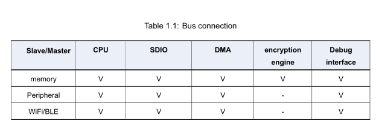
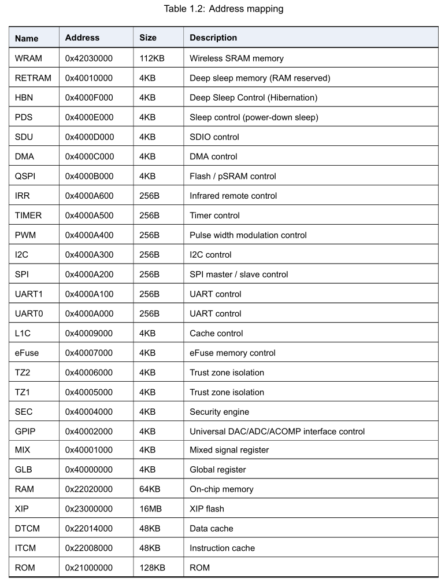
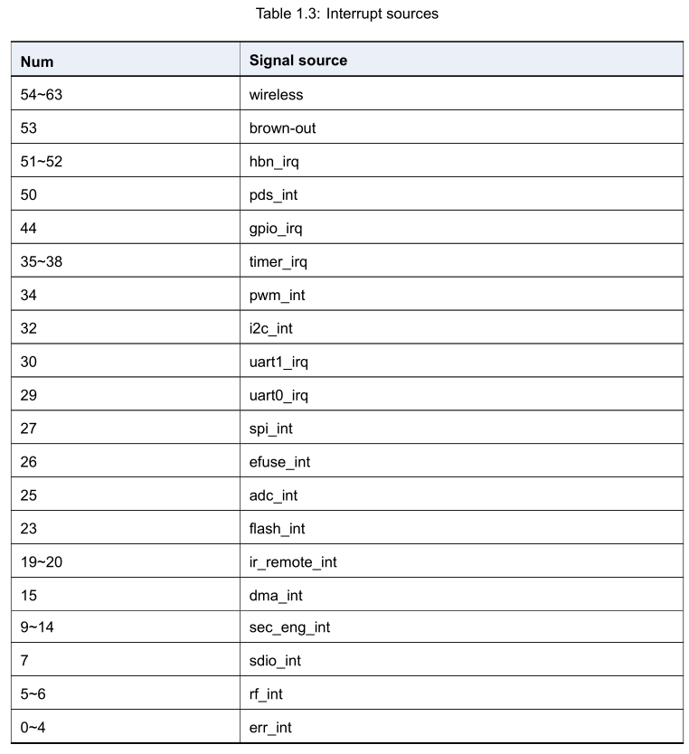
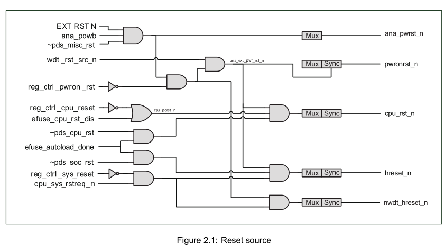
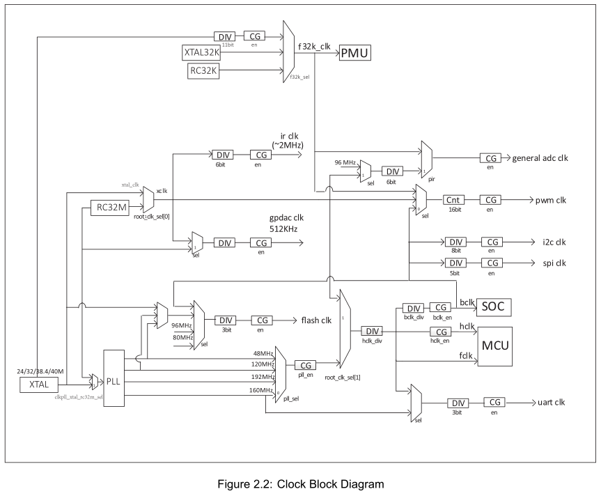

 BL602/BL604 Reference Manual 

 From SZDOIT

## 1 System and memory overview

### 1.1 Introduction

​		The on-chip processor uses RISC-V 32-bit with floating point. With high-speed processing memory system (see the L1C chapter for details), to achieve high-quality computing efficiency. External to the processor is a multilayer 32-bit AHB architecture with low power consumption, low latency, and high flexibility. The memory section contains high-speed tightly coupled memory as well as cache and system shared memory. Off-chip memory supports Flash expansion.

### 1.2 Main features

• RISV-V 32-bit with floating point

• Multi-layer 32-bit AHB bus architecture

• 96KB high-speed memory

• 180KB system memory

• 128KB read-only memory

• Off-chip memory Flash

### 1.3 Function description

​		The BL602 bus connection and address access are summarized as follows: The bus master includes CPU, SDIO,DMA, encryption engine, and debug interface. The bus includes memory, peripherals, WiFi / BLE. Except the en-cryption engine can only access the memory, all other bus masters can access all bus slaves.

​		The address access mainly distinguishes ”memory” or ”peripheral” by [27:24], and the [31:28] bits can be ignored. The memory space is consecutive addresses 0x2008000 ~ 0x204BFFF (272KB SRAM), the read-only memory address is 0x1000000, and the deep sleep memory address is 0x0010000. The off-chip space address is 0x3000000 (maximum support 16MB Flash). The peripheral space is 0x0000000 ~ 0x000F000.

There are 64 interrupt sources. The level or edge trigger is configured by the CPU and can be masked. Details as follows:

## 2 Reset and clock

### 2.1 Introduction

The reset sources included in the chip: hardware reset, watchdog reset, software reset. The chip contains multiple clock sources: XTAL, PLL, RC. It is allocated to each module through configuration such as frequency division.

### 2.2 Reset source

The reset sources are as follows:
• Hardware reset: reset via pins
– Pin maximum reset (PAD_EXT_RST = 1-> 0): all logic will reset and return to the initial state
– Pin power reset (CHIP_EN = 0-> 1): similar to power management reset
– Power management reset: The chip is restored from power failure, and the HBN logic resets the chip system
• Watchdog reset
– When the watchdog alarm triggers a reset signal, the reset management unit will reset the chip system after necessary preparations, and the internal logic of the watchdog will record the status of the watchdog reset
• Software reset: local or partial reset according to software setting register
– Software initial reset (reg_ctrl_pwron_rst): The rising edge of this register is triggered by software to reset the chip system
– Software CPU reset (reg_ctrl_cpu_reset): The rising edge of this register is triggered by software to reset the CPU part of the system
– Retain necessary logic processing such as power management unit, perform chip system reset
– Software module reset: Set software reset according to the requirements of specific modules

### 2.3 Clock source

Clock source contains:
• XTAL ：External crystal clock, according to system requirements, the frequency can be selected from 24, 32, 38.4,40MHz.
• XTAL32K：External crystal clock, frequency 32KHz
• RC32K ：RC oscillator clock, 32KHz, provides calibration
• RC32M ：RC oscillator clock, frequency 32MHz, provides calibration
• PLL ：Phase-locked loop clock, internal system high-speed clock, the highest frequency supports 160MHz

The clock control unit distributes the clock from the oscillator to the core and peripheral devices. By selecting the system clock source, dynamic frequency divider, clock configuration, sleep using 32KHz clock to achieve low power clock management.

Peripheral clock includes: Flash、UART、I2C、SPI、PWM、IR-remote、ADC、DAC.

For more, check it out:https://github.com/SmartArduino/SmartArduino.github.io/blob/master/docs/BouffaloLab/BL602_BL604/ReferenceManual/BL602_BL604_RM_1.0_en.pdf

## Contact Us

- E-mails: [yichone@doit.am](mailto:yichone@doit.am), [yichoneyi@163.com](mailto:yichoneyi@163.com)
- Skype: yichone
- WhatsApp:+86-18676662425
- Wechat: 18676662425