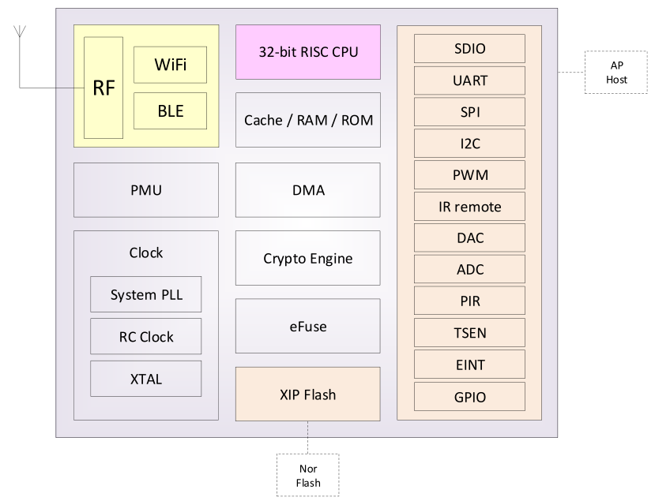

 BL602/BL604 IOT WIFI+BLE CHIPSET 

 From SZDOIT

## 1 PRODUCT OVERVIEW

​	BL602/BL604 is Wi-Fi + BLE combo chipsets for low-cost and low-power applications.
​	Wireless subsystem contains 2.4G radio, Wi-Fi 802.11b/g/n and Bluetooth LE 5.0 baseband/MAC designs. Microcontroller subsystem contains a low-power 32-bit RISC CPU, high-speed cache and memories. Power Management Unit controls low-power modes. Moreover, variety of security features are supported.

​	Peripheral interfaces include SDIO, SPI, UART, I2C, IR remote, PWM, ADC, DAC, ACOMP, PIR, etc.

​	Flexible GPIO configurations are supported. BL602 has total 16 GPIOs and BL604 has total 23 GPIOs.

## 2 TARGET APPLICATIONS

**Low-power IoT applications**

Wi-Fi connection

BLE connection

Home electronics

Remote control

**Wireless (Tier-1 RF Performance)**

- Wi-Fi 802.11 b/g/n

- Bluetooth® Low Energy 5.0

- Wi-Fi Fast connection with BLE assistance

- Wi-Fi and BLE coexistence

- Wi-Fi Security WPS/WEP/WPA/WPA2/WPA3

- STA, SoftAP and sniffer modes

- Multi-Cloud connectivity

- 2.4 GHz RF transceiver

- Integrated RF balun, PA/LNA

**Microcontroller Subsystem**

- 32-bit RISC CPU with FPU

- L1 cache

- RTC timer up to One year

- Two 32b general purpose timers

- Four DMA channels

- Dynamic Frequency from 1MHz to 192MHz

- XIP QSPI flash support

**Security (Complete Security features)**

- Secure boot

- Secure debug

- XIP QSPI On-The-Fly AES Decryption (OTFAD)

- AES 128/192/256

- SHA-1/224/256

- TRNG (True Random Number Generator)

- PKA (Public Key Accelerator)

**Memory**

- 276KB SRAM

- 128KB ROM

- 1Kb eFuse

- Embedded Flash (Optional)

**Peripherals**

- SDIO 2.0 slave (AP-Host)

- SPI master/slave

- Two UART

- I2C master/slave

- Five PWM channels

- 10-bit general DAC

- 12-bit general ADC

- Two general analog comparators

- PIR (Passive Infra-Red) detection

- IR remote HW accelerator

- Flexible 16 GPIOs (BL602) / 23 GPIOs (BL604)

**Power Modes (Ultra-low Power modes)**

- Off

- Hibernate

- Power Down Sleep (flexible)

- Active

**Clock**

- Support XTAL 24/32/38.4/40MHz

- Support XTAL 32/32.768KHz

- Internal RC 32KHz & 32MHz oscillator

- Internal System PLL
**Package Type**

- 32 pin QFN (BL602)

- 40 pin QFN (BL604)