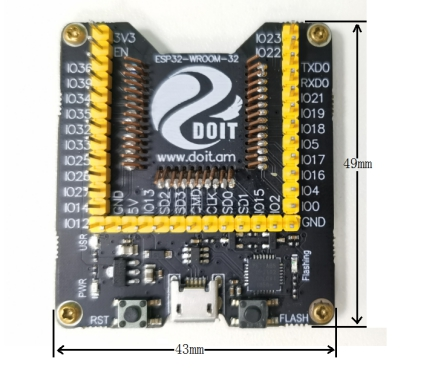
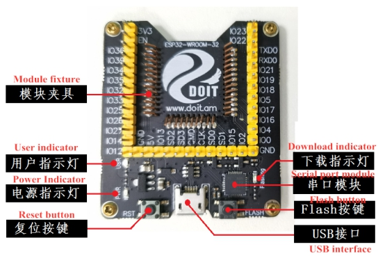
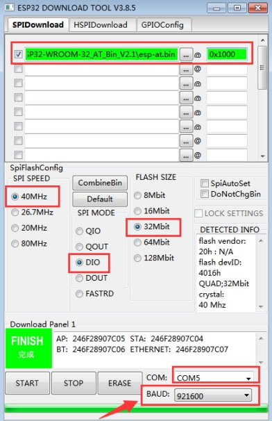
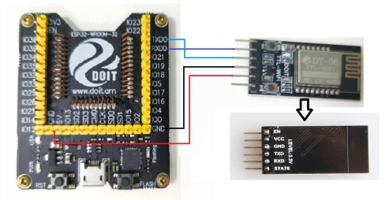
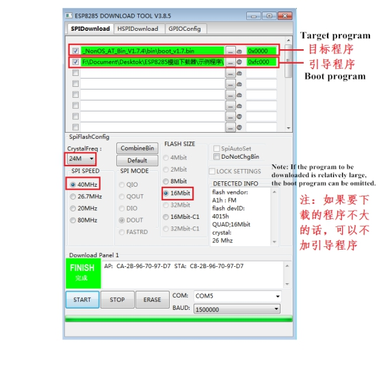

 18DOF VIVI Robot Control Board

 From SZDOIT

# 1.Overview

The ESP32 programmer is suitable for the firmware burning test of modules such as ESP32-WROVER/32S/WROOM-32U. All IO ports have been led out. It can be used as a minimum system development board or a small batch burning fixture, and it can also be used as a serial port debugging Downloader use.

# 2. Features

- Suitable for firmware burning test of ESP32 modules such as ESP32-WROVER/32S/WROOM-32U

- USB to TTL serial port debugging downloader

- Support one-click firmware download function

- Safe and reliable, small size, long service life

- And has power indicator, burning indicator, serial communication indicator

- Lead out all IO ports, which can be used as the smallest system development board or fixture for small batch programming

# 3. Hardware introduction and description

 

size：43x49x12mm

Note: The size parameters are measured manually, the accuracy is not high, everything is subject to the actual product

# 4. Board function description:

- Interface Description:

 

- Instructions for use:

Download and install the corresponding CP2402X serial chip driver according to the operating system. The download link for the Windows system is as follows:

link：https://pan.baidu.com/s/1RyUsmA9_8RtCjBKAEONF3g 

password：doit 

Official website:

https://cn.silabs.com/products/development-tools/software/usb-to-uart-bridge-vcp-drivers

Download the official Flash download tool ESPFlashDownloadTool

 link：https://pan.baidu.com/s/1V5Xszf7SBMLd8UQjwpF-dw 

password：doit

- Use the official software ESPFlashDownloadTool to download the program for ESP32

Automatically download firmware: press in the module, insert the USB cable for power supply, cooperate with the Flash download tool, configure the corresponding burning parameters, click START to download, and then start the firmware burning, the downloader will automatically reset and make the module enter the burning mode.

 

Note: BAUD must be within 921600, otherwise the download will fail

- Use the official software ESPFlashDownloadTool to program other modules now

 wiring

Test stand    DT-06 module

3V3----------------------------VCC

GND--------------------------GND

TXD0----------------------TXD 

RXD0----------------------RXD

 

 

Note: When programming for other modules, do not have modules on the fixture

Plug in the USB cable for power supply, open the burning software, configure the corresponding burning parameters, press and hold the burning button, then short press the reset button, and click START to download to start the firmware burning

# 5. Download resources

link; https://pan.baidu.com/s/1XQDLpBYahtijp--BVvPV9g 

password：tzi3 

# Contact Us

- E-mails: [yichone@doit.am](mailto:yichone@doit.am), [yichoneyi@163.com](mailto:yichoneyi@163.com)
- Skype: yichone
- WhatsApp:+86-18676662425
- Wechat: 18676662425