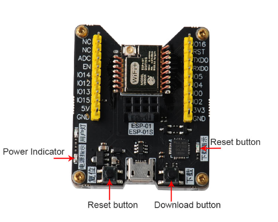
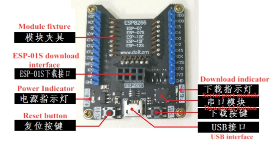
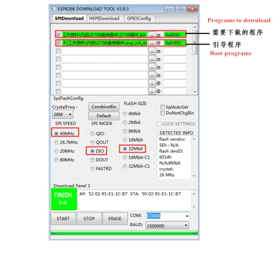
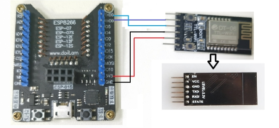
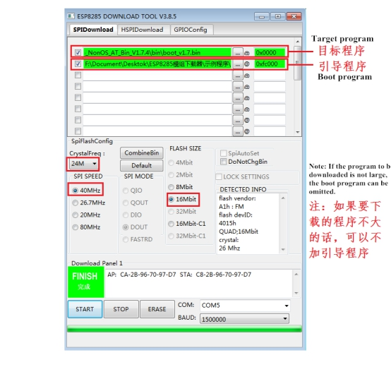
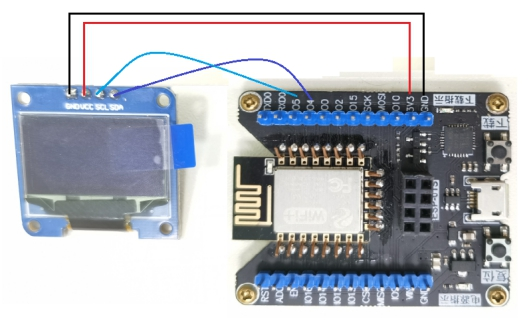
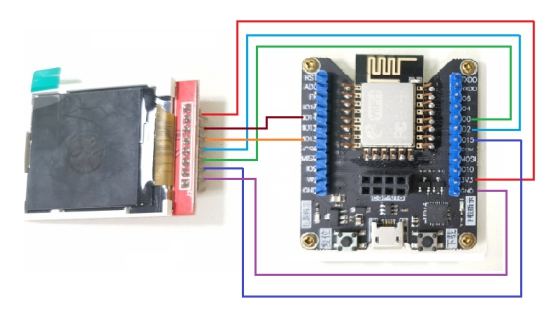

 ESP8266 Module Download

 From SZDOIT

# 1. Overview

ESP8266 programmer is suitable for the firmware burning test of ESP-01/01S/07/07S and other modules. All IO ports have been led out. It can be used as the smallest system development board or small batch burning fixture, and it can also be used as a serial port for debugging. Downloader use.

# 2. Features

-  Applicable to the firmware burning test of ESP8266 modules such as ESP-01/01S/07/07S

- USB to TTL serial port debugging downloader

-  Support one-click firmware download function

- Safe and reliable, small size, long service life

-  And has power indicator, burning indicator, serial communication indicator

- Lead out all IO ports, which can be used as the smallest system development board or fixture for small batch programming

# 3.Hardware introduction and description

 **oard function description:**

1)Interface description:

 

2) Instructions for use:

Download and install the corresponding CP2402X serial chip driver according to the operating system. The download link for the Windows system is as follows:

link：https://pan.baidu.com/s/1RyUsmA9_8RtCjBKAEONF3g 

password：doit 

**Official website:**

https://cn.silabs.com/products/development-tools/software/usb-to-uart-bridge-vcp-drivers

1)ESPFlashDownloadTool

Download the official Flash download tool ESPFlashDownloadTool

link：https://pan.baidu.com/s/1V5Xszf7SBMLd8UQjwpF-dw 

password：doit

2) Use the official software ESPFlashDownloadTool to download the program for ESP8266

Automatically download firmware: press in the module, insert the USB cable for power supply, cooperate with the Flash download tool, configure the corresponding burning parameters, click START to download, and then start the firmware burning, the downloader will automatically reset and make the module enter the burning mode.

Manually download the firmware: press in the module, plug in the USB cable to supply power, open the burning software, configure the corresponding burning parameters, long press the burning button, then short press the reset button, click START to download, and the firmware burning can start

 

Note: When the program to be downloaded is relatively small, the boot program can be omitted

**Use the official software ESPFlashDownloadTool to program other modules**

①　Wiring

Download      DT-06（module）

3V3----------------------------VCC

GND--------------------------GND

TXD0----------------------TXD 

RXD0----------------------RXD

 

 

 

Note: When programming for other modules, do not have modules on the fixture

②　Plug in the USB cable to supply power, open the burning software, configure the corresponding burning parameters, long press the burning button, then short press the reset button, click START to download, then the firmware burning can be started

 

**Use as the smallest system board of ESP8266**

①　ESP8266 minimum system board + 0.96 inch LCD screen connection demonstration:

OLED         ESP8266 Board

GND ------------------ GND

VCC ------------------ 3V3

SCL ------------------ IO5

SDA ------------------ IO4

 

 

②　ESP8266 minimum system board +1.44 inch TFT display connection demonstration:

TFT显示屏（Display screen）   ESP8266板子（board）

  LED  --------------- 3V3

  GND ---------------- GND

  SCK ---------------- IO14

  SDA ---------------- IO13

  A0 ----------------- IO0

 RESET ---------------- IO2

  CS ----------------- IO15

 

# Information download

https://pan.baidu.com/s/1eb9oireY530RQiGhpicCXw 

password：doit 

# Contact Us

- E-mails: [yichone@doit.am](mailto:yichone@doit.am), [yichoneyi@163.com](mailto:yichoneyi@163.com)
- Skype: yichone
- WhatsApp:+86-18676662425
- Wechat: 18676662425