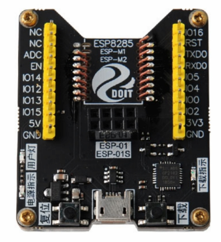
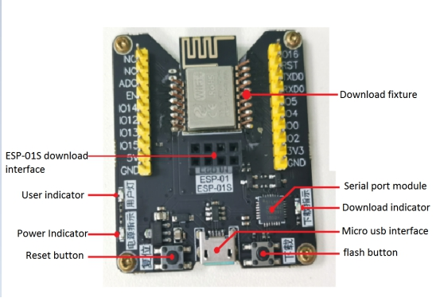
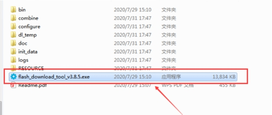
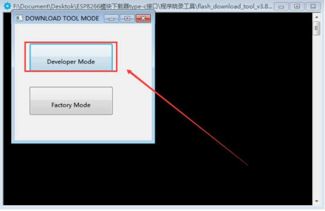
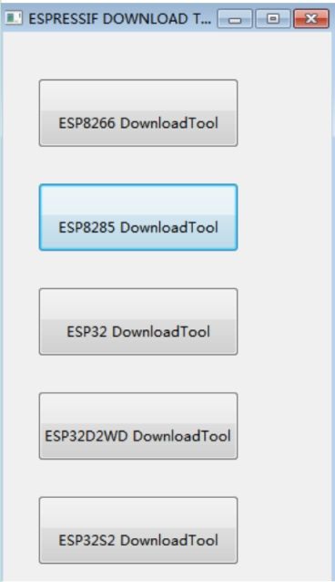
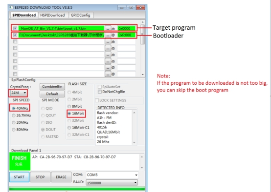

  ESP8285 Module Download  

 from SZDOIT 

# 1. Overview

ESP8285 modules we have:  ESP-M1, ESP-M2, ESP-M3, ESP-M4, DMP-L1

ESP8285 programmer is suitable for the firmware burning test of ESP-M1/M2 and other modules. All IO ports have been led out and can be used as the smallest system development board or small batch burning fixture.

# 2. Features

1) Suitable for firmware burning test of ESP-M1/M2 and other ESP8285 modules

2) USB to TTL serial port debugging downloader

3) Support one-click firmware download function

4) Safe and reliable, small size, long service life

5) And has power indicator, burning indicator, serial communication indicator

6) All IO ports can be drawn out, which can be used as the smallest system development board or fixture for small batch programming

 

# 3. Hardware Introduction And Description

## 3.1 Board Size Parameters

Subject to the actual product

## 3.2 Board Function Description:

 

## 3.3. Instructions For Use:

1. Depending on the operating system, you may need to download and install the corresponding CP2402X serial chip driver. The download link for the Windows system is as follows:

1223444

2. If you don’t have a download tool, please download the official Flash download tool ESPFlashDownloadTool

1223444

3. Automatically download the firmware: press in the module, insert the USB cable for power supply, cooperate with the Flash download tool, configure the corresponding programming parameters, click START to download, you can start the firmware programming, the downloader will automatically reset and make the module enter the programming mode.

Manually download the firmware: press in the module, plug in the USB cable to supply power, open the burning software, configure the corresponding burning parameters, long press the burning button, then short press the reset button, click START to download, and the firmware burning can start

1) Double-click to open flash_download_tool_v3.8.5.exe

 

2) Select Developer Mode

 

3) Select the corresponding module in the pop-up window, ESP-01S select ESP8285 DownloadTool

 

4) Set the parameters and port number, click the START interface to download

# Contact Us

- E-mails: [yichone@doit.am](mailto:yichone@doit.am), [yichoneyi@163.com](mailto:yichoneyi@163.com)
- Skype: yichone
- WhatsApp:+86-18676662425
- Wechat: 18676662425