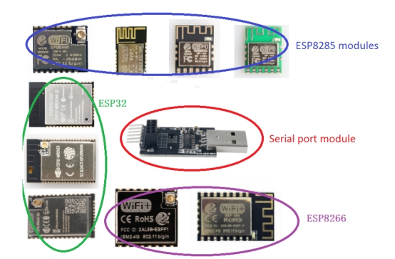
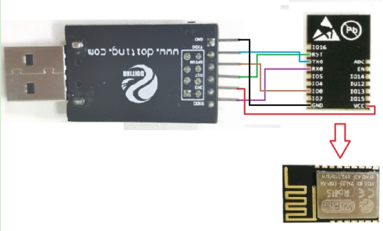
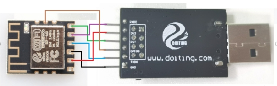
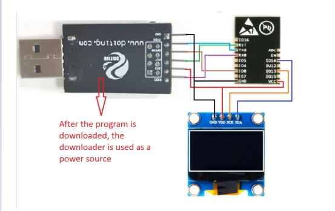
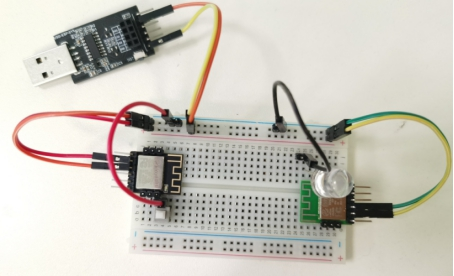

<center><font size=10> Use of a single WiFi module </center></font>
<center> From SZDOIT</center>

## 1. Overvies

Some friends want to buy various WiFi modules to use and compare the advantages and disadvantages of various WiFi modules but then they found that the cost is very high when buying a development board. Or some friends  want to buy modules but don’t know how to program them because the general serial port module does not support the one-click download of the wifi module. Our company has launched a product specifically whole set to solve this problem. It only needs to use a few DuPont cables to lead out the download pins and cuts dowm the cost if you buy them together.

 

## 2. How to use

So how to use it?

Take the ESP8285 module as an example to introduce. First, use DuPont wires to lead out the six pins of VCC/GND/IO0/RX0/TX0/RST on the module with DuPont wires and connect them:

| Downloader | ESP Module |
| ---------- | ---------- |
| 3V3        | VCC        |
| GND        | GND        |
| RST        | RST        |
| TXD0       | TX0        |
| RXD0       | RX0        |
| GPIO0      | IO0        |

 

 

Figure 1 Wiring diagram of ESP-M2 and downloader

 

Figure 2 Wiring diagram of ESP-M3 and downloader

The wiring of other ESP32 and ESP8266 modules is the same

 

## 3. Examples

Demo 1: Use ESP-M2 module to drive 0.96 inch OLED display

Content: Get the current time from the network server through WiFi network, and display it on the LED display in real time

Wiring    

| ESP-M2 | OLED |
| ------ | ---- |
| GND    | GND  |
| VCC    | VDD  |
| IO13   | SCK  |
| IO14   | SDA  |

 

**code：**Please [download](https://github.com/SmartArduino/Arduino-Third-party-Libraries) the third-party library files you use

```
#include <ArduinoJson.h>
#include <dht11.h>
#include <ESP8266WiFi.h> 
#include <ESP8266HTTPClient.h> 
#include <ArduinoJson.h>
#include <SimpleTimer.h>
#include <Adafruit_ssd1306syp.h>
#include <Adafruit_GFX.h>
#include "dht11.h"
#define SDA_PIN 14
#define SCL_PIN 13

//DHT dht(DHTPIN, DHT11);

Adafruit_ssd1306syp display(SDA_PIN,SCL_PIN);

const char* ssid = "Doit";         // 你的WiFi账号
const char* password = "doit3305"; // 你的WIFI密码
String display_year="",display_month="",display_day="",display_hour="",display_minute="",display_second="";
String sool="";
int flag;
int t,h;
void showtime()
{
        if(sool==" ")
        sool=":";
        else
        sool=" ";
        Serial.println("年："+display_year+"\r");
        Serial.println("月："+display_month+"\r");
        Serial.println("日："+display_day+"\r");
        Serial.println("时："+display_hour+"\r");
        Serial.println("分："+display_minute+"\r");
        Serial.println("秒："+display_second+"\r");
        display.clear();
        display.drawRect(0,0,128,64,WHITE);
        display.setTextSize(2);
        display.setTextColor(WHITE);
        display.setCursor(4,4);
        display.println("20"+display_year+"-"+display_month+"-"+display_day);
        display.setTextSize(2);
        display.setCursor(13,47);
        display.println(display_hour+sool+display_minute+sool+display_second);
        display.setTextColor(BLACK, WHITE);
        display.update();

  }
void get_time()
{
  if (WiFi.status() == WL_CONNECTED) 
  {
    HTTPClient http;  //开始登陆 
    //不要使用和下面相同的秘钥
    http.begin("http://quan.suning.com/getSysTime.do");
    int httpCode = http.GET(); //赋值                                                                  
    if (httpCode > 0) 
    { //检查一下是否为0，应该是去检查缓存区是否为空
      /*数据解析  //使用 https://arduinojson.org/assistant/ 一个工具可以直接生成程序，挑有用的复制就行*/
      const size_t capacity = JSON_OBJECT_SIZE(2) + 60;
      DynamicJsonBuffer jsonBuffer(capacity);
      
      JsonObject& root = jsonBuffer.parseObject(http.getString());
      
      const char* sysTime1 = root["sysTime1"]; // "20190419131920"
      String now_time = sysTime1;
      display_year = (now_time.substring(2,4));
      display_month = (now_time.substring(4,6));
      display_day = (now_time.substring(6,8));
      display_hour = (now_time.substring(8,10));
      display_minute = (now_time.substring(10,12));
      display_second = (now_time.substring(12,14));
    }
    http.end();
    delay(100);
    showtime();
  }
}
SimpleTimer timer;
void setup() 
{
  // put your setup code here, to run once:
  Serial.begin(115200);
  WiFi.begin(ssid, password);
  display.initialize();
  display.clear();
  display.drawRect(0,0,128,64,WHITE);
  display.setTextSize(2);
  display.setTextColor(WHITE);
  display.setCursor(0,10);
  display.print("Connecting...");
  while (WiFi.status() != WL_CONNECTED) 
  {
  delay(500);
  display.print(".");
  display.update();
  }
  display.clear();
  display.drawRect(0,0,128,64,WHITE);
  display.setTextSize(2);
  display.setTextColor(WHITE);
  display.setCursor(10,10);
  display.println("Connected");
  display.update();
  delay(1000);
  get_time();
  timer.setInterval(200,get_time);   //设置时间每秒刷新一次
}   
void loop() 
{
  timer.run();
}
```

Demo 2: Use two ESP-M3 modules to complete "remote control"

In this demo, we use 2 modules, one as a client and one as a server.

During the running process, the client will detect the button status on the board in real time and send the button status to the server.After the server receives the it, the server can control the LED on the server terminal board to turn on and off according to the client button state. The final effect is that we can "remotely control" the LED on the server to turn on and off through the buttons on the client ESP8266 development board.

It can be completed according to the following steps:

1. Download the server and client programs to two ESP-M3

2. Wiring

 

 

3. Connect the USB interface and wait for about 10 seconds, then you can control the LED on the server to turn on and off through the buttons on the customer service side

**Server program：**

```
#include <ESP8266WiFi.h>
#include <ESP8266WiFiMulti.h>   // 使用WiFiMulti库 
 
#define buttonPin 4            // 按钮引脚D3
 
ESP8266WiFiMulti wifiMulti;     // 建立ESP8266WiFiMulti对象,对象名称是 'wifiMulti'
 
bool buttonState;       //存储客户端按键控制数据
float clientFloatValue; //存储客户端发送的浮点型测试数据
int clientIntValue;     //存储客户端发送的整数型测试数据
 
const char* host = "192.168.9.182";    // 即将连接服务器网址/IP
const int httpPort = 80;               // 即将连接服务器端口
 
void setup(void){
  Serial.begin(9600);                  // 启动串口通讯
  Serial.println("");
 
  pinMode(buttonPin, INPUT_PULLUP);    // 将按键引脚设置为输入上拉模式
  
  wifiMulti.addAP("Doit", "doit3305"); // 将需要连接的一系列WiFi ID和密码输入这里
  wifiMulti.addAP("ssid_from_AP_2", "your_password_for_AP_2"); // ESP8266-NodeMCU再启动后会扫描当前网络
  wifiMulti.addAP("ssid_from_AP_3", "your_password_for_AP_3"); // 环境查找是否有这里列出的WiFi ID。如果有
  Serial.println("Connecting ...");                            // 则尝试使用此处存储的密码进行连接。
  
  while (wifiMulti.run() != WL_CONNECTED) { // 尝试进行wifi连接。
    delay(250);
    Serial.print('.');
  }
 
  // WiFi连接成功后将通过串口监视器输出连接成功信息 
  Serial.println('\n');
  Serial.print("Connected to ");
  Serial.println(WiFi.SSID());              // 通过串口监视器输出连接的WiFi名称
  Serial.print("IP address:\t");
  Serial.println(WiFi.localIP());           // 通过串口监视器输出ESP8266-NodeMCU的IP
}
 
void loop(void){
 // 获取按键引脚状态
 buttonState = digitalRead(buttonPin); 
 
 // 改变测试用变量数值用于服务器端接收数据检测
 clientFloatValue += 1.5;
 clientIntValue += 2;
 
 // 发送请求
 wifiClientRequest();
 delay(1000);
}
 
void wifiClientRequest(){
  WiFiClient client;  
 
  // 将需要发送的数据信息放入客户端请求
  String url = "/update?float=" + String(clientFloatValue) + 
               "&int=" + String(clientIntValue) +
               "&button=" + String(buttonState);
                         
  // 建立字符串，用于HTTP请求
  String httpRequest =  String("GET ") + url + " HTTP/1.1\r\n" +
                        "Host: " + host + "\r\n" +
                        "Connection: close\r\n" +
                        "\r\n";
                        
  Serial.print("Connecting to "); 
  Serial.print(host); 
  
  if (client.connect(host, httpPort)) {  //如果连接失败则串口输出信息告知用户然后返回loop
    Serial.println(" Sucess");
    
    client.print(httpRequest);          // 向服务器发送HTTP请求
    Serial.println("Sending request: ");// 通过串口输出HTTP请求信息内容以便查阅
    Serial.println(httpRequest);        
  } 
  else
  {
    Serial.println(" failed");
  }
  
  client.stop();                         
}
```

**client program：**

```
#include <ESP8266WiFi.h>
#include <ESP8266WiFiMulti.h>
 
#define buttonPin 4                    // button for GPIO4
 
ESP8266WiFiMulti wifiMulti;            // 建立ESP8266WiFiMulti对象,对象名称是 'wifiMulti'
bool buttonState;                      //存储客户端按键控制数据
float clientFloatValue;                //存储客户端发送的浮点型测试数据
int clientIntValue;                    //存储客户端发送的整数型测试数据
const char* host = "192.168.9.123";    // 即将连接服务器网址/IP
const int httpPort = 80;               // 即将连接服务器端口

void setup(void)
{
  Serial.begin(9600);                  //启动串口通讯
  while(!Serial)
    delay(200);
  pinMode(buttonPin, INPUT_PULLUP);       //将按键引脚设置为输入上拉模式
  
  wifiMulti.addAP("Doit", "doit3305");    //将需要连接的一系列WiFi ID和密码输入这里
  Serial.print("Connecting ...");       //则尝试使用此处存储的密码进行连接。
 
  while (wifiMulti.run() != WL_CONNECTED) //进行wifi连接。
  { 
    delay(200);
    Serial.print('.');
  }
  Serial.println();
  // WiFi连接成功后将通过串口监视器输出连接成功信息 
  Serial.print("Connected to 【" + WiFi.SSID() + "】");            
  Serial.print("IP address:\t"); Serial.println(WiFi.localIP());          
}
 
void loop(void){
 // 获取按键引脚状态
 buttonState = digitalRead(buttonPin); 
 
 // 改变测试用变量数值用于服务器端接收数据检测
 clientFloatValue += 0.5;
 clientIntValue += 1;
 
 // 发送请求
 wifiClientRequest();
 delay(1000);
}
 
void wifiClientRequest(){
  WiFiClient client;  
 
  // 将需要发送的数据信息放入客户端请求
  String ur = "/update?float=" + String(clientFloatValue) + 
               "&int=" + String(clientIntValue) +
               "&button=" + String(buttonState);
                         
  // 建立字符串，用于HTTP请求
  String httpRequest =  String("GET ") + ur + " HTTP/1.1\r\n" +"Host: " + host + "\r\n" + "Connection: close\r\n" + "\r\n";                      
  Serial.print("Connecting to "); 
  Serial.print(host); 
  
  if (client.connect(host, httpPort)) {  //如果连接失败则串口输出信息告知用户然后返回loop
    Serial.println(" Sucessed");
    
    client.print(httpRequest);          // 向服务器发送HTTP请求
    Serial.println("Sending request: ");// 通过串口输出HTTP请求信息内容以便查阅
    Serial.println(httpRequest);        
  } else{
    Serial.println(" failed");
  }
  client.stop();                         
}
```

# Contact

- Email: yichoneyi@163.com
- WhatsApp: 008618676662425
- WeChat: itchenve
- Skype: yichone