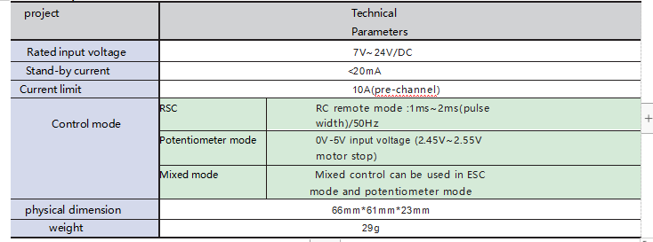

High power DC brush motor drive board Datasheet

## 1. The Profile

## 2. The Limit Parameter

## 3. Limit Parameter

## 4. Control Mode

### 4.1 Electromodulation Mode of Aircraft Model

### 4.2 Potentiometer Control Mode (Use of the sample program)

### 4.3 Control of PM

## 5. Wiring Instructions

### 5.1 WiFi Connection

| Arduino UNO R3 | Big Power Board |
| :------------: | :-------------: |
|       6        |     A（S）      |
|       7        |     B（S）      |
|       5V       |     B（+）      |
|      GND       |     B（—）      |

| Arduino UNO R3 | Big Power Board | WiFi  Module |
| :------------: | :-------------: | :----------: |
|       TX       |      ----       |      RX      |
|       RX       |      ----       |      TX      |
|      ----      |     A（+）      |     VCC      |
|      ----      |     A（-）      |     GND      |

### 5.2 The Bluetooth Connection

| Arduino UNO R3 | Big Power Board |
| :------------: | :-------------: |
|       6        |     A（S）      |
|       7        |     B（S）      |
|       5V       |     B（+）      |
|      GND       |     B（—）      |

| Arduino UNO R3 | Big Power Board | Bluetooth |
| :------------: | :-------------: | :-------: |
|       TX       |      ----       |    RX     |
|       RX       |      ----       |    TX     |
|      ----      |     A（+）      |    VCC    |
|      ----      |     A（-）      |    GND    |

### 5.3 The Handle Connection

| Arduino UNO R3 | Big Power Board |
| :------------: | :-------------: |
|       6        |     A（S）      |
|       7        |     B（S）      |
|       5V       |     B（+）      |
|      GND       |     B（—）      |

| Arduino UNO R3 | Big Power Board | Handle Receiver |
| :------------: | :-------------: | :-------------: |
|       10       |      ----       |       CS        |
|       11       |      ----       |       CMD       |
|       12       |      ----       |       CLK       |
|       13       |      ----       |       DAT       |
|      ----      |     A（+）      |       VCC       |
|      ----      |     A（-）      |       GND       |

## 6. Control Instructions

Please refer to the details, they use the same：https://gitnova.com/#/Robot/Controller/ps2/4motor16servo?id=arduino-ps2-controller-kit --->Usage for App