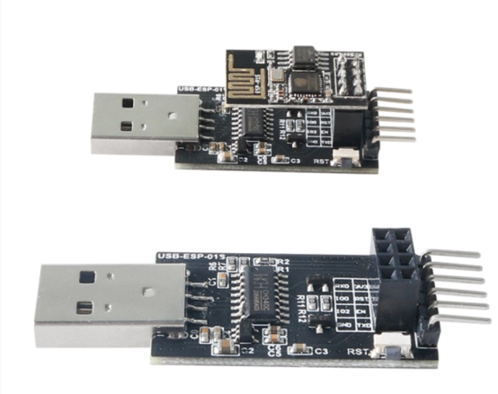
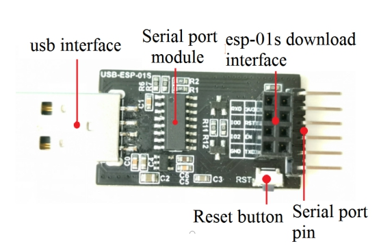
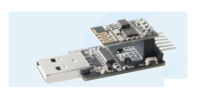
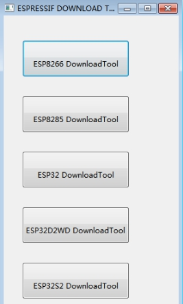
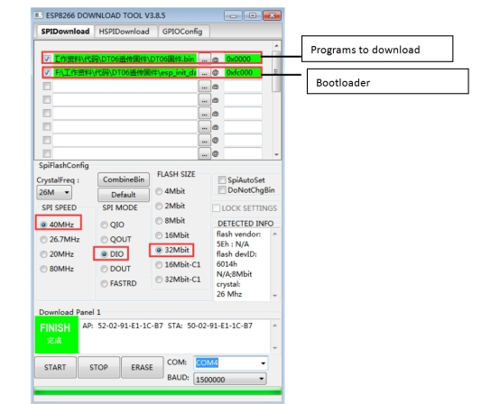
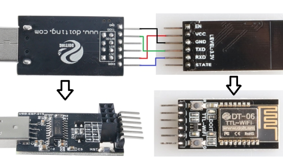

  USB To TTL Downloader 

 from SZDOIT 

## 1. Introduction

This downloader uses CH340 USB to serial port chip, and adds ESP8266 automatic download circuit, which is very convenient for users to download programs, upgrade firmware, serial port debugging, etc. 

 

Support Arduino IDE, ESP8266Flasher, Espressif FLASH_DOWNLOAD_TOOLS and other download software software, one-click download, no wiring, no need to press any buttons. The WiFi module will automatically enter the download mode

## 2. Features

- Stable performance

- Simple operation

- High reliability

## 3. Mechanical Size

characteristics: unit (mm)

 Dimensions: length: 57mm width: 20.4mm height: 11mm (pin header)

​     PCB board: Length: 36mm Width: 20.4mm Height: 1.6mm

The actual size is subject to the actual product.

Board interface description:

 

## 4. Instructions For Use

- Install CH340 driver from here:

Link：https://pan.baidu.com/s/16YzGB5kRHQ_HEy62DwTAeg 

pwassword：doit 

- The official Flash download tool flash_download_tool_v3.8.5:

Link：https://pan.baidu.com/s/1V5Xszf7SBMLd8UQjwpF-dw 

passward：doit

- Automatically download firmware:Insert the ESP-01S module into the download interface,Insert the USB interface into the computer USB interface,With the Flash download tool,Configure the corresponding programming parameters,Click START to download,You can start firmware burning, the downloader will automatically reset and make the module enter the burning mode.

 

①　Double click to open flash_download_tool_v3.8.5.exe

 

②　Select Developer Mode

 

③Select the corresponding module in the pop-up window, 

elect ESP8266 DownloadTool for ESP-01S 

 

④　Set the parameters and port number, click START interface to download

 

 

Note:  The boot program can be omitted when the program to be downloaded is relatively small

Download firmware manually:Wiring, plug in the USB cable for power supply(The wiring diagram is as follows),Open the burning software and configure the corresponding burning parameters,Long press the burning button, then short press the reset button, and click START to download to start firmware burning

Wiring

 

 

## Contact Us

- E-mails: [yichone@doit.am](mailto:yichone@doit.am), [yichoneyi@163.com](mailto:yichoneyi@163.com)
- Skype: yichone
- WhatsApp:+86-18676662425
- Wechat: 18676662425