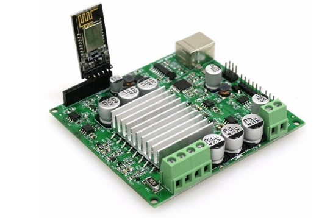
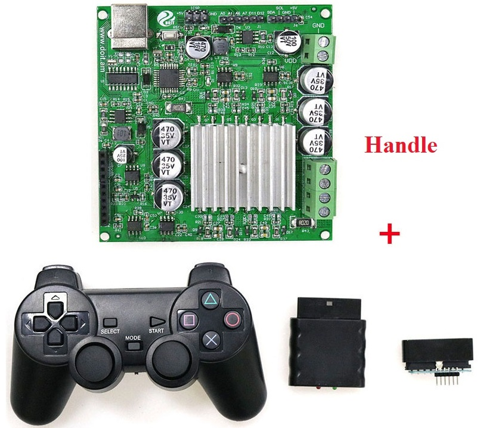
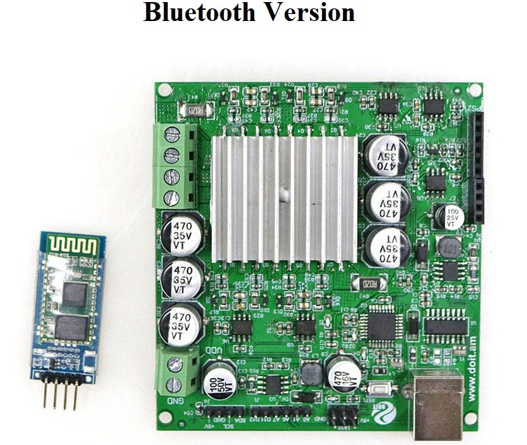
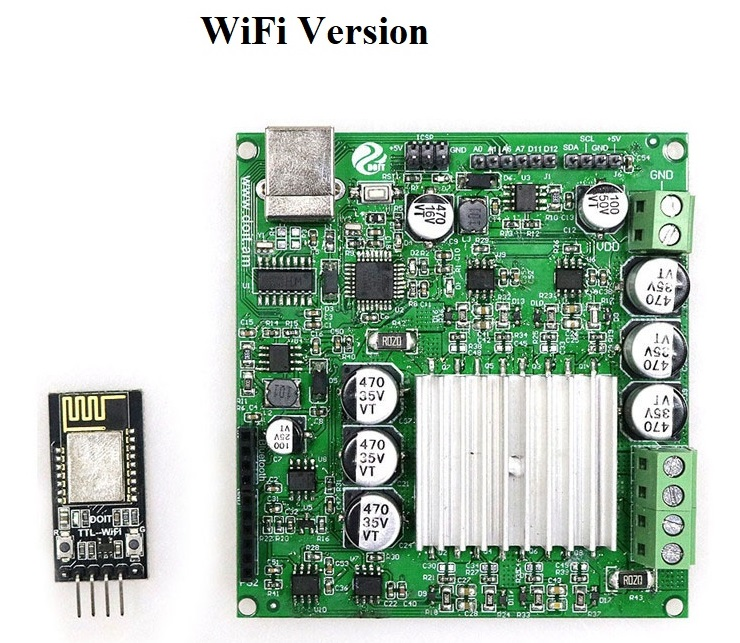

<center> <font size=10> User Manual for Big Power Board </font></center>

<center> from SZDOIT </center>

# Introduction:

This board is a control board, which is compatible with Arduino, is also a DC motor driver shield board. It is very suitable to control the big power robot tank car chassis shown in our shops.



# Features:

- big power: max current could be 20A, and the power can be 480W;
  large load: the tested load is 60kg;
- control mode: wifi (by DT-06), Bluetooth (by HC-05), and PS2;
  2 in 1 board: it is a control board (compatible with Arduino), and also is a DC motor driver board;
- long distance: 100m for wifi, and 10m or for bluetooth or ps2.


# Option Description:

- This development board can be used with the WiFi module, Bluetooth module and handle kit for remote control of the four-wheel drive car;
- The WiFi version and the Bluetooth version require a mobile phone to install the app, and currently only support the Android system;
- By default, the corresponding program is programmed according to the option, and the line can be remotely controlled according to the instructions;
- Only driver board: refers to a separate drive board, no WIFI module, Bluetooth module or handle kit;
- According to the actual measurement, this development board can drive a load of about 60kg.
  Compatible with arduino, it can be used directly by stacking.







# Module pin description and schematic:


- High-power DC motor, internal embedded ATMEGA328 as the Motor Drive control unit.
- On board reserved ATMEGA328 Single-chip computer programming interface (USB and ICSP two ways), convenient program burning;
- Part of the analog/digital signal port for the user to expand and use;
  Reserved Bluetooth &wifi interface, our module can be directly connected to use;
- Reserved PS2 handle interface, direct Plug and use;
- Reserved I²c interface, at the same time lead to the use of a small power module (maximum output current not exceeding 100mA);
- Two-way DC motor output, single output maximum current 20A;
- Power input, maximum DC voltage 30V.The power input is not designed for anti-reverse protection, the wiring error may cause the blow-up machine;
- Motor output overcurrent protection software reservation detection, software set protection threshold (Received ATMEGA328 external interrupt port D2, specific calculation please refer to schematic design parameters, protection current can be software modification ≤20a);

# Source Code

**PS2 version**

```
#include <PS2X_lib.h>  //for v1.6

/******************************************************************
 * set pins connected to PS2 controller:
 *   - 1e column: original 
 *   - 2e colmun: Stef?
 * replace pin numbers by the ones you use
 ******************************************************************/
//PS2手柄引脚；
#define PS2_DAT        13  //14    
#define PS2_CMD        11  //15
#define PS2_SEL        10  //16
#define PS2_CLK        12  //17

// 电机控制引脚；
#define PWMA 3
#define DIRA 5
#define PWMB 6
#define DIRB 9


char speed;

/******************************************************************
 * select modes of PS2 controller:
 *   - pressures = analog reading of push-butttons 
 *   - rumble    = motor rumbling
 * uncomment 1 of the lines for each mode selection
 ******************************************************************/
#define pressures   true
//#define pressures   false
#define rumble      true
//#define rumble      false

PS2X ps2x; // create PS2 Controller Class

//right now, the library does NOT support hot pluggable controllers, meaning 
//you must always either restart your Arduino after you connect the controller, 
//or call config_gamepad(pins) again after connecting the controller.

int error = 0;
byte type = 0;
byte vibrate = 0;

 void setup(){

   pinMode(PWMA, OUTPUT);
   pinMode(DIRA, OUTPUT);
   pinMode(PWMB, OUTPUT);
   pinMode(DIRB, OUTPUT);

   //speed ;

   Serial.begin(57600);
   delay(300) ; //added delay to give wireless ps2 module some time to startup, before configuring it
   //CHANGES for v1.6 HERE!!! **************PAY ATTENTION*************

  //setup pins and settings: GamePad(clock, command, attention, data, Pressures?, Rumble?) check for error
  error = ps2x.config_gamepad(PS2_CLK, PS2_CMD, PS2_SEL, PS2_DAT, pressures, rumble);

  if(error == 0){
    Serial.print("Found Controller, configured successful ");
    Serial.print("pressures = ");
  if (pressures)
    Serial.println("true ");
  else
    Serial.println("false");
  Serial.print("rumble = ");
  if (rumble)
    Serial.println("true)");
  else
    Serial.println("false");
    Serial.println("Try out all the buttons, X will vibrate the controller, faster as you press harder;");
    Serial.println("holding L1 or R1 will print out the analog stick values.");
    Serial.println("Note: Go to www.billporter.info for updates and to report bugs.");
  }  
  else if(error == 1)
    Serial.println("No controller found, check wiring, see readme.txt to enable debug. visit www.billporter.info for troubleshooting tips");

  else if(error == 2)
    Serial.println("Controller found but not accepting commands. see readme.txt to enable debug. Visit www.billporter.info for troubleshooting tips");

  else if(error == 3)
    Serial.println("Controller refusing to enter Pressures mode, may not support it. ");

 //  Serial.print(ps2x.Analog(1), HEX);

  type = ps2x.readType(); 
  switch(type) {
    case 0:
      Serial.print("Unknown Controller type found ");
      break;
    case 1:
      Serial.print("DualShock Controller found ");
      break;
    case 2:
      Serial.print("GuitarHero Controller found ");
      break;
  case 3:
      Serial.print("Wireless Sony DualShock Controller found ");
      break;
   }
}

 void turnLeft(int speed){
   digitalWrite(DIRA,LOW);
   digitalWrite(PWMB,LOW);
   analogWrite(PWMA, speed);
   analogWrite(DIRB, speed);
   delay(20);
}
 void turnRight(int speed){
   digitalWrite(PWMA,LOW);
   digitalWrite(DIRB,LOW);
   analogWrite(DIRA, speed);
   analogWrite(PWMB, speed);
   delay(20);
}

 void forward(int speed){
   digitalWrite(DIRA,LOW);
   digitalWrite(DIRB,LOW);
   analogWrite(PWMA, speed);
   analogWrite(PWMB, speed);
   delay(20);  
}

 void back(int speed){
   digitalWrite(PWMA,LOW);
   digitalWrite(PWMB,LOW);
   analogWrite(DIRA, speed);
   analogWrite(DIRB, speed);
   delay(20);
}
void stop() // 停止；
 {
  digitalWrite(DIRA,LOW);
  digitalWrite(DIRB,LOW);
  analogWrite(PWMA, 0);
  analogWrite(PWMB, 0);
  delay(20);
}
 void loop(){
   /* You must Read Gamepad to get new values and set vibration values
     ps2x.read_gamepad(small motor on/off, larger motor strenght from 0-255)
     if you don't enable the rumble, use ps2x.read_gamepad(); with no values
     You should call this at least once a second
   */  
  if(error == 1) //skip loop if no controller found
    return; 

  if(type == 2) {//Guitar Hero Controller
  return;
  }
  else  { //DualShock Controller
    ps2x.read_gamepad(false, vibrate); //read controller and set large motor to spin at 'vibrate' speed


//start 开始运行，电机初PWM为120；
    if(ps2x.Button(PSB_START))  {
       Serial.println("Start is being held");
       speed = 220;
       forward(speed);
       
                       
    }
// 电机正转；
    if(ps2x.Button(PSB_PAD_UP)){
      Serial.println("Up held this hard: ");
      speed= 220;
      forward(speed);
    }

// 电机反转；
    if(ps2x.Button(PSB_PAD_DOWN)){
      Serial.print("Down held this hard: ");
      speed= 220;
      back(speed); 
    }

 //左转；   
    if(ps2x.Button(PSB_PAD_LEFT)){
       Serial.println("turn left ");
       speed=220;
       turnLeft(speed);         
    }

//右转；
   if(ps2x.Button(PSB_PAD_RIGHT)){
    Serial.println("turn right");
    speed=220;
     turnRight(speed);
   }
// Stop
   if(ps2x.Button(PSB_SELECT)){
   Serial.println("stop");
   speed = 0;
   stop();
   }
   delay(20);

  }
   if(ps2x.Button(PSB_L1) || ps2x.Button(PSB_R1)) { //print stick values if either is TRUE
           Serial.print("Stick Values:");
           Serial.print(ps2x.Analog(PSS_LY), DEC); //Left stick, Y axis. Other options: LX, RY, RX
           Serial.print(",");
           Serial.print(ps2x.Analog(PSS_LX), DEC);
           Serial.print(",");
           Serial.print(ps2x.Analog(PSS_RY), DEC);
           Serial.print(",");
           Serial.println(ps2x.Analog(PSS_RX), DEC);

             int LY=ps2x.Analog(PSS_LY);
             int LX=ps2x.Analog(PSS_LX);
             int RY=ps2x.Analog(PSS_RY);
             int RX=ps2x.Analog(PSS_RX);

             if (LY<125)  //前进
             {

                    speed = 2*(125-LY)-20;
                    forward(speed);       
                  delay(20);  
             }
             //后退
             if (LY>130)
             {
                    speed=2*(LY-130)-20;
                     back(speed);
                    delay(20);  
             }
             //左转
             if (LX<125)
             {
                    speed = 2*(125-LX)-20;
                    turnLeft(speed);
                    delay(20);  
             }
             //右转
             if (LX>130)
             {
                    speed=2*(LX -130)-20;
                    turnRight(speed);
                    delay(20);  
             }
             //如果摇杆居中
             if (LY>=125 && LY<=130 && LX>=125 && LX<=130)
             {
               stop();
             delay(20);  
             }
  
    }
}

```

**Bluetoot or WiFi version**

```
//材料：UNO+Doit电机驱动板+蓝牙/WiFi模块

/****************************IO引脚定义*****************************/
//电机引脚
#define PWMA 3 //左电机转速
#define DIRA 5 //左电机转向
#define PWMB 6 //右电机转速
#define DIRB 9 //右电机转向
//控制电机运动    宏定义
#define MOTOR_GO_FORWARD  {digitalWrite(DIRA,LOW);analogWrite(PWMA,200);digitalWrite(DIRB,LOW);analogWrite(PWMB,200);} //车体前进	                            
#define MOTOR_GO_BACK	  {digitalWrite(PWMA,LOW);analogWrite(DIRA,200);digitalWrite(PWMB,LOW);analogWrite(DIRB,200);}   //车体后退
#define MOTOR_GO_LEFT	  {digitalWrite(DIRA,LOW);analogWrite(PWMA,200);digitalWrite(PWMB,LOW);analogWrite(DIRB,200);}  //车体左转
#define MOTOR_GO_RIGHT	  {digitalWrite(PWMA,LOW);analogWrite(DIRA,200);digitalWrite(DIRB,LOW);analogWrite(PWMB,200);}  //车体右转
#define MOTOR_GO_STOP	  {digitalWrite(DIRA,LOW);analogWrite(PWMA,0);digitalWrite(DIRB,LOW);analogWrite(PWMB,0);}       //车体静止
//串口接收处理
#define MAX_PACKETSIZE 32  //串口接收缓冲区
#include <SoftwareSerial.h>
SoftwareSerial BT(0, 1);
char buffUART[MAX_PACKETSIZE];
unsigned int buffUARTIndex = 0;
unsigned long preUARTTick = 0;
//小车转向
enum DN
{ 
	GO_ADVANCE, 
	GO_LEFT, 
	GO_RIGHT,
	GO_BACK,
	STOP_STOP,
	DEF
}Drive_Num=DEF;

//电机控制标志量
bool flag1=false;
bool stopFlag = true;
bool JogFlag = false;
uint16_t JogTimeCnt = 0;
uint32_t JogTime=0;


//小车电机控制
void CAR_Control()
{
	switch (Drive_Num) 
    {
      case GO_ADVANCE:MOTOR_GO_FORWARD;JogFlag = true;JogTimeCnt = 1;JogTime=millis();break;
      case GO_LEFT: MOTOR_GO_LEFT;JogFlag = true;JogTimeCnt = 1;JogTime=millis();break;
      case GO_RIGHT:MOTOR_GO_RIGHT;JogFlag = true;JogTimeCnt = 1;JogTime=millis();break;
      case GO_BACK:MOTOR_GO_BACK;JogFlag = true;JogTimeCnt = 1;JogTime=millis();break;
      case STOP_STOP: MOTOR_GO_STOP;JogTime = 0;JogFlag=false;stopFlag=true;break;
      default:break;
    }
    Drive_Num=DEF;
    //小车保持姿态210ms
    if(millis()-JogTime>=210)
    {
      JogTime=millis();
      if(JogFlag == true) 
      {
        stopFlag = false;
        if(JogTimeCnt <= 0) 
        {
          JogFlag = false; stopFlag = true;
        }
        JogTimeCnt--;
      }
      if(stopFlag == true) 
      {
        JogTimeCnt=0;
        MOTOR_GO_STOP;
      }
    }
}
//串口数据接收处理
void UART_Control()
{
	char Uart_Date=0;
	if(Serial.available()) //串口收到数据
	{

       Uart_Date = Serial.read();
        BT.print(Uart_Date);
  

  //如果接收到蓝牙模块的数据，输出到屏幕
 
              // Uart_Date=Serial.read();
		/*size_t len = Serial.available();
		uint8_t sbuf[len + 1];
		sbuf[len] = 0x00;
		Serial.readBytes(sbuf, len);
		//parseUartPackage((char*)sbuf);
		memcpy(buffUART + buffUARTIndex, sbuf, len);//确保串口能读完整一帧数据
		buffUARTIndex += len;
		preUARTTick = millis();
		if(buffUARTIndex >= MAX_PACKETSIZE - 1) 
		{
		  buffUARTIndex = MAX_PACKETSIZE - 2;
		  preUARTTick = preUARTTick - 200;
		}*/
	}
      if (BT.available()) {
          Uart_Date = BT.read();
          Serial.print(Uart_Date);
      }
	if(buffUARTIndex > 0 && (millis() - preUARTTick >= 100))//超过100ms没接到数据，则认为已经接收到完整指令
	{ //data ready
		buffUART[buffUARTIndex] = 0x00;
		if((buffUART[0]=='C') && (buffUART[1]=='M') && (buffUART[2]=='D')) //若发送指令非法，则忽略
	    {
	    	;
	    }
		else Uart_Date=buffUART[0];
    	buffUARTIndex = 0;
    }
    switch (Uart_Date)    //串口控制指令
	{
		case '2': Drive_Num=GO_ADVANCE;break;
		case '4': Drive_Num=GO_LEFT; break;
		case '6': Drive_Num=GO_RIGHT; break;
		case '8': Drive_Num=GO_BACK; break;
		case '5': Drive_Num=STOP_STOP;break;
		default:break;
	}
      
}
//IO初始化
void IO_init()
{
	pinMode(PWMA, OUTPUT);
	pinMode(DIRA, OUTPUT);
	pinMode(PWMB, OUTPUT);
	pinMode(DIRB, OUTPUT);
	MOTOR_GO_STOP;
}
/////////////////////////////////////////////////////////////////////////////
void setup()
{
	Serial.begin(9600);
        BT.begin(9600);
	IO_init();
}

void loop()
{
	UART_Control();//串口接收处理
	CAR_Control();//小车控制
}


```

# Contact Us

- E-mails: [yichone@doit.am](mailto:yichone@doit.am), [yichoneyi@163.com](mailto:yichoneyi@163.com)
- Skype: yichone
- WhatsApp:+86-18676662425
- Wechat: 18676662425