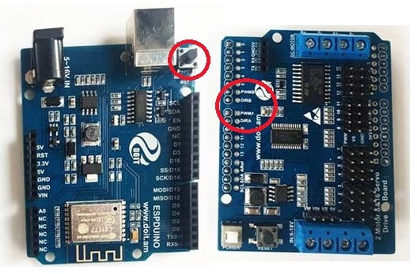
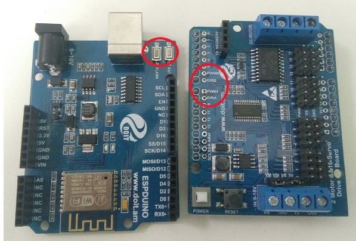
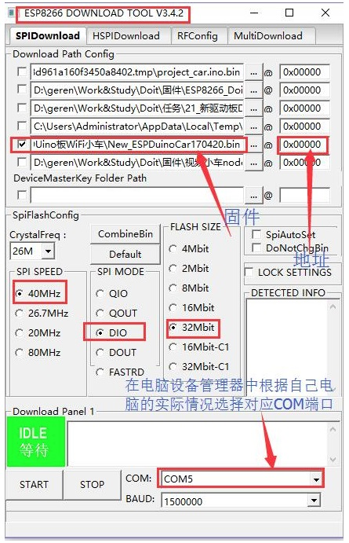

  User Manual for ESPduino Controller 

 from SZDOIT 

## Introduction

ESPduino is a compatible with Arduino UNO board, together with a motor and/or servo shield, then a smart car chassis is developed.

ESPduino can be read at: https://gitnova.com/espduino/

2-Way motor and 16-way servo shield: https://gitnova.com/2-way-servo-arduino-uno-shield/

Apps download: https://gitnova.com/2-way-servo-arduino-uno-shield/

## Firmwares for this controller

**Different version is for the pins marked in the following pictures.**

### FOR V3 controller kit

download firmware FOR V3: [download](https://github.com/SmartArduino/DOITWiKi/blob/master/ESPDuinoCar_V3.bin)

### FOR V2 controller kit

download firmware FOR V2: [download](https://github.com/SmartArduino/DOITWiKi/blob/master/ESPDuinoCar_V2.bin)

### FOR V1 controller kit

download firmware FOR V1: [download](https://github.com/SmartArduino/DOITWiKi/blob/master/ESPDuinoCar_V1.bin)

## How to Download

Use [ESPFlashDownloadTool_v3.4.2.exe](https://github.com/SmartArduino/DOITWiKi/blob/master/flash_download_tool_v3.8.5.zip)  to download the bin file to the board, as the following picture.

## Source Code

source code: [download](https://github.com/SmartArduino/Doit_Cloud/tree/master/Doit_Wechat_Car/ESP8266%20Arduino%20Code)

## Contact Us

- E-mails: [yichone@doit.am](mailto:yichone@doit.am), [yichoneyi@163.com](mailto:yichoneyi@163.com)
- Skype: yichone
- WhatsApp:+86-18676662425
- Wechat: 18676662425