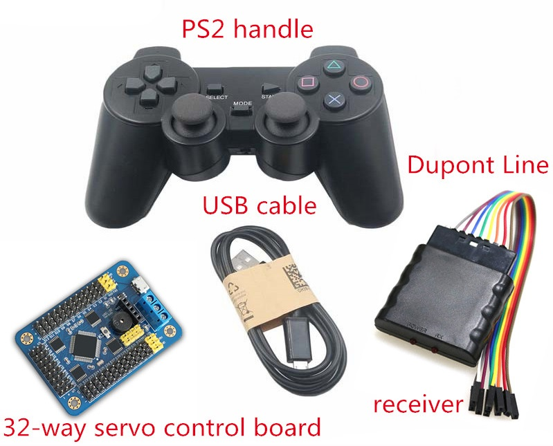
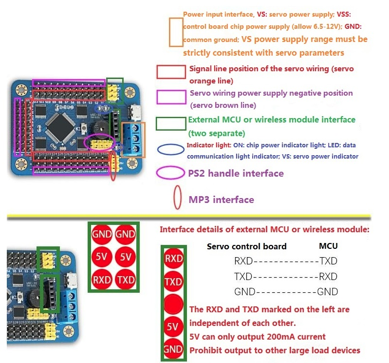
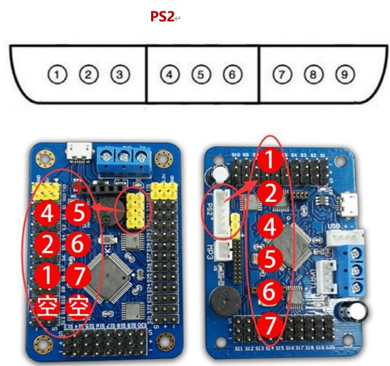
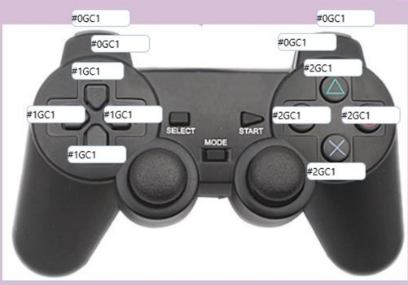

  User Manual for 32-way Servo Board with PS2 

 from SZDOIT 

## 32-channel servo board

### Features

- The hardware is redesigned and the signals are all isolated. (Hardware performance increased by 10 times)
- Rewrite the code all. (10 times more stable)
- The onboard 16M small U disk can store tens of thousands of action groups. (50 times improvement)
- An upgrade package is released every month, entering the era of flashing machines.
- Full support for PS2 joystick and 32-way servo control board.
- Support wifi wireless control (need to purchase wifi module).
- Computer, mobile software in simplified Chinese, traditional Chinese and English
- The biggest advantage of this product is: you can use computer software to control the robot, or control your servo. It can control 32 servos at the same time, with high precision (1us). It adopts a 32-bit CPU imported from the United States and integrates a USB communication interface inside.

### Characteristic

- Separate power supply for servo and control board, independent power supply
- Control channel: control 32 channels at the same time. (Steering gear speed is adjustable)
- Communication input: USB or serial port (TTL)
- Signal output: PWM (accuracy 0.5us).
- Servo drive resolution: 0.5us, 0.045 degrees.
- Baud rate range: 9600 19200 38400 57600 115200 128000.
- Supported servos: Futaba, Hitec, Fraser, Spring, etc. More than 98% of the servos on the market
- PCB size: 63.5mm × 43.5mm.
- Mounting hole spacing: 55 * 35.5mm.
- Storage space: 16M U disk on board.

### Mode description:

- USB connection mode: plug in the computer and control through the host computer.
- UART connection mode: Send command control through other TTL serial level devices, such as Bluetooth, WIFI, MCU, etc. Instructions such as: "# 1P1500 # 2P1000T3000 \\ r \\ n", instructions such as: "G1 \\ r \\ n"
  Offline operation mode: It will be executed automatically upon power-on.
- PS2 wireless remote control mode: Connect the power supply and connect the PS2 wireless remote control receiver to wirelessly control. (PS2 remote control can support single servo remote control, or 20 action group remote control)

## Instructions for PS2 controller

Connect the receiver of the PS2 joystick and the servo control board with 6 DuPont wires as shown in the figure below.
 Look at the side of the handle receiver, the top is large, the bottom is small, the following shape, 9 pins, as long as the first, second, fourth, fifth, sixth, seventh
 Just fine.

In the picture above, connect the first foot on the handle receiver. . . . And so on.

If the power supply is normal after connecting, both lights on the handle receiver will be on.

Configuration handle:

Open the ROBOIDE computer software, the top menu of the software, tools-PS2 controller.

Then enter the action group command that the key needs to execute in the input box near the right PS2 handle button. (Format: # 1GC1, 1G is the first action group, C1 is executed once in a loop) 

After setting, press “OK” to confirm the setting. Then restart the servo control board (power on the servo control board again) and then you can With the buttons of the handle to control the action group.

Remarks:

1. After the handle receiver and the control board are connected normally, if the power supply is normal, the indicator light on the handle receiver will be all on, such as If it is blinking, you need to check whether the handle is powered or whether the power switch is turned on. 
2. The handle has a sleep function. If the indicator light on the handle is completely off, it may be sleeping, you can press the handle START button

## Contact Us

- E-mails: [yichone@doit.am](mailto:yichone@doit.am), [yichoneyi@163.com](mailto:yichoneyi@163.com)
- Skype: yichone
- WhatsApp:+86-18676662425
- Wechat: 18676662425