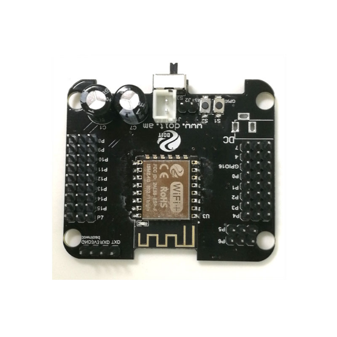
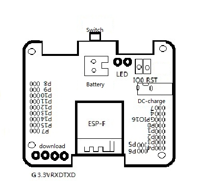
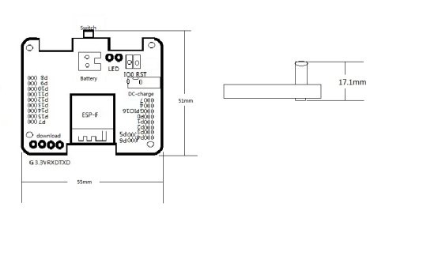

 18DOF VIVI Robot Control Board

 From SZDOIT

## 1.Product Introduction:

ViVi humanoid robot control board is development  based on our esp-f WiFi module, which leads to TTL pin, EN and STATE key. The product can be built in the latest version of our company's humanoid robot firmware, it can complete the data real-time transmission of equipment TTL port to WiFi/cloud, which with Low power consumption control, power status indicator and other functions. This module can directly replace the original wire serial port and realize the data transmission and control of embedded devices.

 

## Product Features:

l Fully compatible with the original wifi transmission module electrical interface and physical interface;	

l The robot firmware is reliable and stable, supports WEB interface configuration download, graphic action download programming;	

l Based on esp-f high performance WiFi module, the overall size: 24mm16mm3mm;	

l Power supply voltage: 4.5 V ~ 6.4 V, TTL voltage: 3.3 V;	

l Lead pin: 3.3 V, TXD, RXD, GND;	

l Average current: 80mA; the maximum operating current when sending the wifi data: 3000mA;	

l Support serial AT instruction;	

l Support reprogrammable, OTA firmware upgrade;	

l Real-time seamless transmission of serial port and WiFi data;	

l Built-in HTTP Web Server, supporting the Web page configuration of various parameters;	

l WiFi supports three modes: AP, STA, AP + STA;	

l Support the WiFi STA mode to reconnect, the TCP Client mode to reconnect;	

l Serial port support to set baud rate, data bit, parity check, stop bit, subcontract time;	

l Support baud rate (BPS): 300/600/1200/2400/4800/9600/19200/38400/57600/74800/115200/230400/460800/921600/1843200/3686400；	

l Operating temperature range: - 40 ℃ - 125 ℃;	

## 2. Interface definition:

Product interface definition shown in the following figure:

 

Modules button and the LED light function:

| No.  | Type | Function description                                         |
| ---- | ---- | ------------------------------------------------------------ |
| 1    | LED  | The power led                                                |
| 2    | S1   | connect WiFi module GPIO0 pin, with the SW2 button to complete the firmware download, |
| 3    | S2   | Connect module the RST pin, with the SW1 button to complete the firmware download. |

 

Note: when the firmware is downloaded, press the S1 button first, then press S2 button, then release to complete the download.(See our ESP-F module)

Product PIN definition shown in the following table:

| No.  | Pin Name    | Type | Function description                           |
| ---- | ----------- | ---- | ---------------------------------------------- |
| 1    | P0-P16, 4,7 | PWM  | Output PWM control servo action                |
| 2    | RXD         | I/O  | UART RXD when used as programming Flash;       |
| 3    | TXD         | I/O  | UART TXD when used as programming Flash;       |
| 4    | GND         | P    | GND                                            |
| 5    | VCC         | P    | Module power supply : 2.8-3.6V, recommend 3.3V |

## 3. Size

 

 

## 4. Electrical parameters:

| DC charging       | Use battery charger 6.4V, Trickle up           |
| ----------------- | ---------------------------------------------- |
| Battery           | 4.8V-6.4V, suggest to use Ni-MH battery        |
| Servo access end  | 4.8V-6.4V                                      |
| Start current     | The instantaneous current is as high as 5000mA |
| Quiescent current | 180mA~210mA                                    |

Note: Robots are not controlled when power supply is shortage, it is normal to have slight shaking in the shoulder during the movement.

## Contact Us

- E-mails: [yichone@doit.am](mailto:yichone@doit.am), [yichoneyi@163.com](mailto:yichoneyi@163.com)
- Skype: yichone
- WhatsApp:+86-18676662425
- Wechat: 18676662425