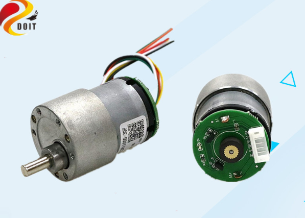
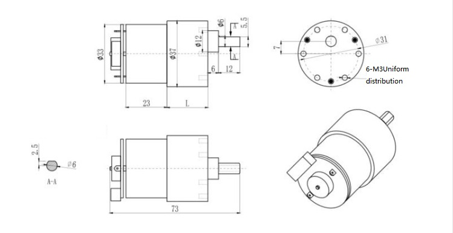
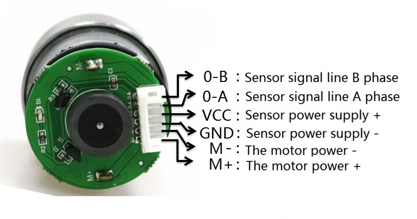

<center><font size=10> DT37GB-520 DC Deceleration Motor With High Torque </font></center>
<center> from SZDOIT</center>

## 1. Introduction

​        The 37-520 motor comes with a high-precision magnetic encoder, matched with a Hall encoder, which has the characteristics of high precision and strong anti-interference ability. It is the best choice for DIY balance carts.



##  2. Motor Parameters:

- The Motor Type: Permanent magnet has a brush
- Output rate: 360 ± 10% rpm
- Reduction Ratio: 1 : 30
- Rated Voltage: 12 V
- Rated Current: 400 mA
- Rated Power:  4.8 W
- Rated Torque: 1.0 kgf.cm
- Locked-rotor Current: 2.8A
- Locked-rotor Torque: 10 kgf.cpm
- Weight: 145g



## 3. Encoder Parameters:

- Type: AB term incremental Hall encoder
- Line Speed:  390(Measurement of reducer output shaft)
- Rated Voltage: 5V
- Interface Type: PH2.0
- Features: Its own pull-up plastic, support STM/51/Arduino and other SCM directly read




## 4. How to Test the Motor

​    There are two methods.

### 4.1 Use Oscilloscope

​	When power on the motor, and connect to the Hall sensor of motor, you will see the following wave. This way is very simple.


### 4.2 Use Arduino

#### 4.2.1 Connect to UNO


#### 4.2.2 Test Code

```
/*
 * How to test encoder with Arduino
 * url: http://osoyoo.com/?p=30267
 */
 #define outputA 6
 #define outputB 7
 int counter = 0; 
 int aState;
 int aLastState;  
 void setup() { 
   pinMode (outputA,INPUT);
   pinMode (outputB,INPUT);
   
   Serial.begin (9600);
   // Reads the initial state of the outputA
   aLastState = digitalRead(outputA);   
 } 
 void loop() { 
   aState = digitalRead(outputA); // Reads the "current" state of the outputA
   // If the previous and the current state of the outputA are different, that means a Pulse has occured
   if (aState != aLastState){     
     // If the outputB state is different to the outputA state, that means the encoder is rotating clockwise
     if (digitalRead(outputB) != aState) { 
       counter ++;
     } else {
       counter --;
     }
     Serial.print("Position: ");
     Serial.println(counter);
   } 
   aLastState = aState; // Updates the previous state of the outputA with the current state
 }

```

From the monitor, you can see the output data.

**Very important, when you install the motor to the car chassis, Please choose the M3*6 screw to fix the motor. By our experience, if you choose the screw is too long, the motor would be stalled, and cannot be run.**


## 5. Frequently asked Questions

**Q: What range is this motor used in**

**A:**As long as the **size, voltage, speed and torque** of the motor can meet your requirements, this product can be used in any mechanical automation equipment

**Q:Can this type of motor adjust speed**

**A:**Can adjust the speed, but the motor speed can **only be reduced not adjustable high**, such as you buy the motor is 100 RPM, so only can be adjusted between 0~100, **the lower the speed of the motor torque**

**Q: Can this motor be forward and reverse**

**A:** Yes , if the positive pole of the power supply is connected to the M+ of the motor and the negative pole is connected to the M- of the motor, the motor is rotating in the forward direction, and the positive pole of the power supply is connected to the M+ of the motor. The M- and negative poles of the motor are connected to the M+ of the motor, and the motor will reverse.


## Contact Us

- E-mails: [yichone@doit.am](mailto:yichone@doit.am), [yichoneyi@163.com](mailto:yichoneyi@163.com)
- Skype: yichone
- WhatsApp:+86-18676662425
- Wechat: 18676662425