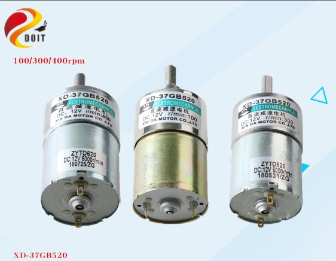
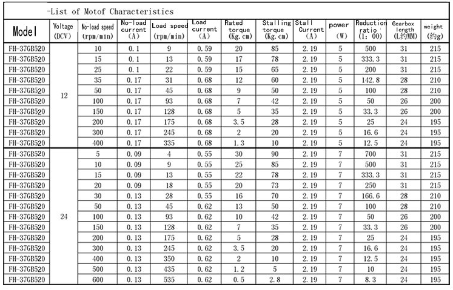
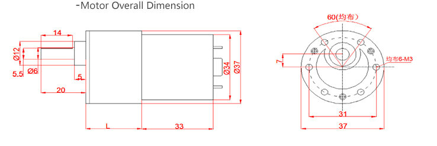
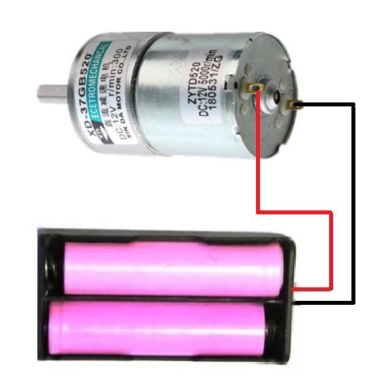
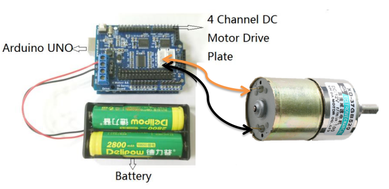
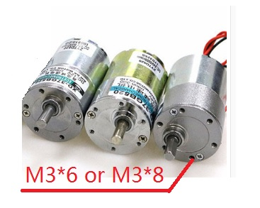

<center><font size=10> XD-37GB520 Brush-DC High-power Motor </font></center>
<center> from SZDOIT</center>

# 1. Introduction

​		Xd-37gb520 is a high-power brush motor, output torque up to 55kGF.cm, support positive and negative rotation and speed regulation, very suitable for outdoor DIY products.



#  2. Motor Parameters:

- Brand: Letter Da Motor
- Rated Voltage: 12 V
- Weight: 280 g





# 3. How to Test the Motor

​    There are two methods.

## 3.1 Direct Use of Power

​	This method is very simple, that is, directly connect the 12V power supply to the motor, but the disadvantage is that it cannot adjust speed and manually switch the power supply to adjust the positive and negative rotation of the motor



## 3.2 Use Arduino + 4 Channel DC Motor Drive Board

### 3.2.1 Connect to Drive Board



### 3.2.2 Test Code

```
#define PWMA 9
#define DIRA 8
int speed = 100;   //The speed ranges from 0 to 255, with 255 being the fastest

void setup()
{
	Serial.begin(9600);
	delay(200);
	pinMode(PWMA, OUTPUT);
	pinMode(DIRA, OUTPUR);
	analogWrite(PWMA, speed);
}
void loop()
{
	digitalWrite(DIRA, HIGH);  //forward
	delay(10000);              //10s
	digitalWrite(DIRA, LOW);   //back
	delay(10000);              //10s
}
```

**Very important, when you install the motor to the car chassis, Please choose the M3x6 or M3x8 screw to fix the motor. By our experience, if you choose the screw is too long, the motor would be stalled, and cannot be run.**



# 4. Frequently Asked Questions

**Q: What range is this motor used in**

A: As long as the **size, voltage, speed and torque** of the motor can meet your requirements, this product can be used in any mechanical automation equipment

**Q:Can this type of motor adjust speed**

A:Can adjust the speed, but the motor speed can **only be reduced not adjustable high**, such as you buy the motor is 100 RPM, so only can be adjusted between 0~100, **the lower the speed of the motor torque**

**Q: Can this motor be forward and reverse**

A: Yes , if the positive pole of the power supply is connected to the M+ of the motor and the negative pole is connected to the M- of the motor, the motor is rotating in the forward direction, and the positive pole of the power supply is connected to the M+ of the motor. The M- and negative poles of the motor are connected to the M+ of the motor, and the motor will reverse.


# 5.Contact Us

- E-mails: [yichone@doit.am](mailto:yichone@doit.am), [yichoneyi@163.com](mailto:yichoneyi@163.com)
- Skype: yichone
- WhatsApp:+86-18676662425
- Wechat: 18676662425