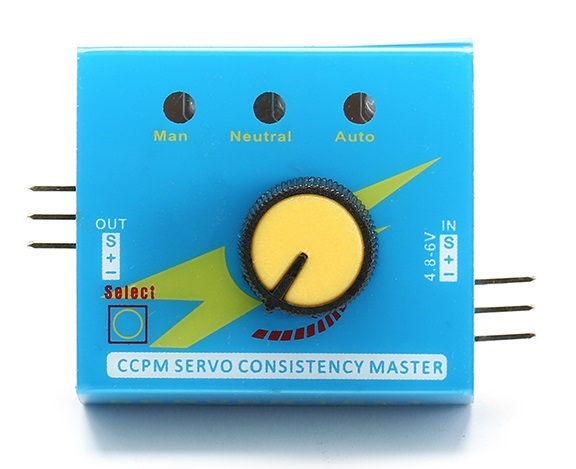
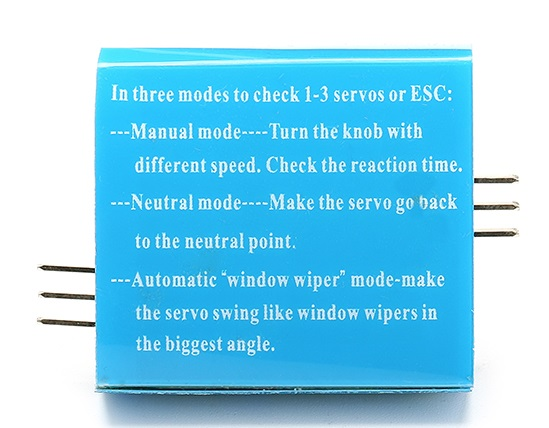
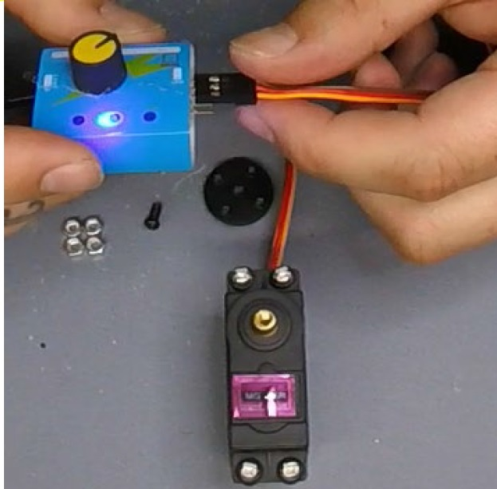
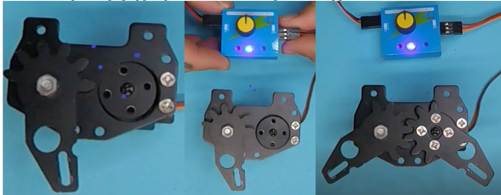

  User Manual for Servo Tester 

 from SZDOIT 

# Introduction

The device also can be used as a signal generator for electric speed controller (ESC), then you can test your motor system without using a transmitter and receiver.

# Three Modes

- There are 3 modes to check servos or ESC:
  Manual mode: turn the knob with different speed, check the reaction time.
- Neutral mode: make the servo go back to the neutral point.
- Automatic "window wiper" mode: make the servo swing like a window wipers in the biggest angle.

It can connect 1-3 servos simultaneously and test such as 1-3 servos consistency and so on. You can also connect 1-3 ESC to test and compare their reaction time respectively. It can connect 3 servos of the CCPM helicopters and select servos.
It can also connect the servo of airplanes install the steering-box and adjust planes by using such as the neutral mode and so on.

# Paramters

- Item Name: Servo Tester
- Size: 46x32x17mm
- Weight: 8g
- Color: Blue
- Input: DC 4.2 to 6.0V
- Output: <15mA (5.0)
- Output signal: 1.5ms±0.5ms
- Adjustment Methods: Manual, Neutral, Automatic.

# Usage

  

Connect the power supply from the right single row of pins, the three blue lights will be on at the same time, and then the left most light will be on. At this time, you can select three modes through the mode "**selection**" button. When the left most light is on, it is the manual adjustment mode, and you can directly use the potentiometer (and adjustment knob) to control the rotation of the steering gear; then press Press the key, the middle light will be on, at this time, it is the return to middle test; press the key again, the right most light will be on, it is the automatic test, the steering gear will rotate continuously, and then rotate reversely after it is stuck, and cycle in turn. The connection method of the test electric adjustment is the same as that of the steering gear. When testing the motor, you need to connect the electric adjustment first. The methods are all in accordance with the above steps.

**Very import!! Before installing the robot bracket, please make sure that let the servo at center by using this servo tester.**

# Contact Us

- E-mails: [yichone@doit.am](mailto:yichone@doit.am), [yichoneyi@163.com](mailto:yichoneyi@163.com)
- Skype: yichone
- WhatsApp:+86-18676662425
- Wechat: 18676662425