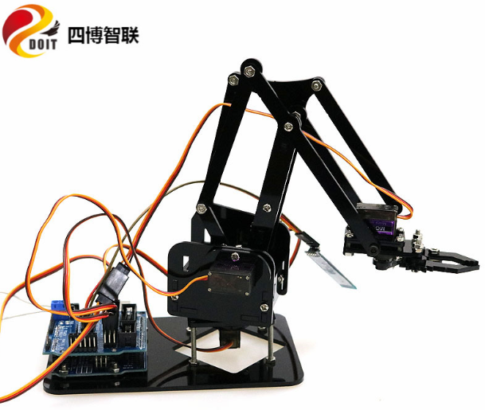

  Assembly of MeArm Mechanical Arm  

 from SZDOIT 

​    MeArm is currently the hottest desktop robot arm, and with the help of a DIY kit, it can not only take you into the maker world, but also develop your programming skills, suitable for students and the public to play. This document is a DIY step with 17 steps.

​    Note:The 180-degree steering gear is different from the ordinary motor and has a fixed Angle. Before shipment, all the steering gear has been in the state of 90°median. Please do not turn the steering gear Angle at will before installing the mechanical arm, otherwise the installation will fail! If you turn the steering gear before installation, please reset the steering gear according to the Angle.

## Step 1: Out of Box

|      |                   |
| ---- | ----------------- |
|      |  |

### Packaging List：

| Name | PM3*30mm screw | PM3*10mm screw | PM3*8mmscrew | PM3*6mm screw | PM3 nut | Single head M3*9 copper nut | servo |
| ---- | -------------- | -------------- | ------------ | ------------- | ------- | --------------------------- | ----- |
| QTY  | 4              | 12             | 15           | 15            | 16      | 7                           | 4     |

### Control The Suite:

 Arduino UNO R3             x 1

 4 Motor && 16 Servo Board  x 1

## Step 2: Base

Necessary screws:

1) 30 mm x 4        Cooper Pillar x 8

2) Single head the pillars x 4

 

 

 

 

## Step 3: First Servo

As the first figure, please choose the servo with the longest axis. Please pay special care in each servo installation because servo can only rotate 180 degrees instead of 360 degrees.

Necessary screws:

1) 8mm x 2

 

 

 

 

## Step 4: Left Arm

Please attach the stick and rotate the servo clockwise until it stops. Then fix the stick as the last fourth figure. Necessary screws:

1) 12mm x 3

2) 8mm x 2

 

 

 

 

 

 

## Step 5: Right Arm

Please attach the stick and rotate the servo clockwise until it stops. Then fix the stick as the last figure. Necessary screws:

1) 10mm x 3

2) 8mm x 2

3) 6mm x 1

 

 

 

## Step 6: Left Arm + Chassis

Necessary screws:

1) 10mm x 2

2) 6mm x 1

 

 

 

 

## Step 7: Right Arm + Chassis

 

 

## Step 8: Middle Column

 

 

## Step 9: Merging With The Base

Please attach the chassis to the base, rotate the servo clockwise until it stops. Then fix the servo on the base as the last figure.

 

## Step 10: Branch 1

Necessary screws:

6mm x 2

 

 

## Step 11: Branch 2

The number of the branch is 2. Necessary screws:

1) 8mm x 1

2) 6mm x 2

	

## Step 12: Last Servo

Necessary screws:

8mm x 4

 

 

 

 

## Step 13: Gripper 1

Necessary screws:

1) 8mm x 1

2) 6mm x 3

 

 

## Step 14: Gripper 2

Rotate the servo clockwise until it stops and fix it as the last second figure. Rotate counterclockwise a little big to connect the stick and the gripper.

  10mm x1

 

 

## Step 15: Attach The Gripper

  8mm x2

  6mm x1

## Step 16: Add Control Board

Please pay attention to the color of 4 servo cables. Yellow color is adjacent to the arm. Coffee color is next to joystick.

## Contact Us

- E-mails: [yichone@doit.am](mailto:yichone@doit.am), [yichoneyi@163.com](mailto:yichoneyi@163.com)
- Skype: yichone
- WhatsApp:+86-18676662425
- Wechat: 18676662425