
  4DOF Mechanical Arm Installation Instructions  

 from SZDOIT 

Note: The 180-degree steering gear is different from ordinary motors and has a fixed angle. All the servos are in the 90-degree neutral state before shipment. Please do not rotate the servo angle at will before installing the robot arm, otherwise the installation will fail!

(If you accidentally turn the servo before installation, please reset the servo according to the angle.)

Screw package used for installation:

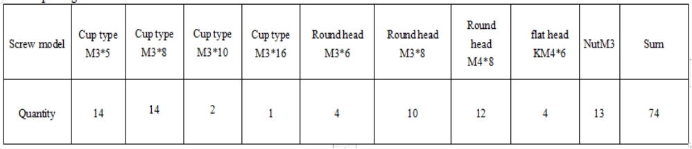

Other accessories

# 1. Rotating base installation

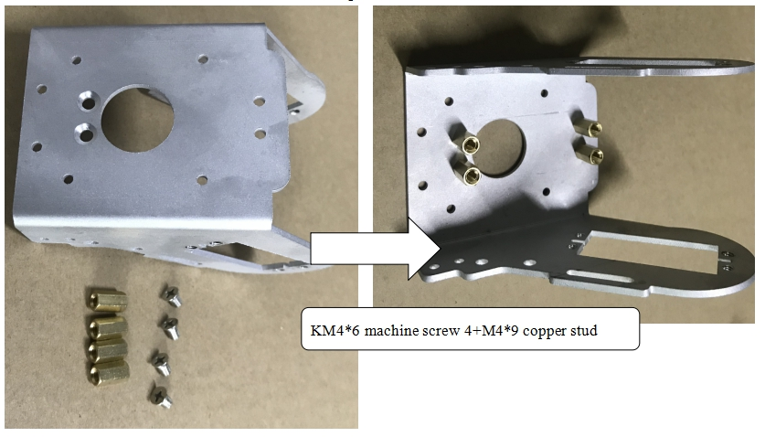

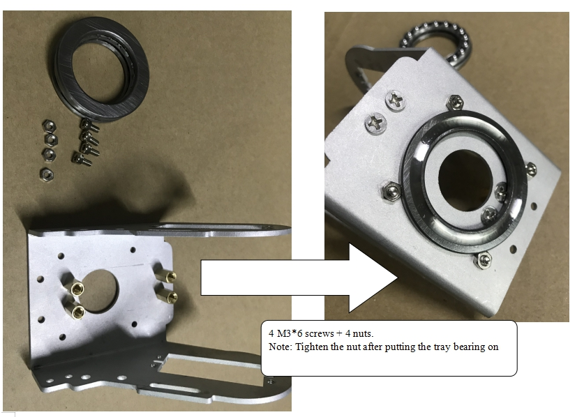

 

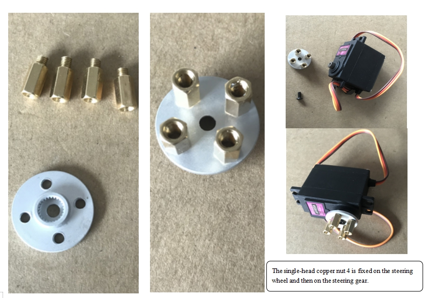 

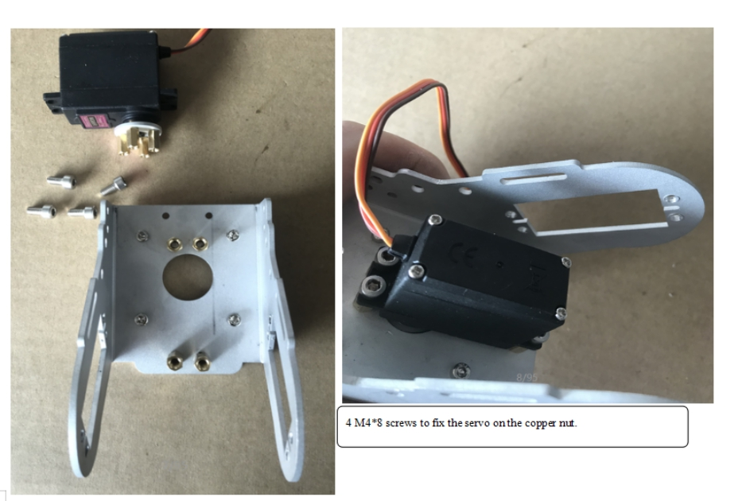

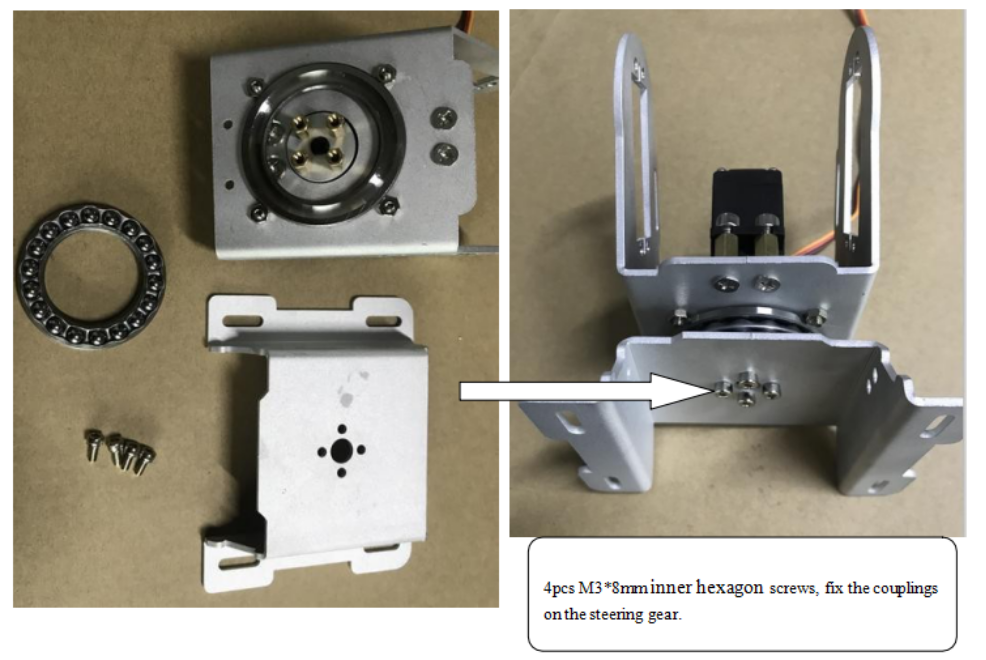

# 2. Install Arm

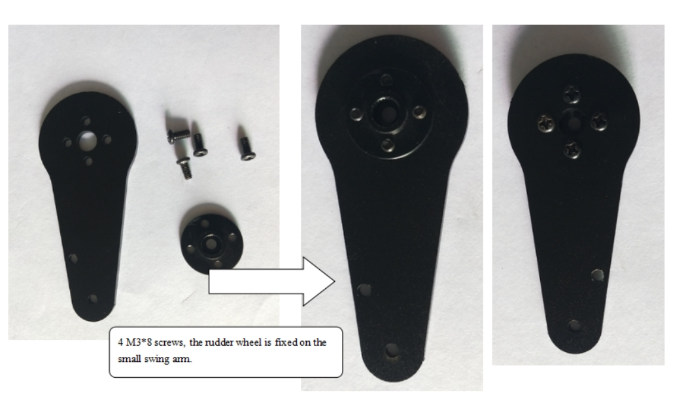 

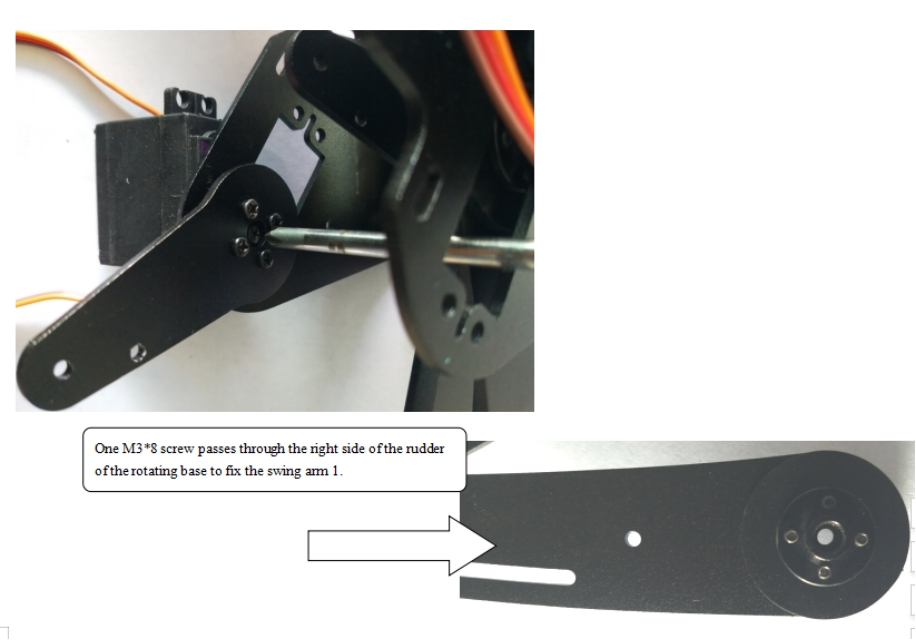

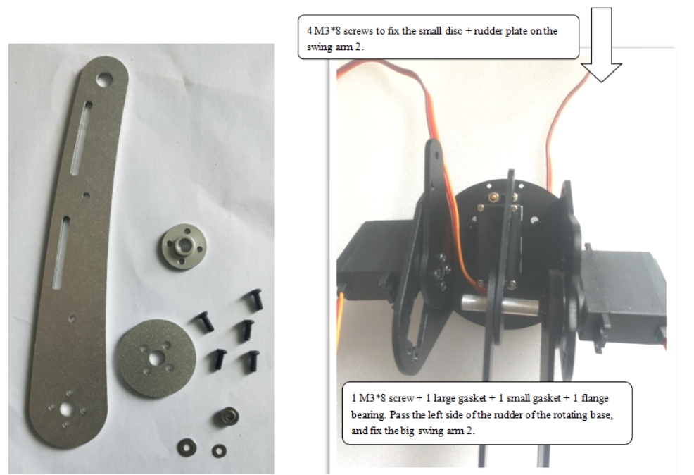 

 

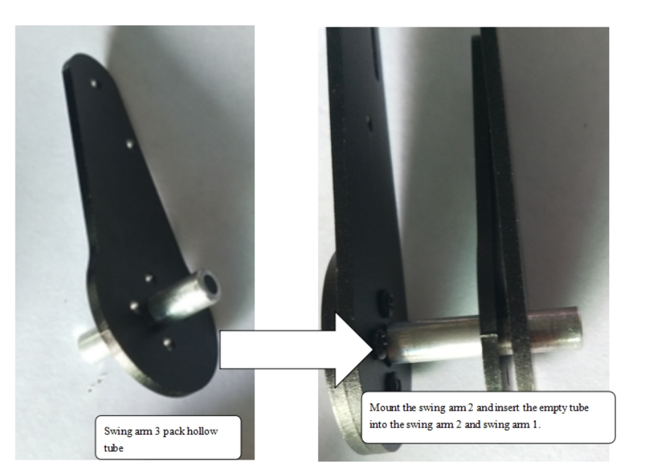

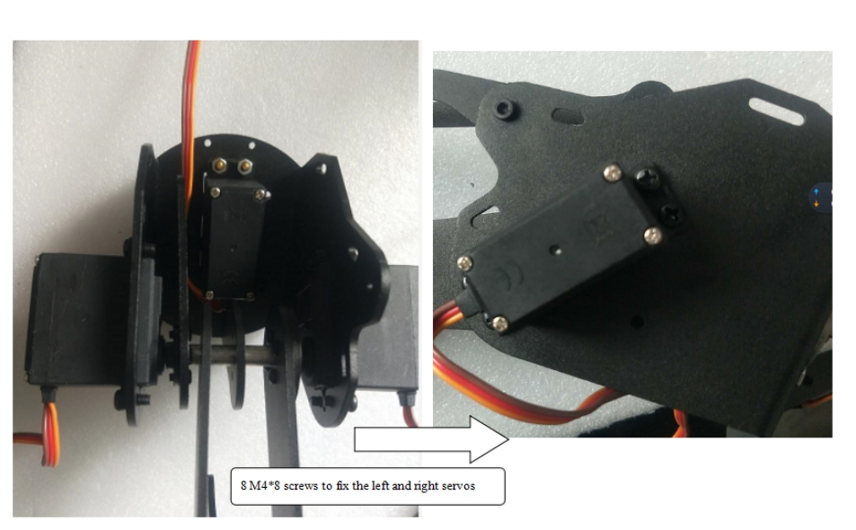 

# 3. Install The Beam

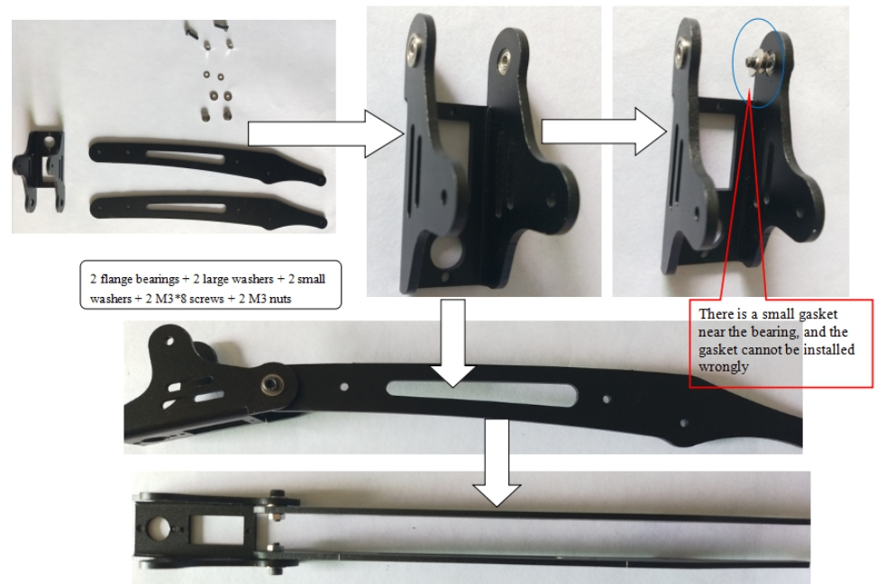 

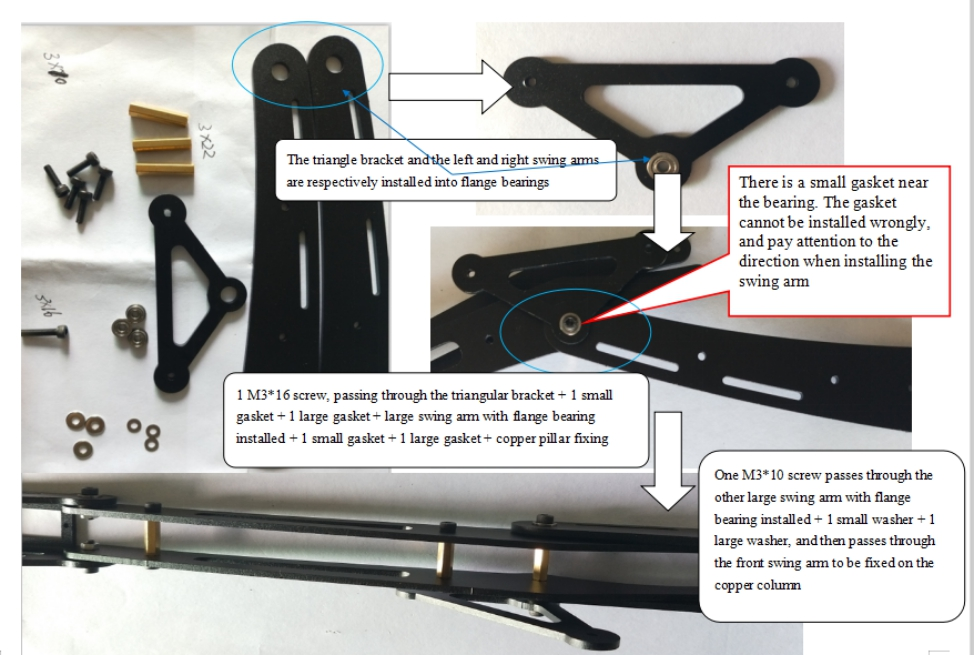 

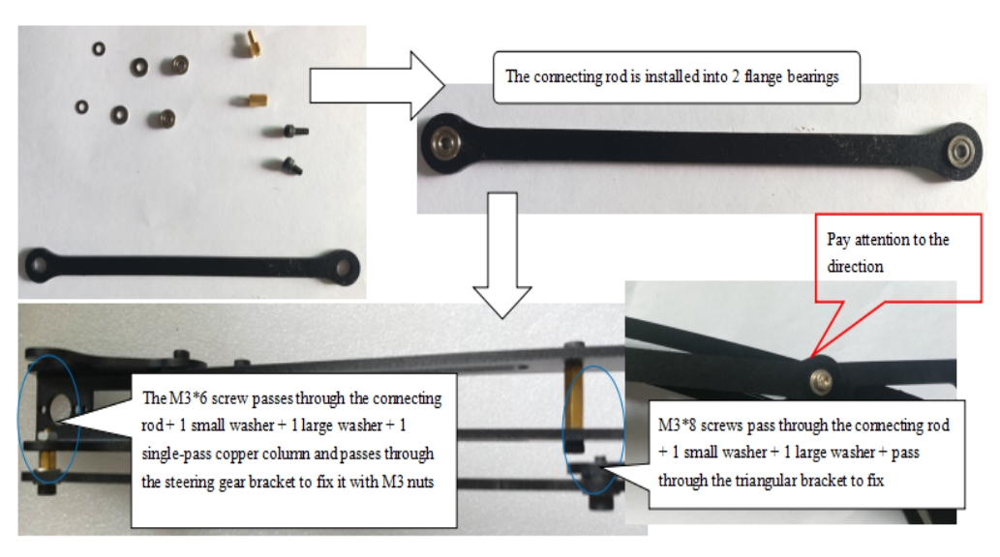 

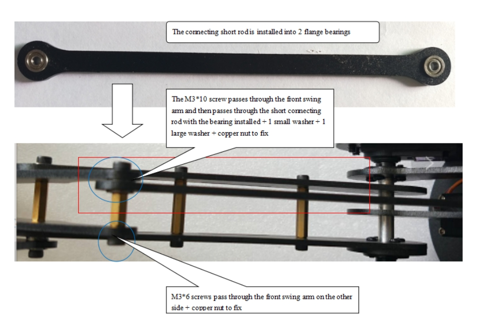 

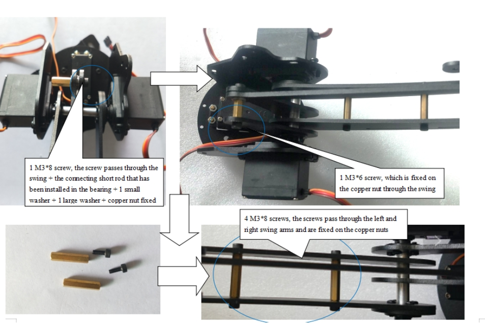 

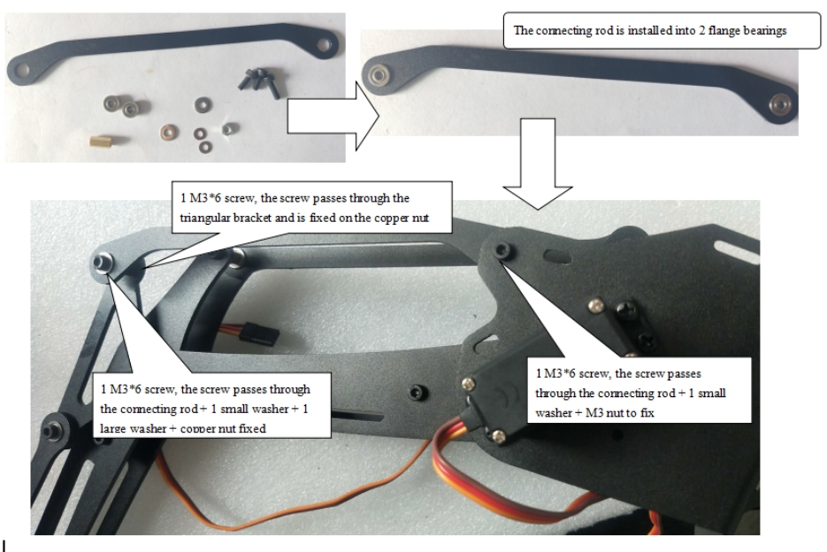 

# Contact Us
- E-mails: [yichone@doit.am](mailto:yichone@doit.am), [yichoneyi@163.com](mailto:yichoneyi@163.com)
- Skype: yichone
- WhatsApp:+86-18676662425
- Wechat: 18676662425

 

 