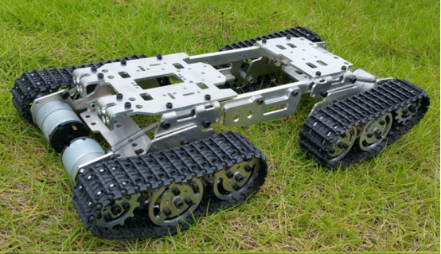
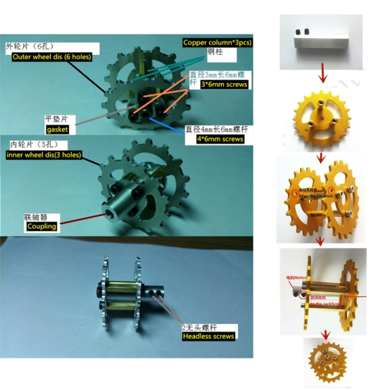
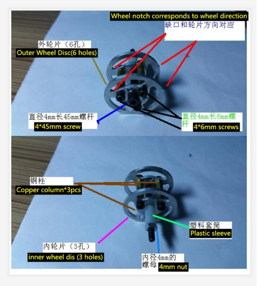
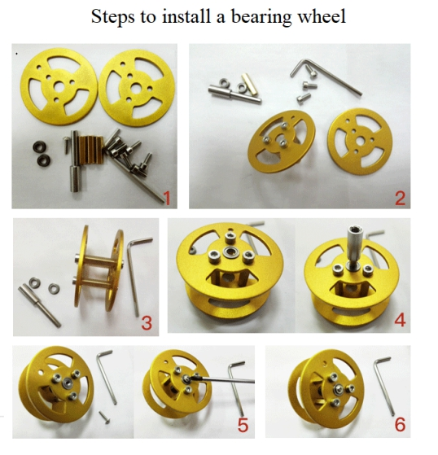
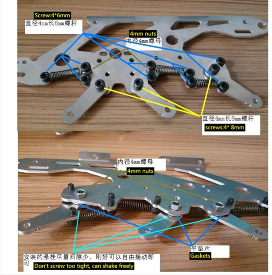
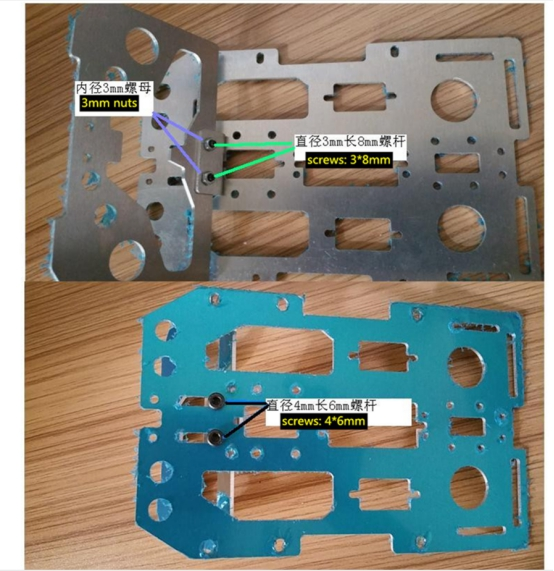
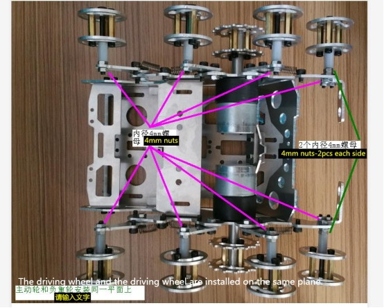
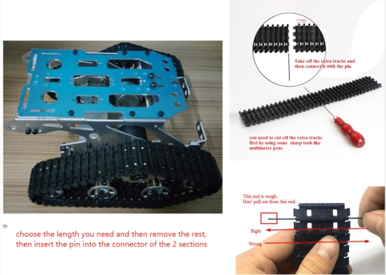

 Insatallation Manual For 4WD Shock Absorbing Tank Chassis 

 From SZDOIT

# Step 1 Install driving wheels

# Step 2 Install bearing wheels

 

 

# Step3 Install the side panel

 

# Step4. Install the upper panel

 

# Step5. Combine the upper panel and the side panels

 

# Step6. Install the wheels to the frame

 

# Step 7. Install the track.

 

# Support and Servers

My shop1:

https://www.aliexpress.com/item/32824314467.html?spm=2114.12010615.8148356.1.3efd4109XBQExS

My shop2:

https://www.aliexpress.com/item/32879608583.html?spm=2114.12010615.0.0.416d1cadSPEd3P&gps-id=pcStoreJustForYou&scm=1007.23125.137358.0&scm_id=1007.23125.137358.0&scm-url=1007.23125.137358.0&pvid=f3731fb5-3ba5-4349-af28-4705faf1cb1a

- E-mails: [yichone@doit.am](mailto:yichone@doit.am), [yichoneyi@163.com](mailto:yichoneyi@163.com)
- Skype: yichone
- WhatsApp:+86-18676662425
- Wechat: 18676662425