
 C101 Car Installation Instructions 

 From SZDOIT

# 1. Material list

 

| Name                     | Quantities |
| ------------------------ | ---------- |
| plate                    | 1          |
| TT motor                 | 4          |
| Black encoder            | 4          |
| wheel                    | 4          |
| Long M3 flat head screws | 8          |
| M3 nut                   | 8          |

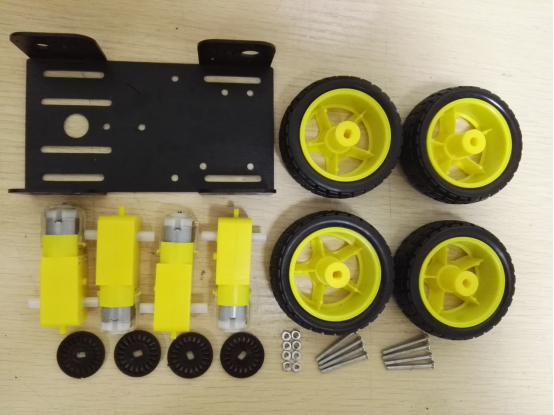 

# 2. Installation Process

1)Installed the black encoder into the tt motor

List:

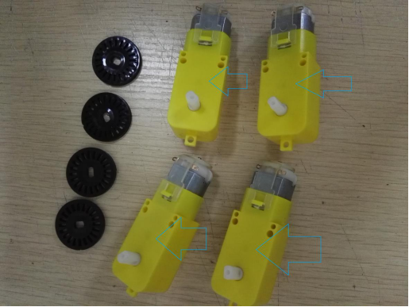 

Installation process:

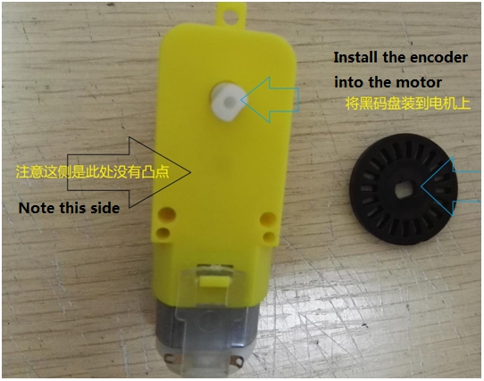 

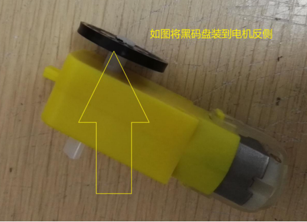 

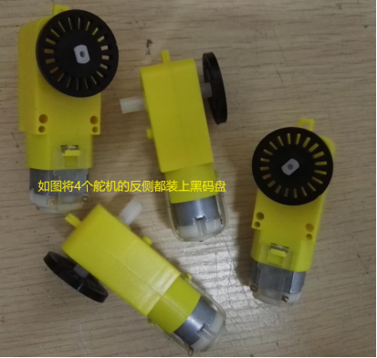 

2)The TT motor is mounted on the side side of the chassis

List:

 

Installation process:

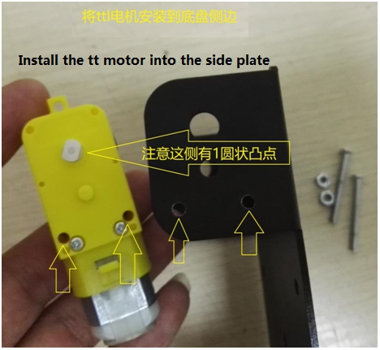 

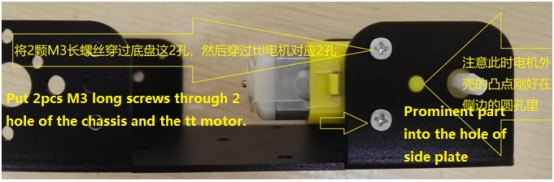 

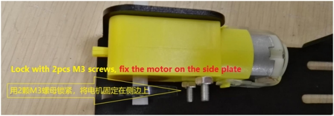 

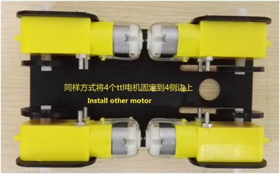 

3)Install the plastic wheels on motor

List:

 

Installation process:

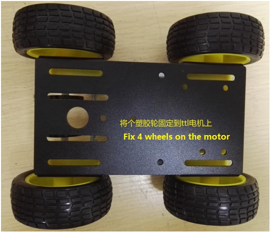 

# 3. Real Product

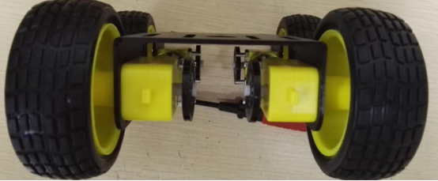 

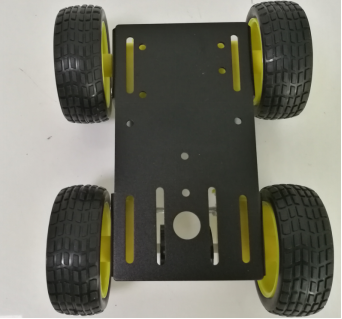 

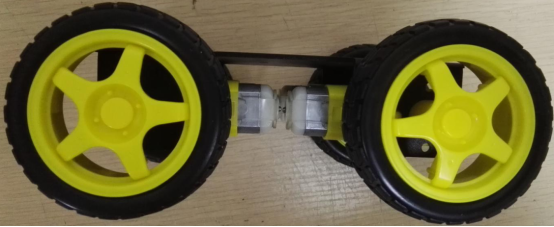 

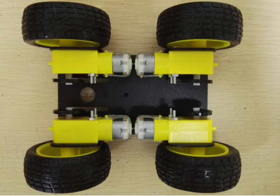 

# 4. Note: 

1). When installing, 8 screws should be tightened.

2). If the wheel is easy to fall off, it can be considered in the middle viscose treatment.

# Contact Us

- E-mails: [yichone@doit.am](mailto:yichone@doit.am), [yichoneyi@163.com](mailto:yichoneyi@163.com)
- Skype: yichone
- WhatsApp:+86-18676662425
- Wechat: 18676662425