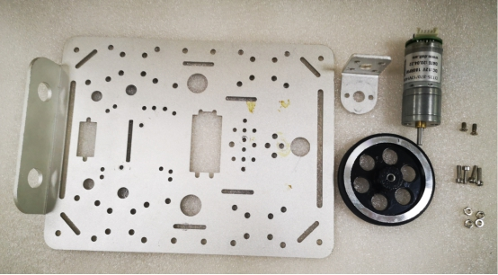
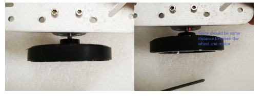
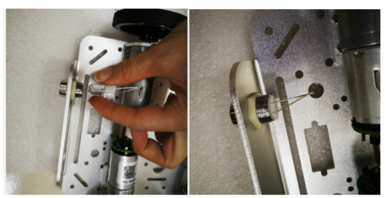

  C200 Trolley Installation  

 from SZDOIT 

## Instructions
 

Package List:

|        Name         | QTY  |           Name           | QTY  |
| :-----------------: | :--: | :----------------------: | :--: |
|        Panel        |  1   |          Motor           |  4   |
|    Motor bracket    |  4   |          Wheel           |  4   |
| M3 flat head screws | some | M4 hexagon socket screws | some |
|       M3 nuts       | some |         M4 nuts          | some |

 

## Installation Steps

### 1. Install Motors

#### 1.1Take Panel And Motor Bracket

 

#### 1.2 M4 Hexagon Socket Screws And Nuts To Tighten

 

 

#### 1.3 Take Motors

Tighten with M3 plathead screws

 

### 2. Install Wheels

#### 2.1 Take A Wheel. Use The Allen Key Provided By The Wheel Lo loosen The Top Wire

 

#### 2.2 Insert The Wheel To Motor

 

 

#### 2.3 Tighten The Top Wire

 

#### 2.4 The Left 3 Wheels Are The Aame Steps

 

### 3.Install LED Lights

 

 

 

 

 

 

## Finish!

 

 

## Contact Us

- E-mails: [yichone@doit.am](mailto:yichone@doit.am), [yichoneyi@163.com](mailto:yichoneyi@163.com)
- Skype: yichone
- WhatsApp:+86-18676662425
- Wechat: 18676662425