
 C300 Trolley Installation Instructions

 From SZDOIT

## 1. Materials preparation

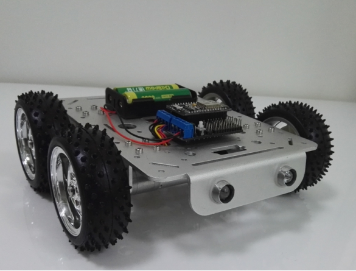

### (1)Materials List

| Name                    | Quantities | Name                | Quantities |
| ----------------------- | ---------- | ------------------- | ---------- |
| T200 tank chassis       | 1          | 18650 battery box   | 1          |
| Motor bracket           | 4          | M312 hexagon screws | 16         |
| 31Plastic wheel         | 4          | M3 nut              | 21         |
| 4mm hexagon coupling    | 4          | M3 flat head screws | 13         |
| 9V dc motor             | 4          | M3 top silk         | 8          |
| Motor wire              | 4          | Short M4 scews      | 4          |
| Nodemcu development kit | 1          | M36 support pillar  | 4          |
| Motor wire              | 4          | Hexagon             | 3          |

### (2)Items pictures

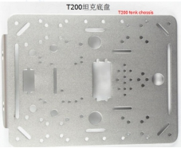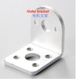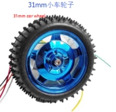 

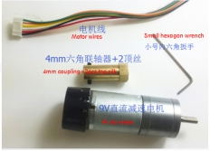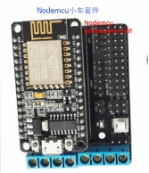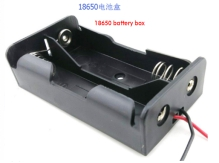 

## 2. Installation steps

### (1)Install the motor bracket

Materials：Car chassis1、Motor bracket4、M312 hexagon srews 16、M3 nut 16；

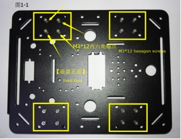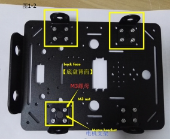 

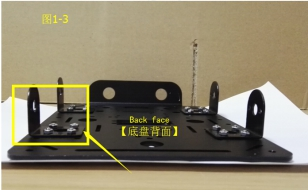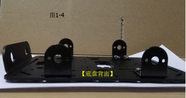 

### (2)Install the motor

Materials：Motor4、M3 Flat head screws 8；

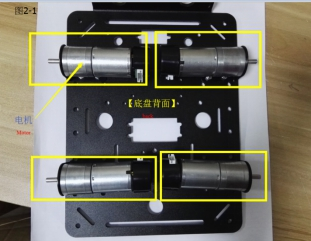 

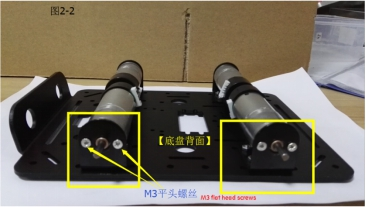 

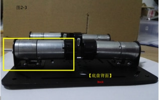 

### (3)Install the coupling

材料：4mm Hexagon coupling(long)4、M3 top silk 8；

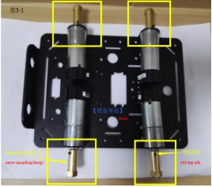 

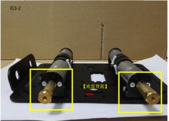 

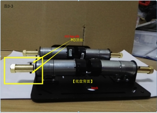 

### (4)Install the wheel

Materials：31mm wheel4、short M4 screws 4；

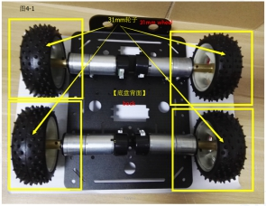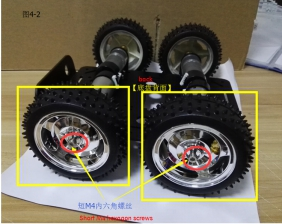 

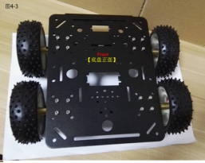 

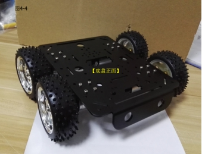 

### (5)Install the motor wires and control board

Materials：motor wires4、nodemcu development kit1、18650 battery box1；

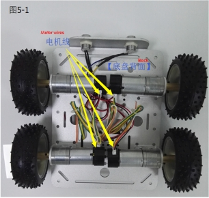 

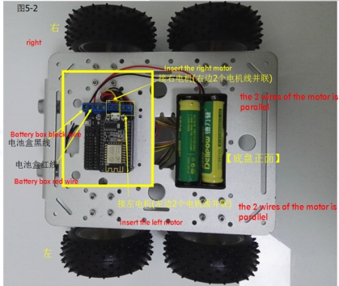 

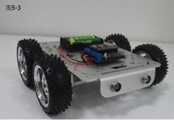 

 

## 3. Note

1. When the coupling is mounted to the motor, it is noticed that the distance is about 2mm from the distance of the motor bracket.

2. When installing the coupling, one of the small round holes in the coupling is transferred to the plane of the motor shaft, and then lock the m3 top silk, so that the installation is relatively firm.

3. The LED light of the car only have adornment effect, to be connected to the electricity,Please connect A 150 ohm resistor in one of each LED light, and then the two wires of each LED light are connected to A +, A- (or B +, B-) of the motor drive board., when the led light can be on or off when move.

## Contact Us

- E-mails: [yichone@doit.am](mailto:yichone@doit.am), [yichoneyi@163.com](mailto:yichoneyi@163.com)
- Skype: yichone
- WhatsApp:+86-18676662425
- Wechat: 18676662425