
 C4 4WD Smart Car Chassis Intallation Manual 

 From SZDOIT

## 1. Materials List

​       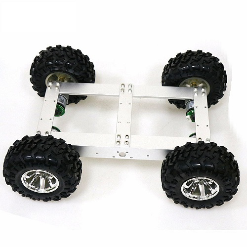

​      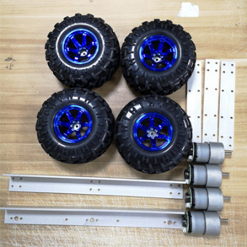

​        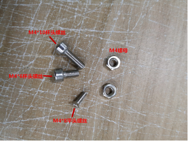

 

## 2. Installation Steps:

### 2.1 Install the frame:

1) Use the 1 long and short 2pcs bracket, fix it with screws and nuts as the picture showed.

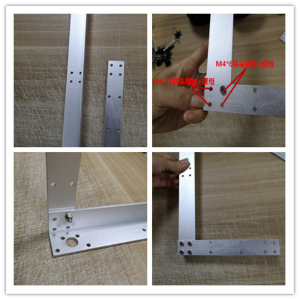 

 2) Install the bracket step by step, note: On arrow logo use the short M4 hexagon screws.

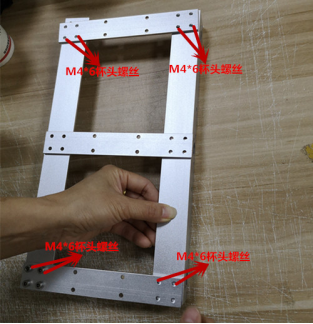 

### 2.2 Install the motor

1) Use the coupling and screws, lock the Jackscrews into the couplings.

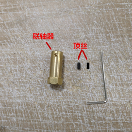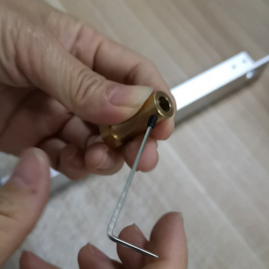 

2) Install the motor into the bracket, and lock it with M36mm flat head screws, and then install the coupling , lock the Jackscrews.

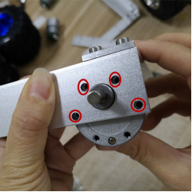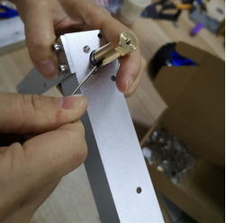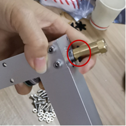 

### 2.3 Install the wheel

Install the wheel on the coupling, and lock it with M410mm hexagon screws. Install another wheel as the same way.

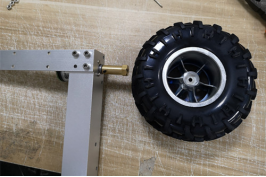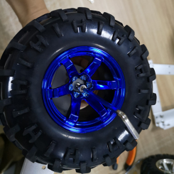 

## Contact Us

- E-mails: [yichone@doit.am](mailto:yichone@doit.am), [yichoneyi@163.com](mailto:yichoneyi@163.com)
- Skype: yichone
- WhatsApp:+86-18676662425
- Wechat: 18676662425