
 15DOF Humanoid Robot Installation Instructions 

 From SZDOIT

## 1. Preparation

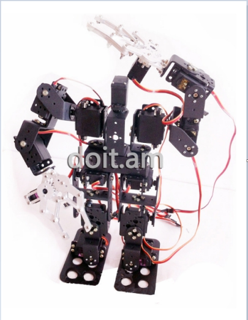

### 1.1 Bracekets

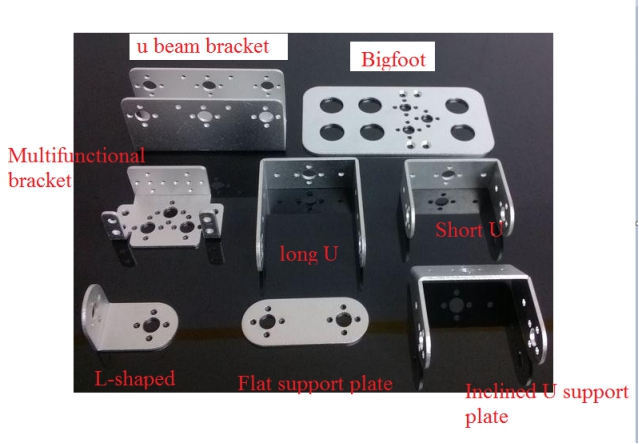 

### 1.2 Screws And Hardware&Accessories

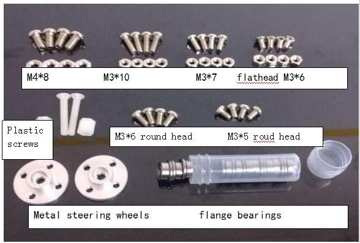

### 1.3 Installation Tools

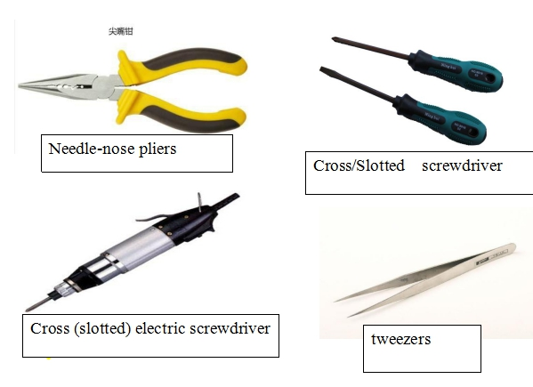 

 

 

## 2. Installation

Prepare the above-mentioned structural parts, hardware screw accessories and installation tools. Then we begin to install, first install the bracket structure of each part of the robot.

### 2.1 Installation of Robot Foot Structure

 

- Take 2 large feet, 2 multi-function brackets, 8 flat-head M3 x 6 screws, 8 M3 nuts, as shown in the figure

- During installation, the countersunk hole of the big foot is facing down, so that the screw cap can be buried in the countersink, to make the bottom is smooth.

- During installation, the multi-functional bracket is kept horizontal and aligned left and right, because the aperture is slightly larger, there is a certain amount of shaking

- The screws need to be tightened with needle-nose pliers to make the frame stable.

### 2.2 Install the robot ankle structure

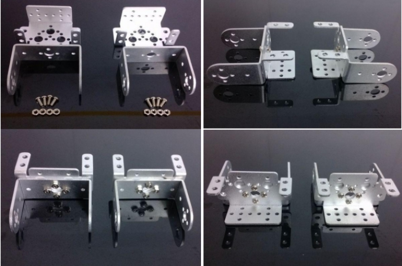 

- Take 2 multi-function brackets, 2 short U brackets, 8 round-head M3x 7 screws, 8 M3 nuts, as shown in the figure

- During installation, the screws are facing upwards and the nuts are facing downwards. Pay attention to the alignment of the multi-functional bracket and the short U bracket when connected.

- The screws must be fastened with needle-nose pliers after installation, to make the frame stable

### 2.3 Installation of Robot Lower Leg Structure 

 

- Take 2 inclined U brackets, 2 short U brackets, 8 round head M3  x7 screws, 8 M3 nuts, as shown in the figure

- Installation. During installation, the nut is on the inclined U, and the nut is on the short U. Pay attention to keep the inclined U bracket and the short U bracket connected.

- After alignment, the screws need to be tightened with needle-nose pliers to make the frame stable.

### 2.4 Installing robot straddle structure

 

- Take 2 long U brackets, 2 short U brackets, 8 round head M3 x7 screws, 8 M3 nuts, as shown in the figure

- installation. During installation, the screws pass through the inside of the short U bracket, and the nuts are fastened on the top of the long U bracket.

- The bracket is installed vertically and crosswise. The screws must be fastened with needle-nose pliers to achieve a stable structure.

### 2.5 Installing Robot Torso Structure

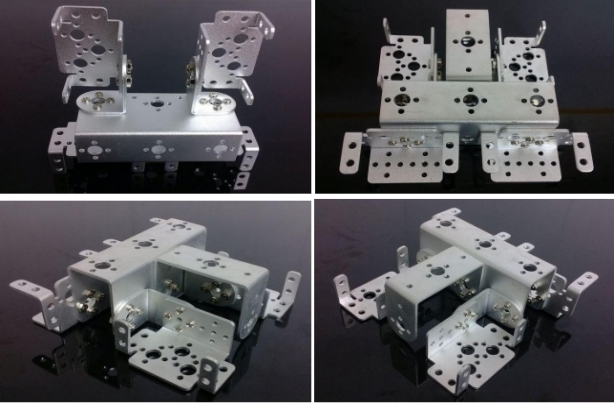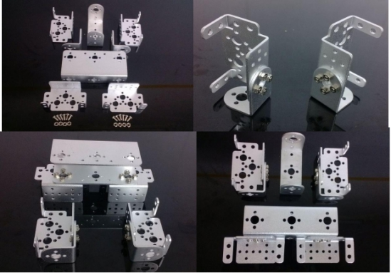 

- Take 4 multi-functional brackets, 1 short U bracket, 1 U-beam bracket, 2 L-brackets, round head M3x7 screws

- 28 M3 screws and 28 M3 nuts, install as shown.

- The robot's torso is mainly composed of double shoulders, double hips and neck braces.

- During the installation process, the screws are fixed from the inside to the outside, so as not to affect the installation of the servo. After the the  installation is finished, the screws need to be tightened with needle-nose pliers to make the frame stable. At the end of all installations, the bracket must be fixed The direction of the position is positive and not ske

### 2.6 Installation of Robot Arm Structure

 

- Take 2 multifunctional brackets, 2 long U brackets, 2 L brackets, 16 round head M3X7 screws, 16 M3 nuts, and install as shown in the figure.

- During the installation process, the screws are fixed from the inside to the outside, so as not to affect the installation of the servo. After the the  installation is finished, the screws need to be tightened with needle-nose pliers to make the frame stable. At the end of all installations, the bracket must be fixed The direction of the position is positive and not skewed.

### 2.7 Installation Of The Robot Wrist Structure

 

- Take 2pcs long multi-function brackets, 2pcs flat brackets, 8 pcsround-head M3X7 screws, and 8 pcsM3 nuts, and install them as shown in the figure. During the installation process, the screws pass through the inside of the multi-function bracket, and the nuts are fastened on the top of the in-line bracket.Need to fasten with needle-nose pliers

## 3. Install Robot Joints-steering Gear

Now we have completed the installation of the whole body structure of the robot, and then arrange them according to the form of the human body structure, as shown in the figure below; then, start to install the joints of each part.

Note:

All the servos are adjusted to the middle position by default (that is, the position of the left and right movement range of the servos). Before installing the servos, please do not rotate the servos. If it is  rotated accidentally, please adjust to the middle Position by using the host computer software to , or adjust to the middle position with a steering gear tester, the value of the middle position of the steering gear is 1500. The following uses digital steering gear as an example to illustrate the installation process.

### 3.1 Install The Robot Foot Servo

 

- Take 1 each of the left and right foot structure of the installed robot, 2 pcs servo steering gears, 2 pcs round head M3X10 screws, 8 pcs round head M4X8 screws, and 4 pcs M4 nuts.

- First, as shown in the figure, insert the M3X10 screw from the inside of the multi-function bracket and install it (This screw is used to install the flange bearing at the rear, so the screw must be installed before installing the steering gear)Note: The installation position of the M310 screw must be in the middle hole on the inner side of the multi-function bracket, keeping it on a horizontal line with the extended bearing of the steering gear.

- Use M48 screws and M4 nuts to fix the 4 corners of the steering gear and the multi-function bracket respectively. The screws need to be fastened with needle-nose pliers

### 3.2 Install the robot ankle servo

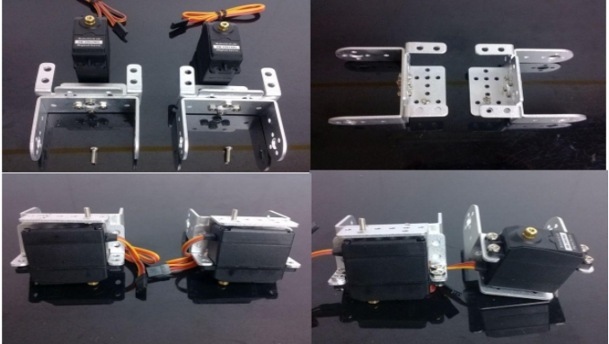 

- Take 1 each of the left and right ankle structures of the installed robot, 2 pcs servo steering gears, 2pcs round head M3X10 screws, 8pcs round head M4X8 screws, 4pcs M4 nuts

- First, as shown in the figure, insert the M3X10 screw from the inside of the multi-function bracket and install it (This screw is used to install the flange bearing at the rear, so the screw must be installed before installing the steering gear)Note: The installation position of the M3X10 screw must be in the middle hole on the inner side of the multi-function bracket, keeping it on a horizontal line with the extended bearing of the steering gear.

- Use M4X8 screws and M4 nuts to fix the 4 corners of the steering gear and the multi-function bracket respectively. The screws need to be fastened with needle-nose pliers

### 3.3 Install the robot leg servos

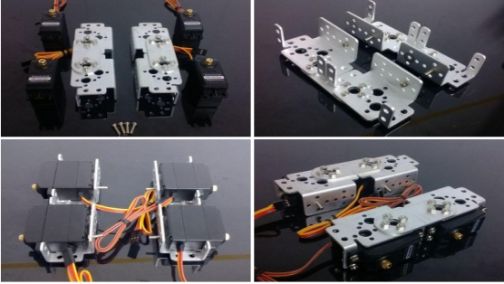 

- Take 1 each of the left and right thigh structure of the installed robot, 4pcs servo steering gears, 4 pcs round head M3X10 screws, 16 pcs round head M4X8 screws, and 16pcs  M4 nuts.

- First, as shown in the figure, insert the M3X10 screw from the inside of the multi-function bracket and install it (This screw is used to install the flange bearing at the rear, so the screw must be installed before installing the steering gear)Note: The installation position of the M310 screw must be in the middle hole on the inner side of the multi-function bracket, keeping it on a horizontal line with the extended bearing of the steering gear.

- Use M4X8 screws and M4 nuts to fix the 4 corners of the steering gear and the multi-function bracket respectively. The screws need to be fastened with needle-nose pliers

### 3.4 Install the Robot Bod Servos

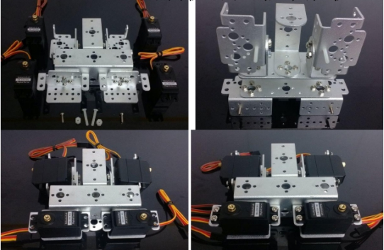 

- Take the installed robot torso structure, 4 pcs servo servos, 2 pcs round M3X10 screws, 16pcs  round head M4X8 screws, 16pcs  M4 nuts, 2 pcs nylon plastic flat head M3X20 screws, and 2 pcs plastic M3X6  studs

- First, as shown in the figure, insert the M3X10 screw from the inside of the multi-function bracket and install it (This screw is used to install the flange bearing at the rear, so the screw must be installed before installing the steering gear)Note: The installation position of the M3X10 screw must be in the middle hole on the inner side of the multi-function bracket, keeping it on a horizontal line with the extended bearing of the steering gear.

- Use M4X8 screws and M4 nuts to fix the 4 corners of the steering gear and the multi-function bracket respectively. The screws need to be fastened with needle-nose pliers

### 3.5 Install the Robot Arm Servos

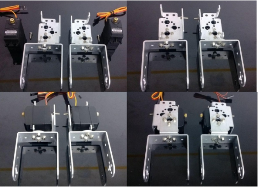 

- Take 1 each of the left and right arm structure of the installed robot, 2 servo steering gears, 2 round head M3X10 screws, 8 round head M4X8 screws, and 8 M4 nuts

- First, as shown in the figure, insert the M3X10 screw from the inside of the multi-function bracket and install it (This screw is used to install the flange bearing at the rear, so the screw must be installed before installing the steering gear)Note: The installation position of the M3X10 screw must be in the middle hole on the inner side of the multi-function bracket, keeping it on a horizontal line with the extended bearing of the steering gear.

- Use M4X8 screws and M4 nuts to fix the 4 corners of the steering gear and the multi-function bracket respectively. The screws need to be fastened with needle-nose pliers

### 3.6 Install The Wrist Servos

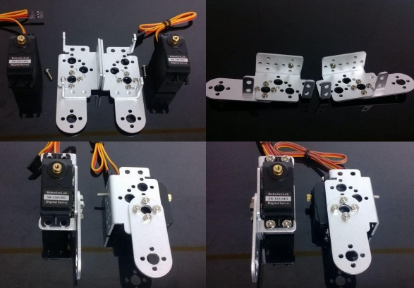 

- Take 1 each of the left and right wrist structures of the installed robot, 2 pcs servo servos, 2pcs round head M3X10 screws, 8pcs round head M4X8 screws, and 8pcs M4 nuts

- First, as shown in the figure, insert the M3X10 screw from the inside of the multi-function bracket and install it (This screw is used to install the flange bearing at the rear, so the screw must be installed before installing the steering gear)Note: The installation position of the M3X10 screw must be in the middle hole on the inner side of the multi-function bracket, keeping it on a horizontal line with the extended bearing of the steering gear.

- Use M4X8 screws and M4 nuts to fix the 4 corners of the steering gear and the multi-function bracket respectively. The screws need to be fastened with needle-nose pliers

## 4.  Connect parts of the robot

Now all parts of the robot have been installed, and what we need to do is connect the parts of the structure to assemble a complete body. As shown in the figure below, first arrange the structure of each part of the robot roughly so that you can understand the location of each part as a whole.

It should be noted that although the symmetrical structure of the robot looks like the same, it is actually different (because of the different positions of the mounting screws), so it cannot be used in general during installation. The structure on the left cannot be used for installation on the right, please know this

### 4.1 Connect the Robot Feet And Ankles

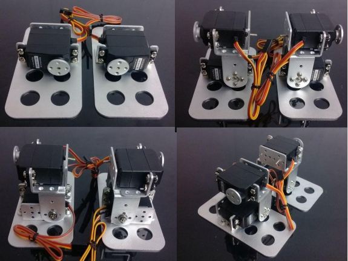 

- Take the installed robot foot and ankle structure, 4 pcs metal rudder discs, 8 pcs round head M3X5 screws, 2pcs round head M3X6 screws, 2 pcsM3 nuts, and 2 pcs flange bearings. Note: do not rotate the servos

- Put the parts together. Use 4pcs round head M3X5 screws to fix the front metal rudder wheel, and use 1pcs  round head M3X6 screw to fix the middle hole. At the  the back, install it with a flange bearing, and then tighten it with an M3 nut. The screws must be fastened with needle-nose pliers 

### 4.2 Connect Legs 1

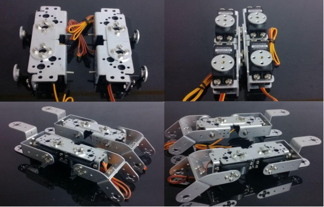 

- Take the installed robot thigh structure, calf structure and crotch joints, 4pcs metal rudder wheels, 16pcs round head M3X5 screws, 4pcs round head M3X6 screws, 4 pcs M3 nuts, and 4pcs flange bearings, Note: do not rotate the servos

- Put the parts together. Use 4pcs round head M3X5 screws to fix the front metal rudder wheel, and use 1pcs  round head M3X6 screw to fix the middle hole. At the  the back, install it with a flange bearing, and then tighten it with an M3 nut. The screws must be fastened with needle-nose pliers 

### 4.2 Connect Legs 2

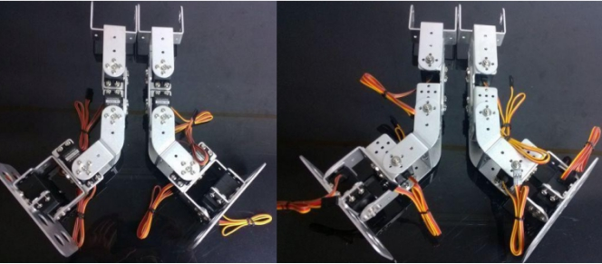

- Take the lower body mechanism of the robot installed in the previous two steps, 8 round head M3X5 screws, 2 round head M3X6 screws, 2 M3 nuts, and 2 flange bearings.

- Put the parts together. Use 4pcs round head M3X5 screws to fix the front metal rudder wheel, and use 1pcs  round head M3x6 screw to fix the middle hole. At the  the back, install it with a flange bearing, and then tighten it with an M3 nut. The screws must be fastened with needle-nose pliers 

#### 4.3 Connect the Arms

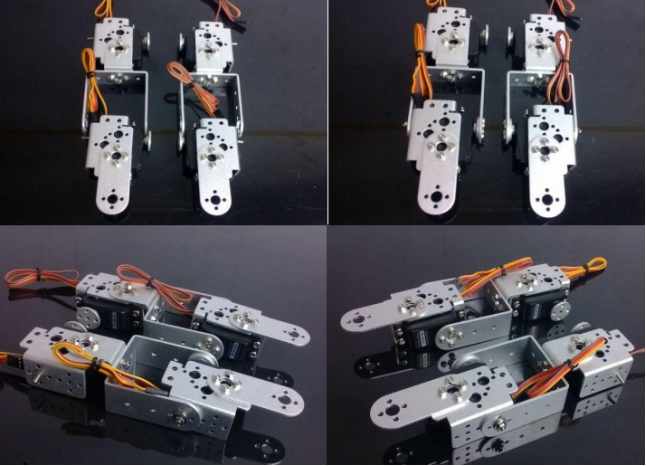 

- Take 1 each of the installed robot arm structure and wrist structure, 4 metal rudder wheels, 8 round head M3X5 screws, 2 round head M36 screws, 2 M3 nuts, and 2 flange bearings, such as Install as shown,Note: do not rotate the servos

- Put the parts together. Use 4pcs round head M3X5 screws to fix the front metal rudder wheel, and use 1pcs  round head M3X6 screw to fix the middle hole. At the  the back, install it with a flange bearing, and then tighten it with an M3 nut. The screws must be fastened with needle-nose pliers 

### 4.4 Connnect Head And Shoulders

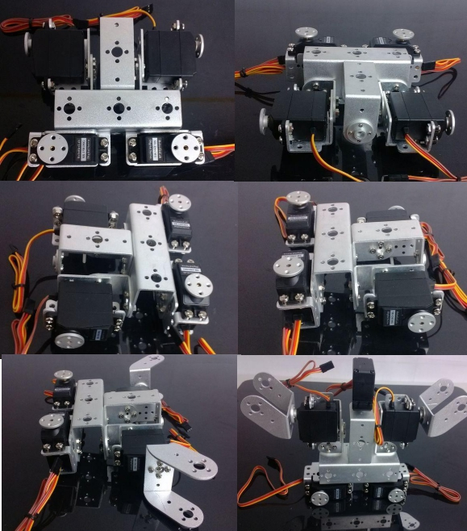 

- Take 1 robot torso, 2pcs  inclined U brackets, 1pcs steering gear, 5pcs metal steering wheels, 12pcs round head M3X5 screws, and 3pcs round head M3X6 screws, and install them as shown in the figure.

- Fix a metal rudder disc on the top of the torso; then, attach two oblique U-shaped supports

- The frame is fixed on the left and right shoulders of the robot's torso, 1 servo is fixed to the neck of the robot's torso, the front metal rudder wheel is fixed with 4pcs round head M3X5 screws on the four sides, and the middle hole is fixed with 1 round head M3 6 Fix with screws.

### 4.5 Connect The Upper Body Of The Robot

 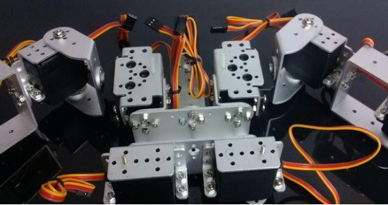

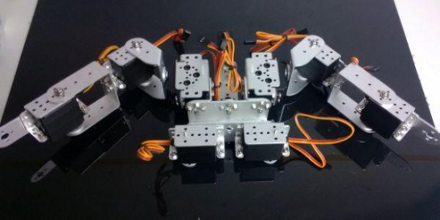

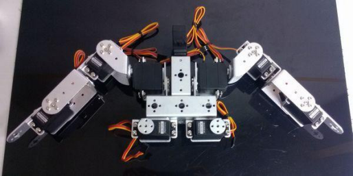

- Take the robot arm structure and body structure installed in the previous two steps, 8 round-head M3X5 screws, 2 round-head M3X6 screws, 2 M3 nuts, and 2 flange bearings, as shown in the figure Show installation. 

- Put the two  installed structures together, and  use 4pcs round head M3X5 screws to fix the front metal rudder wheel, and use 1pcs round head M3X6 screw to fix the middle hole. At  the back, install it with a flange bearing, and then tighten it with an M3 nut. After installing the screws,  tighten all the screws with needle-nose pliers

### 4.6 Connect The Lowe Body

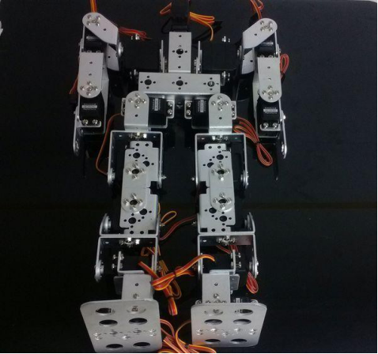

- Take the upper body structure and the double leg structures of the robot installed in the previous two steps, 8pcs round-head M3X5 screws, 2pcs round-head M3X6 screws, 2pcs M3 nuts, and 2 pcs flange bearings, install as shown in the figure 

- Put the two  installed  structure together, and fix the 4pcs round head M3X5 screws around the front metal rudder wheel, and fix the middle hole with 1 round head M3X6 screw. At the back, install it with a flange bearing, and then tighten it with an M3 nut. The screws must be fastened with needle-nose pliers.

## Services and Support

My shop1: https://www.aliexpress.com/item/32383818177.html?spm=5261.ProductManageOnline.0.0.211c4edfPXBpUC

My shop2: 

https://www.aliexpress.com/item/32882853324.html?spm=2114.12010615.8148356.27.f3151fadI75IJy

My shop3: 

https://www.aliexpress.com/item/32873784745.html?spm=2114.12010615.8148356.9.2184462fSlfLgd

- E-mails: [yichone@doit.am](mailto:yichone@doit.am), [yichoneyi@163.com](mailto:yichoneyi@163.com)
- Skype: yichone
- WhatsApp:+86-18676662425
- Wechat: 18676662425