
  User Manual for 17 DoF Humanoid 

 from SZDOIT 

## 1. Introduction

This manual is for 17 dof humanoid installation, which can be controlled by Arduino, raspberry pi, or stem 32 controller.

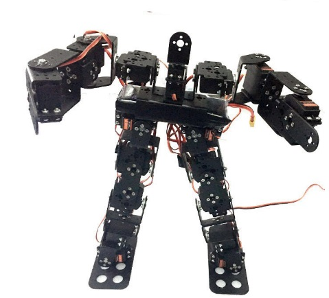

## 2. Installation Steps

**Step 1:** As Shown in Image below take 2 x Robot big Feets board, 2 x Multi-functional Brackets, 8 x Nuts and 8 x Screws. 

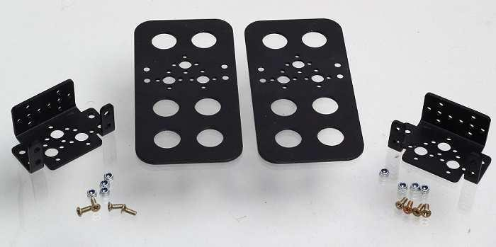

Fix the Multi-functional Brackets on the Robot big Feets with the help of Screws and Nuts. The assembly will look as shown in the following Image. 

**Step 2:** Now take 2 x Short U Brackets, 2 x Servo Horns, 8 x Servo Screws as shown in the following Image. 

Fix the Servo Horns with the help of Servo Screws. Following image shows how it looks after fixing. 

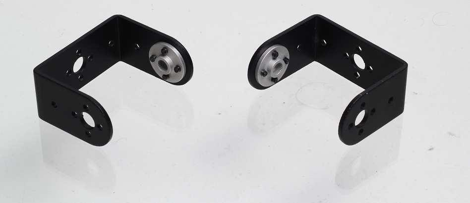

**Step 3:** Fix the Short U Brackets on the Multipurpose Brackets as shown in following image by using 2 x M3 Screws, 2 x Nuts, and 2 x Bearings shown in the Black Boxes in below image. 

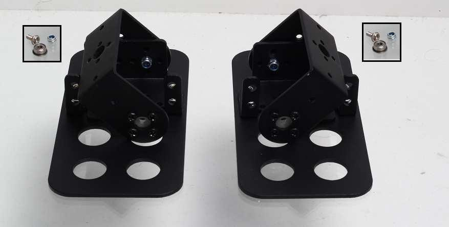

**Step 4:** Now take 2 x Servo Motors, 8 x M4 Screws and 8 x M4 Nuts as shown below. 

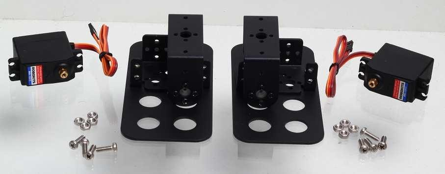

Fix the Servo Motors in the assembly as shown below with the help of M4 Mid Screws and M4 Nuts. Now the Black Box in the below image shows the Servo Screw which is to be fixed to Servo Motor Shaft after Neutralizing the Servo Motor. To Neutralize connect the Servo Motor to Servo Controller. Power up Servo Controller with 5 to 6 VDC power supply and connect to PC software with USB or Bluetooth connection. Neutralize the servo (Put the servo to center position) using software. After that tight the Servo Screw (Shown in Black Box) to the Shaft of the Servo Motor as shown in the below image.

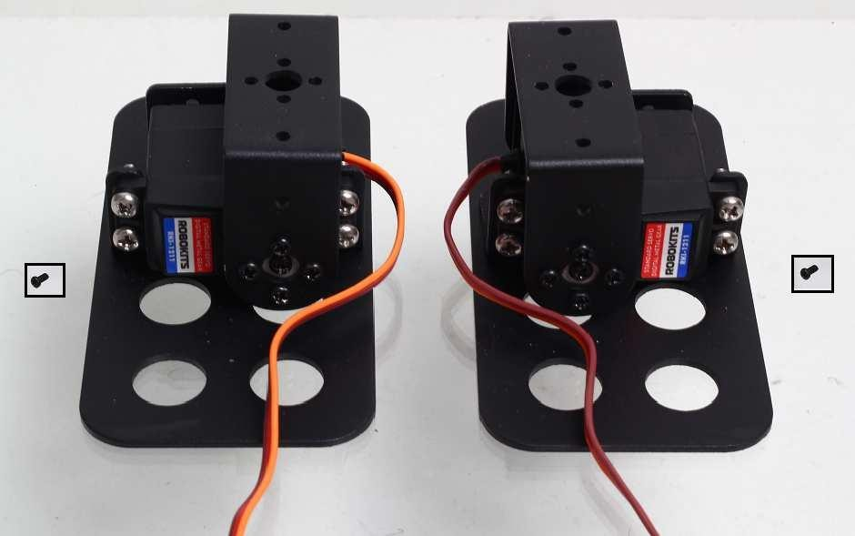

**Step 5:** Now take 2 x Multi-funtional Brackets, 8 x Big Button Screws, and 8 x  Nuts.

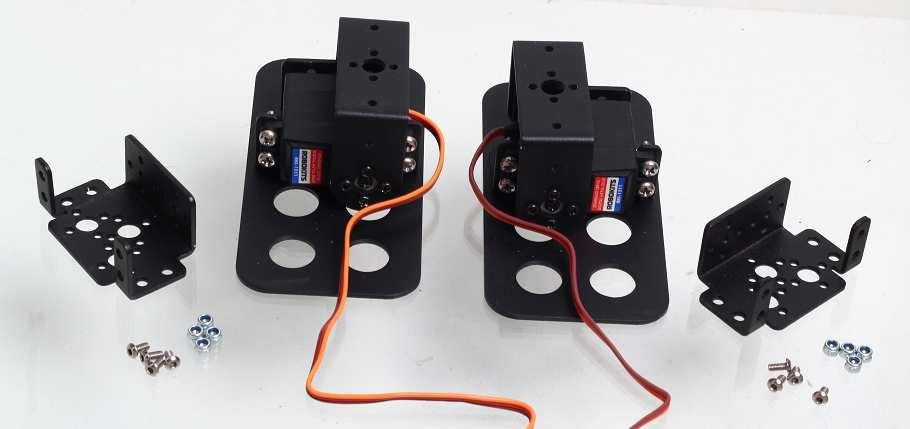

Fix the Multipurpose Brackets as shown below with Big Button Screws and Lock Nuts.

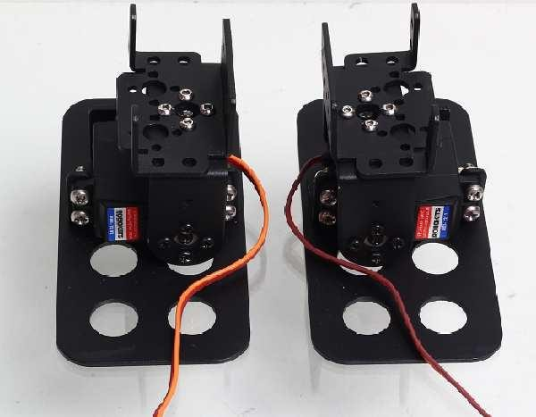

**Step 6:** Now take 2 x Oblique U Brackets, 2 x Short U Brackets, 8 x Big Button Screws and 8 x Nuts as shown below. 

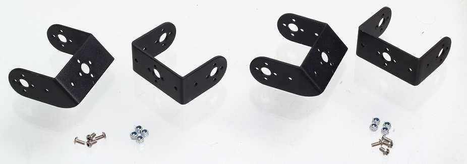

Fix the Oblique U Bracket with Short U Bracket as shown below with Big Button Screws and Lock Nuts. 

 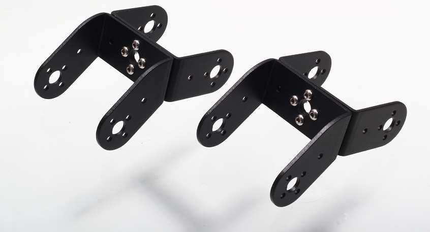

**Step 7:** Now take both the structures assembled as shown below, 2 x Servo Horns, 8 x Servo Screws, 2 x M3 Mid Screws, 2 x Lock Nuts and 2 x Bearings as shown below. 

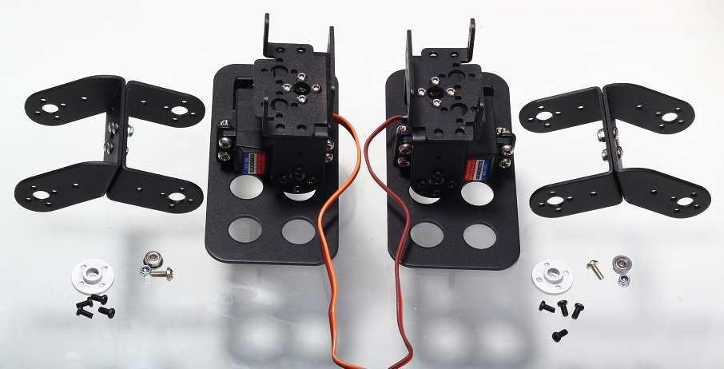

Assemble the structure as shown in the following image.

**Step 8:** Now take 2 x Servo Motors, 8 x M4 Screws, 8 x M4 Nuts and the structure assembled in previous step. This Servos are to be fixed on the Multipurpose Brackets seen in the following image. 

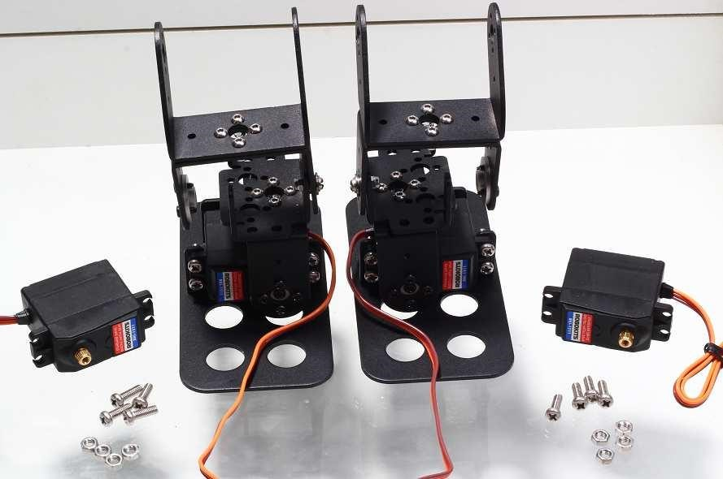

Fix the Servo Motor on the Multipurpose Brackets as seen in the below image. Neutralize the Motor and then tight the Servo Screw on the Motor Shaft. The Servo Screws are shown in the Black Boxes. 

**Step 9:** Now take 4 x Multipurpose Brackets, 2 x Interconnect Brackets, 16 x Small Button Screws and 16 x Nuts as seen in the below image. 

The assembled structure will look as seen in the below image after connecting the Multipurpose Brackets and Interconnect Brackets. 

**Step 10:** The following image shows the two structures that we have assembled. To connect both of them we need 2 x M3 Mid Screws, 2 x Lock Nuts (image shows nuts but you can use Lock Nuts), 2 x Bearings. Also we need 8 x Servo Screws and 2 x Servo Horns for further assembly. 

Fix the both the structures as seen in the below image with the help of M3 Mid Screws, Nuts and Bearings. Also fix the Servo Horns. 

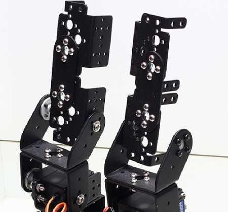

**Step 11:** Now take 2 x Long U Brackets, 2 x Servo Horns, 8 x Servo Screws, 2 x M3 Mid Screws, 2 x Nuts and 2 x Bearings as seen the below image along with the assembled structure. 

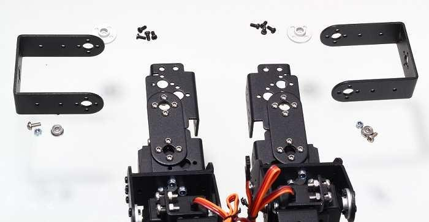

Fix the Long U Brackets to the Structure as seen in the below image with the help of M3 Mid Screws and Lock Nuts. Also fix the Servo Horns. 

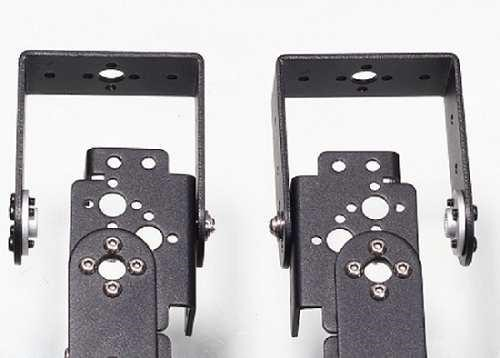

**Step 12:** Now take 4 x Servo Motors, 16 x M4 Screws, 16 x M4 Nuts, 4 x Servo Screws. Fix the Servo Motors at Place 1, 2, 3 and 4 shown in the Red Color in the below image. Tight the Servo Screws to the shaft of each Servo Motor after neutralizing each Servo Motor. The following image shows the Servo Motors already fixed.  

The M4 Screws, M4 Nuts and the Servo Motor is shown below in the Big Black Box while the Servo Screw is shown in the small Black Box. 

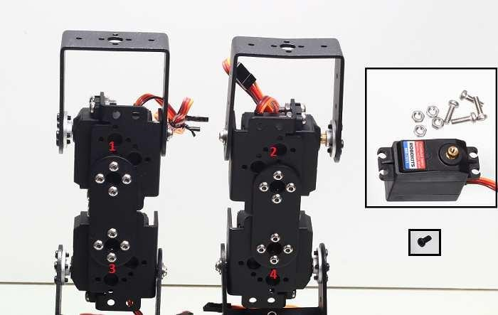

 **Step 13:** Take 2 x Short U Brackets, 8 x Big Button Screws and 8 x Nuts. Fix the Short U Brackets on the top of Long U Brackets with the help of Big Button Screws and Lock Nuts. The structure after fixing the Short U Brackets is shown in the main image below. The Short U Brackets, Big Button Screws and Lock Nuts is shown in the Black Box in the below image. 

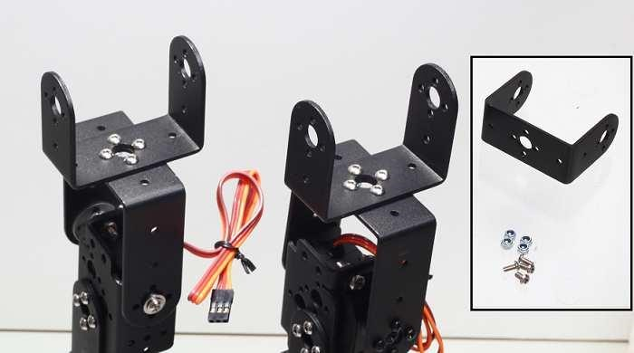

**Step 14:** Now take 2 x Multipurpose Brackets, 2 x L Shaped Brackets, 1 x Long U Bracket, 1 x Large U Bracket, 20 x Big Button Screws and 20 x Lock Nuts as shown in the following image. 

The structure assembled will look like the one shown in the below two images. 

**Step 15:** Now we will connect the two structures that we have already assembled in previous steps and they are also shown below. To connect them take 2 x M3 Mid Screws, 2 x Nuts and 2 x Bearings. Also take 2 x Servo Horns and 8 x Servo Screws for fixing the Servo Motors. 

After connecting the two structures the assembly will look as shown in the following image. 

**Step 16:** Now take 2 x Servo Motors, 8 x M4 Screws, 8 x M4 Nuts and 2 x Servo Screws. The Servo Motors are to be fixed at place 1 and 2 shown in the below image.  

The Servo Screws is to be fixed at the shaft of both Servo Motors after neutralizing the Servo Motors. 

**Step 17:** Now take 2 x Multipurpose Brackets, 8 x Big Button Screws and 8 x Lock Nuts which are shown in the Black Box in the following image.  

 These Multipurpose Brackets are to be fixed at the places 1 and 2 Shown in the below image with the help of Screws and Nuts taken. 

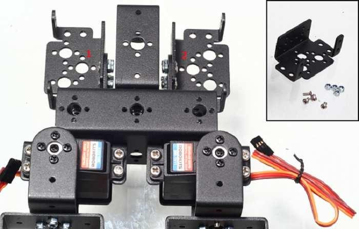

**Step 18:** Now take 2 x Servo Motors, 8 x M4 Screws and 8 x M4 Nuts and fix them at place 1 and 2. 

 

**Step 19:** Now remove the Long U Bracket from the top of the structure shown in the below image and fix the Servo Horn on the top of Long U Bracket with the help of Servo Screws. Below image shows the already fixed Servo Horn. Now before fixing the Long U Bracket on the same place from where it was removed, fix the Servo Motor on the Servo Horn and tight the Servo Screw on the Servo Motor Shaft. 

After fixing Servo Motor the structure will look like the below image.

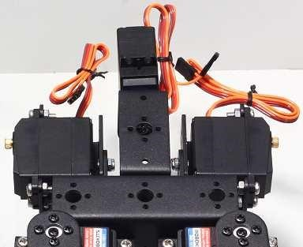

**Step 20:** Now let’s assemble both the hands of Humanoid Robot. Take 2 x Oblique U Brackets, 2 x Multipurpose Brackets, 2 x Servo Horns, 8 x Servo Screws, 2 x M3 Mid Screws, 2 x Lock Nuts and 2 x Bearings. Below sequence of images shows the assembly.  

After doing so you will get two structures shown below one for Right Hand and another for Left Hand. 

**Step 21:** Now take the two structures assembled in previous step along with 2 x L Shaped Brackets, 2 x Servo Horns, 8 x Servo Screws, 8 Small Button Screws, and 8 Nuts as shown in the below image. 

Now after fixing the Servo Horns and L Shaped Brackets you will have the following two structures.

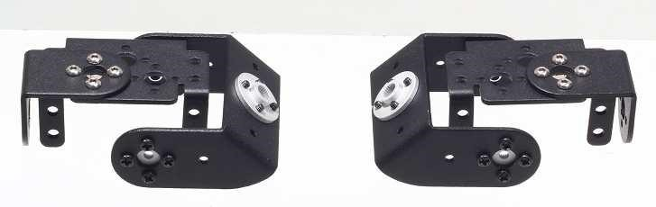

**Step 22:** Now take 2 x Long U Brackets, 8 x Small Button Screws, 8 x Nuts along with already assembled structures as shown in following Image. 

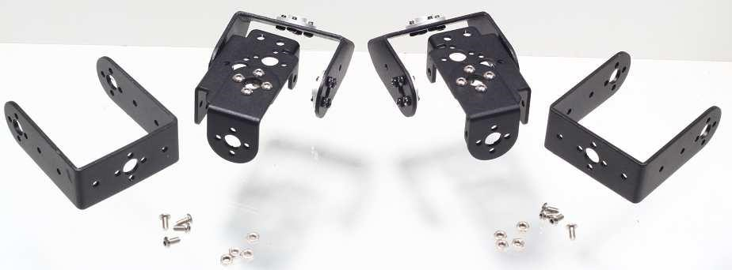

After fixing Long U Brackets you will have the below structures.

**Step 23:** Now take 2 x Multipurpose Brackets, 2 x Interconnect Brackets, 8 x Small Button Screws,  8 x Nuts, 2 x M3 Mid Screws, 2 x Lock Nuts and 2 x Bearings as shown below. 

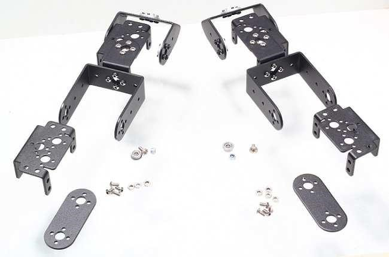

After fixing Multipurpose Brackets and Interconnect Brackets you will have the below two structures one for right hand and another for left hand. 

**Step 24:** Now we will fix the Servo Motor in the two hands. Take 4 x Servo Motors, 16 x M4 Screws and 16 x M4 Nuts as seen in the below Image. 

After fixing the Servo Motors, both the hands will look as seen in the below image. 

**Step 25:** Now take 2 x Servo Horns and 8 x Servo Screws to fix the Servo Horns for the last two Servo Motors. 

After fixing the Servo Motors neutralize all the four Motors and tight the Servo Horns Screws shown in the Small Black Box on the Shaft of all the Servo Motors. 

**Step 26:** Now we have both the Hands ready as shown in the below Image and also the Middle Structure. Now we will fix both the hands with the Middle Structure to complete the Assembly. For fixing we take 2 x Servo Screws which are shown in the Black Box in the below Image. Now Neutralize both the Servo Motors and tight the Servo Screws on the Shaft of both the Motors.

After fixing the both the hands top portion of the Humanoid will look as seen in the below Image. 

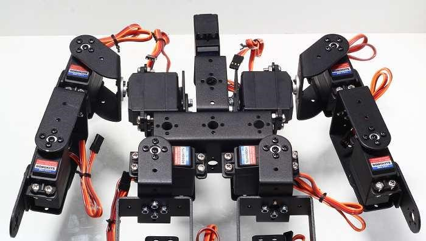

## Contact Us

- E-mails: [yichone@doit.am](mailto:yichone@doit.am), [yichoneyi@163.com](mailto:yichoneyi@163.com)
- Skype: yichone
- WhatsApp:+86-18676662425
- Wechat: 18676662425

