
 19DOF Humanoid Robot Installation Instructions 

 From SZDOIT

# 1. Understanding and preparation of each component

 

 

## 1.1 Equipped with mounting structure bracket

 

 

The names of the structural brackets shown from left to right in the figure from top to bottom are: U-beam bracket, big foot, multi-functional bracket, long U bracket, short U bracket, L bracket, one-line bracket, and oblique U bracket.

## 2.Complete with mounting screws and hardware accessories

The names of the hardware accessories shown from left to right in the figure from top to bottom are: round head M4 X8 screw (M4 nut), round head M3 X10 screw (M3 nut), round head M3 X7 screw (M3 nut ), Flat head M3 X6 screw (M3 nut), nylon plastic flat head M3 X20 screw (M3 X6 plastic stud), round head M3 X6 screw, round head M3 X5 screw, metal steering wheel, flange bearing.

## 3.Complete installation tools

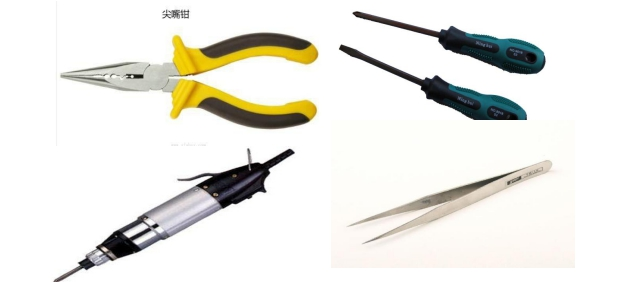 

 

 

The names of the tools shown from left to right and top to bottom in the picture are: needle-nose pliers, Phillips (slotted) screwdriver, Phillips (slotted) electric screwdriver, tweezer
Needle-nose pliers: It is mainly used to hold the nut, or tighten the nut after the nut is installed to make the structure more stable.
Cross (slotted) screwdriver: It is mainly used to install various types of screws.
Cross (slotted) electric screwdriver: can fasten or remove screws quickly, speed up installation, more professional, usually using electricity
Use a screwdriver to quickly tighten the screws, and then use needle-nose pliers to manually tighten the screws.
Tweezers: For some structural locations where fingers are not easily accessible, tweezers can be used to deliver screws and nut.

#  2. Mounting structure

Prepare the above-mentioned structural parts, hardware screw accessories and installation tools. Enter the installation link below, first install the bracket structure of each part of the robot.

## 2.1 Installation of robot foot structure   

  

- Take 2 big feet, 2 multi-function brackets, 8 flat head M3X 6 screws, 8 M3 nuts, as shown in the figure
  installation. During installation, pay attention that the countersink of the big foot is facing down, so that the screw cap can be buried in the countersink, so that the bottom is smooth.

- When installing, pay attention to the horizontal position of the multifunctional bracket, and align it left and right. Because the aperture is slightly larger, there is a certain amount of shaking, so install it well.
  The screws need to be tightened with needle-nose pliers to achieve a stable structural effect. 

  ##  2.2 Install the robot ankle structure

   

  Take 2 multi-functional brackets, 2 short U brackets, 8 round-head M3 X7 screws, 8 M3 nuts, and install as shown in the figure. During the installation, the nut is facing upwards and the nut is facing downwards. Pay attention to the alignment of the multi-functional bracket and the short U-bracket when it is connected. The screws must be tightened with needle-nose pliers to achieve a stable structure. 

  ## 2.3 Installation of robot lower leg structure 

   

  Take 2 inclined U brackets, 2 short U brackets, 8 round head M3 X7 screws, 8 M3 nuts, and install as shown in the figure. During installation, the nut is on the inclined U, and the nut is on the short U. Pay attention to the alignment of the inclined U bracket and the short U bracket. The screws must be fastened with needle-nose pliers to achieve a stable structural effect.

  ## 2.4 Installing robot thigh structure

  

   Take 4 multi-function brackets, 2 inline brackets, 16 round head M3 X7 screws, 16 M3 nuts, and install as shown in the figure. During the installation, the screws are pushed out from the inside of the multi-functional bracket and the nuts are tightened outside. Note that the two multi-functional brackets are connected by a straight connecting piece to maintain vertical alignment. The screws must be fastened with needle-nose pliers to achieve a stable structure . 

  ##  2.5 Installing robot straddle structure

   

  Take 2 long U brackets, 2 short U brackets, 8 round head M3 X7 screws, 8 M3 nuts, and install as shown in the figure. During installation, the screws pass through the inside of the short U bracket, and the nuts are fastened on the top of the long U bracket. The short U bracket and the long U bracket are installed in a vertical cross. 

  ##  2.6 Installing robot torso structure  

    

  Take 4 multifunctional brackets, 1 short U bracket, 1 U beam bracket, 2 L brackets, 28 round head M3X 7 screws, 28 M3 nuts, and install as shown in the figure. The torso part of the robot is mainly composed of double shoulders, double hips and neck brackets. During the installation process, the screws are fixed from the inside to the outside, so as not to affect the installation of the steering gear, which is convenient for needle-nose pliers. Needle-nose pliers are fastened to achieve a stable structural effect. At the end of all installations, make sure that the fixed position of the bracket is positive and not skewed.

  ## 2.7 Installation of robot arm structure

      

  Take 2 multifunctional brackets, 2 long U brackets, 2 L brackets, 16 round head M3 X7 screws, 16 M3 nuts, and install as shown in the figure. During the installation, the screws are fixed from the inside to the outside so as not to affect the installation of the servo, which is convenient for the needle-nose pliers to be fixed. The screws must be tightened with the needle-nose pliers to achieve a stable structural effect. Confirm that the fixed position of the bracket is positive and not skewed. 

  ##  2.8 Installing robot wrist structure

   

  Take two long multifunctional brackets, two inline brackets, eight round-head M3X 7 screws, and eight M3 nuts, and install them as shown in the figure. During the installation, the screws are pushed out from the inside of the multi-functional bracket, and the nuts are fastened on the top of the flat-shaped bracket. The screws must be fastened with needle-nose pliers to achieve a stable structural effect. 

  # 3. Install robot joints-servo

  After step 2, we have installed the whole structure of the robot. Now we review all the installed structures. First, arrange them according to the structure of the human body, as shown in the figure below; then, start to install the joints of each part. 
   All servos are factory-adjusted to the middle position by default (that is, the maximum range of left and right movement range of the servo). It is best not to rotate the servo before installing the servo. , Or use the servo tester to adjust to the middle position, the middle position of the servo is 1500. The following takes the digital servo as an example to illustrate the installation process. 

  ##  3.1 Install robot foot servo 

   

  Take the left and right foot structures of the installed robot, one servo servo, two round head M3X10 screws, eight round head M4X8 screws, and four M4 nuts. First, as shown in the figure, the M3  10 screw is installed from the inside of the multi-functional bracket to the outside. This screw is used to install flange bearings at the rear. Therefore, the screw must be installed before installing the servo. Note: M3X10 The installation position of the screw must be in the middle hole of the inside of the multi-function bracket, and keep it on a horizontal line with the protruding bearing of the servo. Install the steering gear, and use M4  8 screws and M4 nuts to fix the four corners of the steering gear and the multi-functional bracket. The screws must be fastened with needle-nose pliers to achieve a stable structural effect. 

  ##  3.2 Install robot ankle servo

  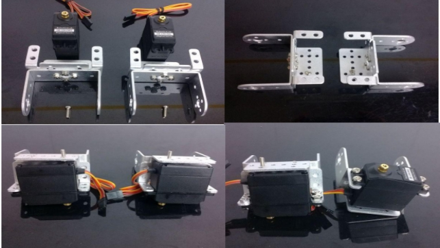 

  Take the left and right ankle structures of the installed robot, two servo , two round head M3X10 screws, eight round head M4X8 screws, and four M4 nuts. First of all, as shown in the figure, the M3X10 screw is pulled out from the inside of the multi-function bracket for installation. This screw is used to install flange bearings at the rear. Therefore, the screw must be installed before installing the servo. Note: M3X10 The installation position of the screw must be in the middle hole of the inside of the multi-function bracket, and keep it on a horizontal line with the protruding bearing of the servo. Install the steering gear, and use M4X8 screws and M4 nuts to fix the four corners of the servo and the multi-functional bracket. The screws must be fastened with needle-nose pliers to achieve a stable structural effect. 

  ##  3.3 Install the robot leg servo

   

  Take the left and right thigh structures of the installed robot, 4 servos, 4 round head M3X10 screws, 16 round head M4X8 screws, and 16 M4 nuts. First of all, as shown in the figure, the M3X10 screw is pulled out from the inside of the multi-functional bracket. This screw is used to install flange bearings at the back. Therefore, the screw must be installed before installing the servo. Note: M3X10 The installation position of the screw must be in the middle hole of the inside of the multi-function bracket, and keep it on a horizontal line with the protruding bearing of the servo. Install the steering gear, and use M4X8 screws and M4 nuts to fix the four corners of the servo and the multi-functional bracket. The screws must be fastened with needle-nose pliers to achieve a stable structural effect. 

  ##  3.4 Install the robot torso servo

  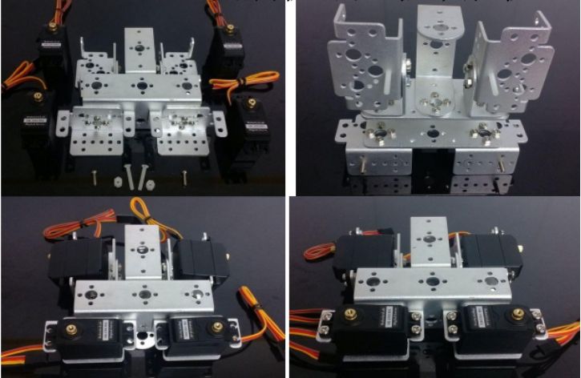  

  Take the installed robot trunk structure, 4 servo steering gears, 2 round M3X10 screws, 16 round head M4X8 screws, 16 M4 nuts, 2 nylon plastic flat head M3X20 screws, and plastic M3  6 Two studs. First, as shown in the figure, the M3X10 screw is pulled out from the inside of the multifunctional bracket to install the screw for mounting flange bearings at the back; the plastic screw is screwed out according to the figure above to install the controller. Therefore, the screw position must be installed before installing the servo. Note: The M3X10 screw must be installed in the middle hole of the inside of the multi-function bracket to keep it on the horizontal line with the protruding bearing of the servo. Install the steering gear, and use M4X8 screws and M4 nuts to fix the four corners of the steering gear and the multi-functional bracket. The screws must be fastened with needle-nose pliers to achieve a stable structural effect. 

  ## 3.5 Installing a robot arm servo 

      

  Take one left and right arm structure of the installed robot, two servos, two round head M3X10 screws, eight round head M4 X8 screws, and 8pcs M4 nuts. First of all, as shown in the figure, the M3X10 screw is pulled out from the inside of the multi-function bracket for installation. This screw is used to install flange bearings at the rear. Therefore, the screw must be installed before installing the servo. Note: M3X10 The installation position of the screw must be in the middle hole of the inside of the multi-function bracket, and keep it on a horizontal line with the protruding bearing of the servo. Install the servo, and use M4X8 screws and M4 nuts to fix the four corners of the servo and the multi-functional bracket. The screws must be fastened with needle-nose pliers to achieve a stable structural effect. 

  ##  3.6 Installing a robotic wrist servo

  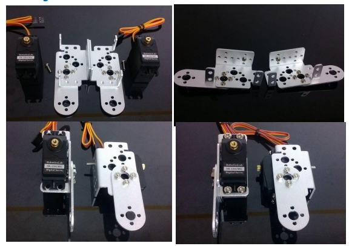    

  Take the left and right wrist structures of the installed robot, two servos, two round-head M3X10 screws, eight round-head M4X8 screws, and eight M4 nuts. First, as shown in the figure, the M3X10 screw is installed from the inside of the multi-functional bracket to the outside. This screw is used to install flange bearings at the rear. Therefore, the screw must be installed before installing the servo. Note: M3X10 The installation position of the screw must be in the middle hole of the inside of the multi-function bracket, and keep it on a horizontal line with the protruding bearing of the servo. Install the servo, and use M4  8 screws and M4 nuts to fix the four corners of the servo and the multi-functional bracket. The screws must be fastened with needle-nose pliers to achieve a stable structural. 

  #  4. Connect robot parts

  After the first few steps, all parts of the robot have been installed. The remaining work is how to connect the parts and assemble a complete body. As shown in the figure below, first arrange the structure of each part of the robot roughly, so that you can understand the position of each part as a whole, and you will not get the wrong installation and misalignment when connecting. It should be noted that although the symmetrical parts of the robot look the same, they are actually different (because the positions of the mounting screws are not the same), so they cannot be used universally. The structure on the left cannot be used for the right. Caution! 

  ##  4.1 Connect robot feet to ankles

  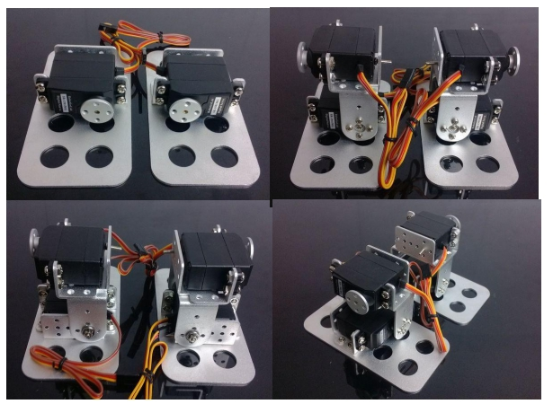     

  Take the installed robot feet, one ankle structure each, four metal steering wheels, eight round head M3x5 screws, two round head M3x6 screws, two M3 nuts, and two flange bearings, as shown in the figure. Install as shown. First, install the metal steering wheel vertically on the servo (Note: The default angle of the default delivery of the servo is the middle value. If you accidentally rotate the servo, the current output angle of the servo is unknown. You need to adjust it to the middle value by software. 1500 angle, when installing the metal rudder, you must ensure that the four holes of the rudder are horizontal and vertical, and can not be installed at an angle.  5 Screw fixing, the middle hole is fixed with one round head M3x6 screw. At the back of the imaginary shaft, install it with a flange bearing, and then tighten it with M3 nut. The screws must be fastened with needle-nose pliers after installation to achieve a stable structural effect. 

  ## 4.2 Connect the robot calf to the thigh

  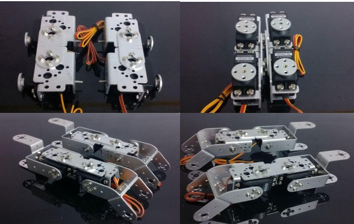     

  Take the installed robot's thigh structure, calf structure and crotch joint, 1 metal steering wheel, 4 round M3x5 screws, 4 round M3x6 screws, 4 M3 nuts, flange bearings 4 as shown. First, install the metal steering wheel vertically on the servo (Note: The default angle of the servo is the default value for delivery. If you accidentally rotate the servo, the current servo output angle is unknown. You need to adjust the software to the middle value of 1500. , When installing the metal rudder, you must ensure that the four holes of the rudder are horizontal and vertical, and cannot be installed at an angle); then, put the two structures together, and use four round heads M3x5 around the front metal rudder. Screw fixing, the middle hole is fixed with a round head M3x6 screw. At the back of the imaginary shaft, install it with a flange bearing, and then tighten it with a M3 nut. The screws must be fastened with needle-nose pliers after installation to achieve a stable structural effect. 

  ##  4.3 Connect robot leg

      

  Take the robot lower body mechanism installed in the previous two steps, 8 round head M3x5 screws, 2 round head M3x6 screws, 2 M3 nuts, 2 flange bearings, and install as shown in the figure. Put the two structures that have been installed together, and fix them with 4 round head M3x5 screws around the front metal steering wheel, and fix the middle hole with 1 round head M3x6 screw. At the back of the imaginary shaft, install it with a flange bearing, and then tighten it with a M3 nut. Screws must be fastened with needle-nose pliers after installation, to achieve a stable structural effect. 

  ##  4.4 Connect the robot arm 

  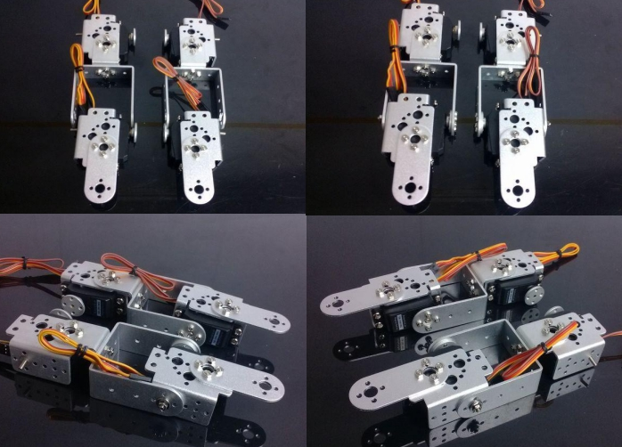  

  Take one each of the installed robot arm structure and wrist structure, four metal servos, eight round-head M3x5 screws, two round-head M3x6 screws, two M3 nuts, and two flange bearings, such as Install as shown. First, install the metal servo vertically on the servo (Note: The default angle of the default delivery of the servo is the middle value. If you accidentally rotate the servo, the current output angle of the servo is unknown. You need to adjust the software to the middle value 1500 angle, when installing the metal servo, you must ensure that the four holes of the servo are horizontal and vertical, and cannot be installed at an angle); then, put the two structures together, and use four round heads M3 around the front metal servo. M3x5 Screw fixing, the middle hole is fixed with one round head M3x6 screw. At the back of the imaginary shaft, install it with a flange bearing, and then tighten it with a M3 nut. The screws must be fastened with needle-nose pliers after installation to achieve a stable structural effect. 

  ##  4.5 Connect robot shoulder and head

  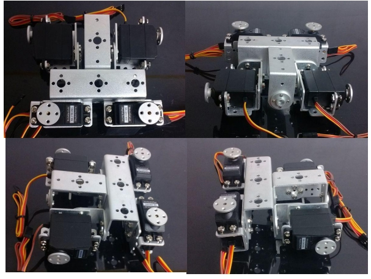        
     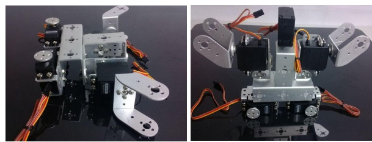	       

  Take one installed robot torso, two inclined U brackets, one steering gear, five metal steering wheels, 12 round-head M3x5 screws, and 3 round-head M3x6 screws, and install as shown in the figure. First, install the metal steering wheel vertically on the servo (Note: The default angle of the default delivery of the servo is the middle value. If you accidentally rotate the servo, the current output angle of the servo is unknown. You need to adjust the software to the middle value 1500 angle, when installing the metal steering wheel, you must ensure that the four holes of the steering wheel are horizontal and vertical, and can not be installed at an angle); Secondly, fix the reverse side of a metal steering wheel on the top of the torso; then, two inclined U The brackets are fixed to the left and right shoulders of the robot's torso respectively. One servo is fixed to the neck of the robot's torso. The front metal steering wheel is fixed around with four round head M3x5 screws, and the middle hole is fixed with one round head M3x6 Fix with screws. 

  ##  4.6 Connect the upper body of the robot 

  #     

   

   
   Take one each of the robot arm structure and torso structure installed in the previous two steps, eight round head M3x5 screws, two round head M3x6 screws, two M3 nuts, and two flange bearings, as shown installation. Put the two structures that have been installed together, and fix them with 4 round head M3x5 screws around the front metal steering wheel, and fix the middle hole with 1 round head M3x6 screw. At the back of the imaginary shaft, install it with a flange bearing, and then tighten it with a M3 nut. The screws must be fastened with needle-nose pliers after installation to achieve a stable structural effect.  

  ## 4.7 Connect the lower body of the robot 

   
    

  Take the upper body structure and the two leg structure of the robot installed in the previous two steps, one round head M3x5 screw, two round head M3x6 screws, two M3 nuts, and two flange bearings, as shown in the figure. Show installation. Put the two structures that have been installed together, and fix them with 4 round head M3x5 screws around the front metal steering wheel, and fix the middle hole with 1 round head M3x6 screw. At the back of the imaginary shaft, install it with a flange bearing, and then tighten it with a M3 nut. The screws must be fastened with needle-nose pliers after installation to achieve a stable structural effect. 

  ##  4.8 Mechanical claw installation2pcs L bracket

  2pcs servo2pcs Steering wheel
  2pcs paw
  12pcs M3 nut 
  22pcs M3x8 ,4pcs M3x6
  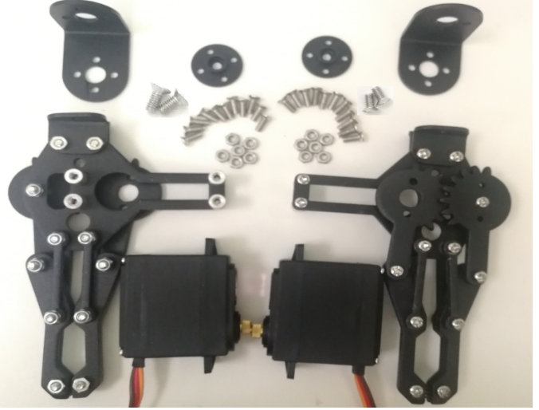    

  ## 4.9 First install the servo: 

    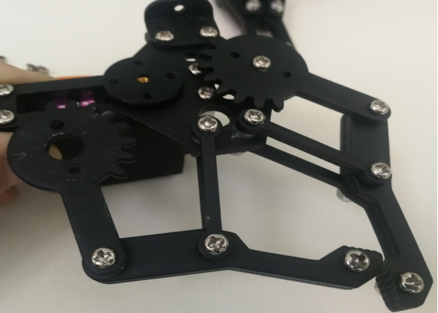 

  First use M3x8 screws to fix the steering wheel and servo, and then use 2 M3x6 screws to fix the claw and steering wheel. 

  Finally use 4 M3x8 to fix the servo on the mechanical claw 

  The other paw is also installed like thisWhen using the L bracket to attach the claws:     

  First use 3 M3x8 + 2 M3 nuts to fix the claw and L bracket, and then use 4 M3x8 screws + 4 M3 nuts to fix the claw on the robot arm.   
       

# Contact Us

- E-mails: [yichone@doit.am](mailto:yichone@doit.am), [yichoneyi@163.com](mailto:yichoneyi@163.com)
- Skype: yichone
- WhatsApp:+86-18676662425
- Wechat: 18676662425