
 9DOF Humanoid Robot Installation Instructions 

 From SZDOIT

## Installation tips

When install the robot, we should obey the rules of installing from bottom to up and from left to right.We should make sure every step we install is correct and have no mistakes, then we can go on. Otherwise, when you find something wrong later, you must take apart and install from beginning.For the beginner, you need to pay much attention to the angular position of [steering gear.](http://www.icstation.com/product_info.php?products_id=1603)You must adjust the corner position of steering gear to the center.If you don't do so, when the steering gear run, the motion of joint parts will be limited.

## Step 1: Install the foot structure

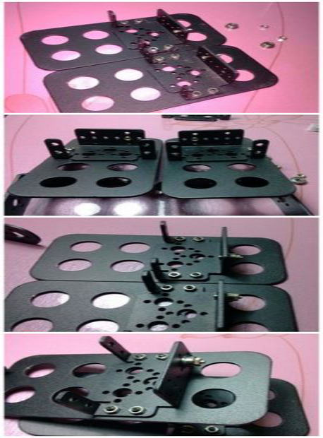 

## Step 2: Put the steering gear to the right corner

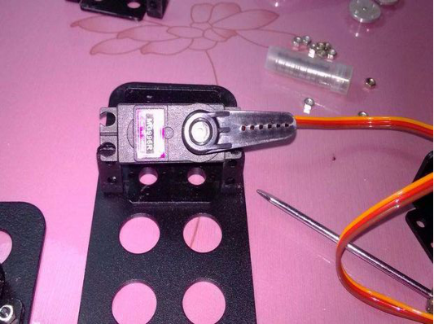 

When complete the installation of foot structure, then start to install the [steering gear](http://www.icstation.com/product_info.php?products_id=1603).First adjust the median of it and then put the steering gear to the right corner.

## Step 3: Put the steering gear to the left corner

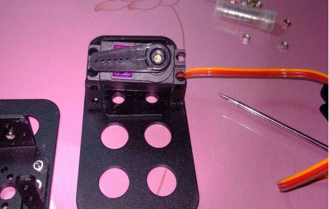 

## Step 4: Put the steering gear to the center

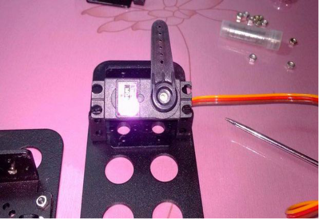 

And then put the [steering gear](http://www.icstation.com/product_info.php?products_id=1603) to the center.So the angular range of the steering has been set well.Install the steering gear like this the range of the joint of robots is the largest.(When in specific application., you can choose the angle of installed position reasonably and avoid appearing dead angle.

## Step 5: Install Two Servos

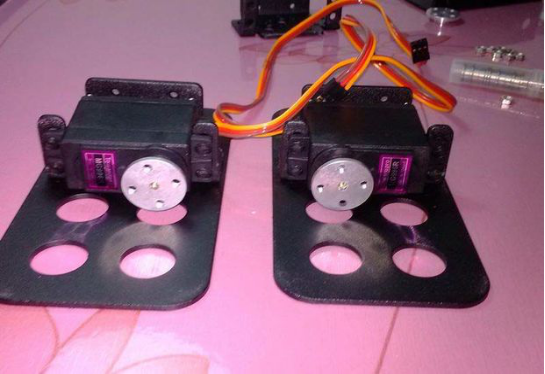 

The two [steering gear ](http://www.icstation.com/product_info.php?products_id=1603)are both adjusted to the appropriate angle following the above steps and start to install.

## Step 6: The effect of adding mental helm

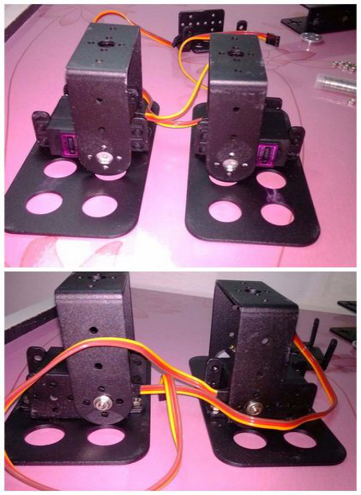 

Adjust the direction of the helm and the direction of helm and the aperture of the[ long U bracket](http://www.icstation.com/product_info.php?products_id=2546) are the same.Next install the long U bracket.

## Step 7: Mount the screw

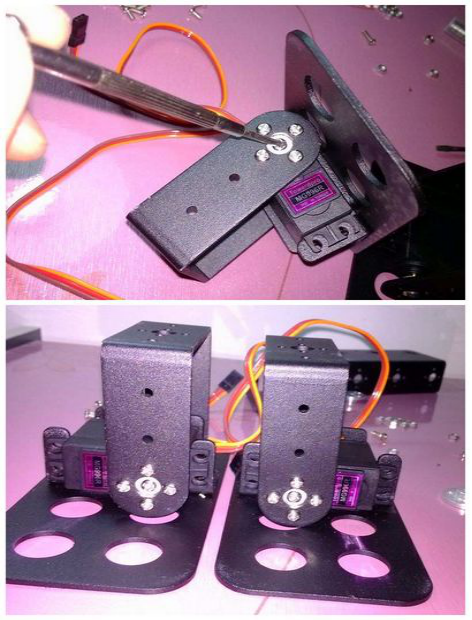 

## Step 8: Install the joint of legs

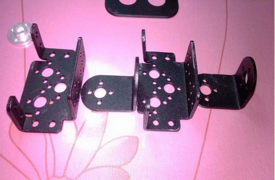 

Next install the joint of legs.Prepare the accessories.

## Step 9: Install the L bracket

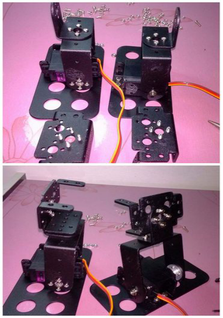

You should install the [L bracket ](http://www.icstation.com/product_info.php?products_id=2547)first, otherwise it will be difficult to install the bracket of the steering gear.

## Step 10: Complete installing the Servos

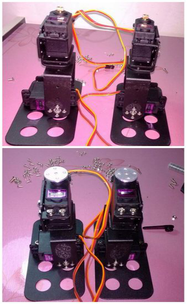 

The [steering gear](http://www.icstation.com/product_info.php?products_id=1603) should be adjusted to the right angle and then start to install.

## Step 11: Install the waist of robot

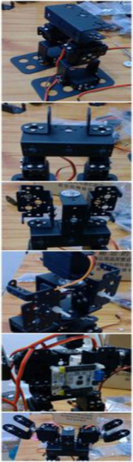 

The waist of robot should use the[ U-shaped beam](http://www.icstation.com/product_info.php?products_id=2552) to install.

## Step 12: Install the arm of robot

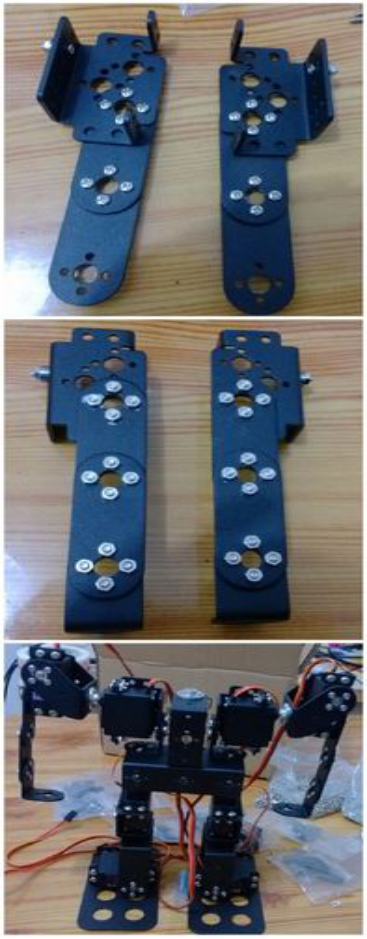 

## Step 13: Finish the whole installation

 

## Contact Us

- E-mails: [yichone@doit.am](mailto:yichone@doit.am), [yichoneyi@163.com](mailto:yichoneyi@163.com)
- Skype: yichone
- WhatsApp:+86-18676662425
- Wechat: 18676662425