
  User Manual for TC-100/TC100 

 from SZDOIT 

Part of the installation:

wheel：
metal bearing wheel:https://gitnova.com/#/Robot/FrameChassis/Wheel/MetalBearingWheel/MetalBearingWheel

track: https://gitnova.com/#/Robot/FrameChassis/track/track

metal driving wheel: https://gitnova.com/#/Robot/FrameChassis/Wheel/MetaDrivingWheel/metaldrivingwheel

DC motor: https://gitnova.com/#/Robot/Engine/9vMotor/9vmotor

Controller：
Arduino UNO:https://gitnova.com/#/Robot/Controller/ps2/4motor16servo

ESPDuino:https://gitnova.com/#/Robot/Controller/controller/espduinoController

App：

https://gitnova.com/#/Robot/Controller/app/AppforSmartCar

​      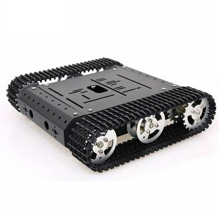

## Materials List:

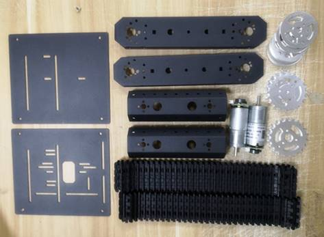

## Installtion steps

1. Install the frame, use long bracket and motor, as the picture, lock it with M3*8 flat head screws.

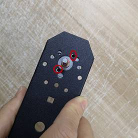

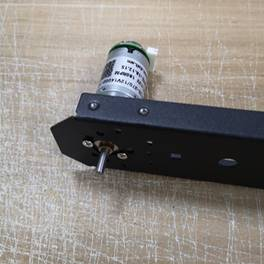

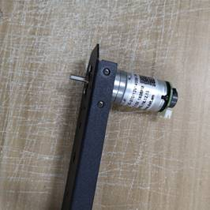

2. Install the bearing wheel and driving wheels firstly. 

   https://gitnova.com/#/Robot/FrameChassis/Wheel/MetalBearingWheel/MetalBearingWheel

3. Install the bearing and Jackscrewsm, and then install the bearing into the motor shaft.

.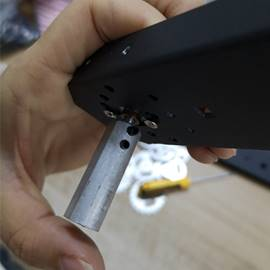

Note: When installing, the coupling is stuck at the protruding part of the motor shaft (if coupling are full inserted into the motor, it will be blocked and cannot be rotated)

Install the driving wheel into the coupling, and fix it with M4*12 hexagon screws.

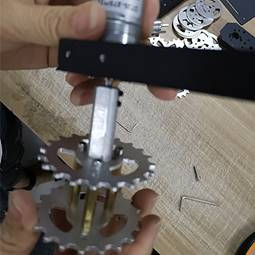

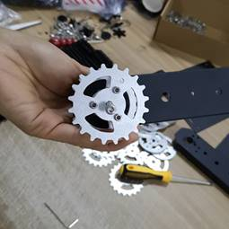

4. Install the bearing wheel. Use the middle of the long bracket, intall the bearing wheel with M4*12mm hexagon screws.

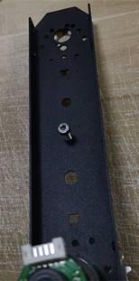

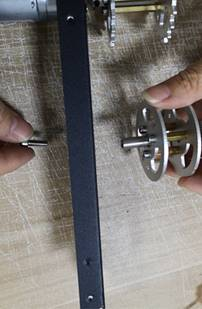

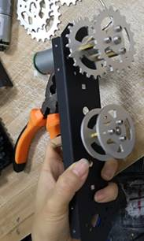

5. Use 2pcs gasket, as the picture, put into the inside and outside of the bracket.

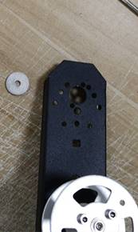

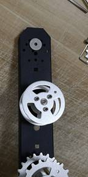

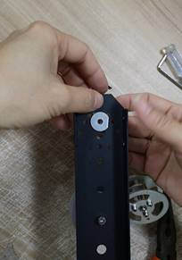

Use M4*12mm screws to pass trough the 2 holes, and fix the bearing wheels.

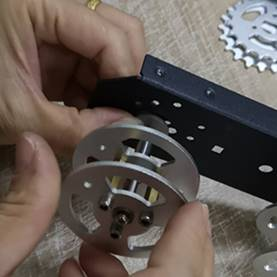

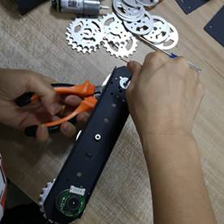

6. Install the another part.

7. Install the short bracket, use 2pcs short bracket, intall into the 2pcs long bracket separately. As the picture showed, lock it with M3*8 flat head screws. 

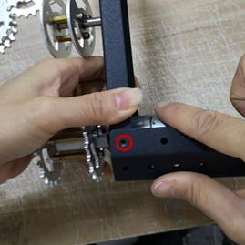

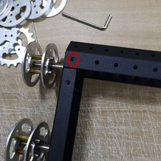

8. Use the M3*8 flat head screws to install the below bracket.

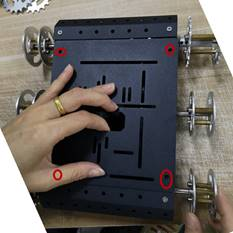

Install the another parts.

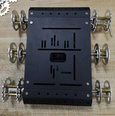

9. Install the track.

Note: Use multimeter pen or other pointed tool to take apart the track.

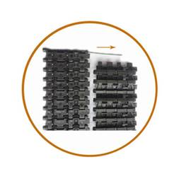

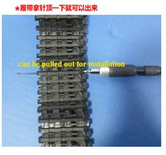

Install the track as the right picture showed.

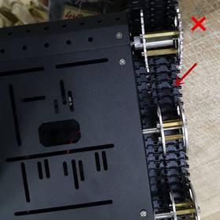

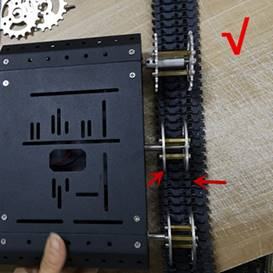

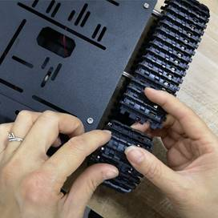

 

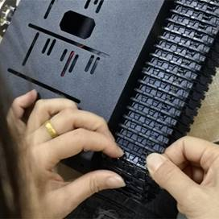

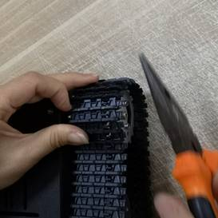

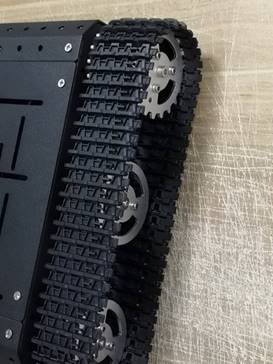

## Contact Us

- E-mails: [yichone@doit.am](mailto:yichone@doit.am), [yichoneyi@163.com](mailto:yichoneyi@163.com)
- Skype: yichone
- WhatsApp:+86-18676662425
- Wechat: 18676662425