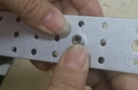
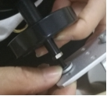
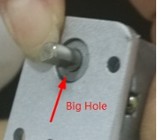
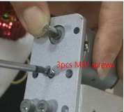
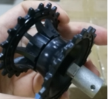
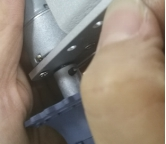
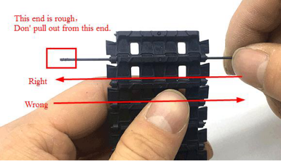
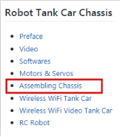
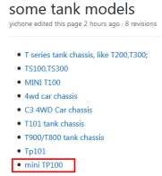

 MiniTP100 Tank Car Installation Instructions 

 From SZDOIT

Part of the installation:

wheel：

track: https://gitnova.com/#/Robot/FrameChassis/track/track

DC motor: https://gitnova.com/#/Robot/Engine/9vMotor/9vmotor

Controller：
Arduino UNO:https://gitnova.com/#/Robot/Controller/ps2/4motor16servo

ESPDuino:https://gitnova.com/#/Robot/Controller/controller/espduinoController

App：

https://gitnova.com/#/Robot/Controller/app/AppforSmartCar

## 1. Package Included

| Name          | Quantities | Name               | Quantities |
| ------------- | ---------- | ------------------ | ---------- |
| bracket       | 2          | M3*8 inner screw   | 2          |
| beam          | 2          | Jack screw         | 2          |
| gasket        | 4          | M4*10 screws       | 8          |
| Bearing wheel | 2          | M3*6 flat screw    | 12         |
| Driving wheel | 2          | M4 nut             | 12         |
| motor         | 2          | M4*50 screws       | 2          |
| track         | 2          | M3 nut             | 4          |
| coupling      | 2          | F-M dupont line    | 4pin       |
| M2 wrench     | 1          | 2-battery box      | 1          |
| M3 wrench     | 1          | Acrylic plate      | 1          |
| M4 wrench     | 1          | M3*6+50mm coupling | 4          |

## 2. Installation Steps

1) Install the bracket

 

2) Install the bearing wheel

 

3) Install the motor(Lock it with M3*6 screws)

 

4) Install the driving wheel

 

5) Adjust the suitable length and install the track(Pls use the tool to cut off the spare tracks if it is too long.)

 

More importantly. You can download the complete manual from wiki.doit.am.

   

## Contact Us

- E-mails: [yichone@doit.am](mailto:yichone@doit.am), [yichoneyi@163.com](mailto:yichoneyi@163.com)
- Skype: yichone
- WhatsApp:+86-18676662425
- Wechat: 18676662425