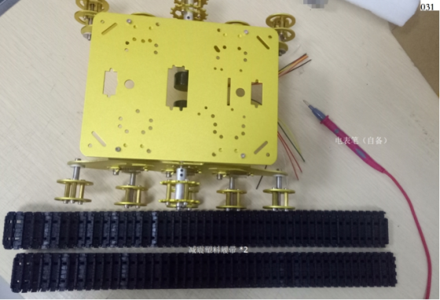
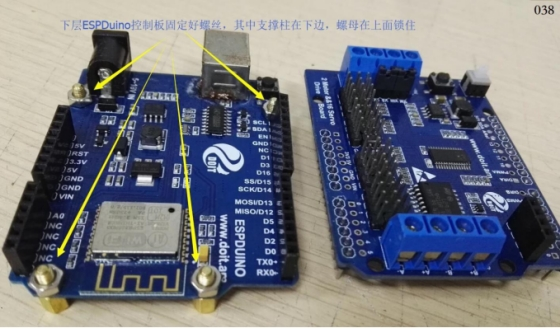
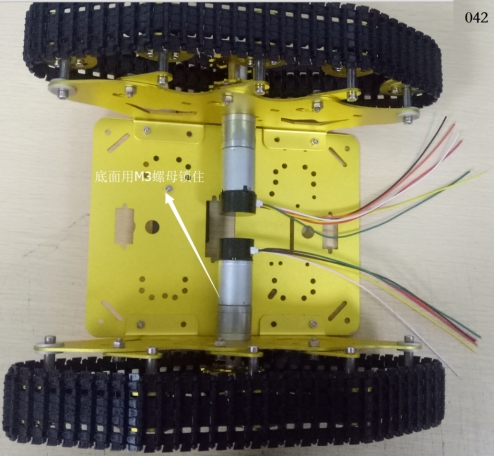

  TS300 Installation Manual 

 From SZDOIT

## 1 listing

 

 WiFi car ESPDUINO -TS300 tank car    WiFi car Nodemcu -TS300 tank car

### A：---- ESPDuino version：

 

Description:

| Number | Name                          | QTY  | Number | Name                    | QTY  |
| ------ | ----------------------------- | ---- | ------ | ----------------------- | ---- |
| 1      | Shock absorbent plastic track | 2    | 14     | (large) gasket          | 8    |
| 2      | Side panel (left)             | 1    | 15     | M4 socket hexagon screw | 8    |
| 3      | Side panel (right)            | 1    | 16     | Suspension (left)       | 4    |
| 4      | (small) metal bearing wheel   | 10   | 17     | Suspension (right)      | 4    |
| 5      | (small) metal drive wheel     | 2    | 18     | M4 Wrench               | 1    |
| 6      | bearing                       | 8    | 19     | M3 Wrench               | 1    |
| 7      | M4 Nut                        | 8    | 20     | M2 Wrench               | 1    |
| 8      | Spring                        | 8    | 21     | The motor cover         | 2    |
| 9      | columns                       | 4    | 22     | Motor line              | 2    |
| 10     | M3 Nut                        | 10   | 23     | 18650 battery packs     | 1    |
| 11     | M38 socket hexagon screw      | 4    | 24     | ESPDuino suite          | 1    |
| 12     | M38 flat head screws          | 10   | 25     | The screwdriver         | 1    |
| 13     | 9V motor with code plate      | 2    | 26     | chassis                 | 1    |

### B：---- NodeMCU Version：

 

Description：

| Number | Name                          | QTY  | Number | Name                     | QTY  |
| ------ | ----------------------------- | ---- | ------ | ------------------------ | ---- |
| 1      | Side panel (left)             | 1    | 15     | (large) gasket           | 8    |
| 2      | Side panel (right)            | 1    | 16     | M38 flat head screws     | 10   |
| 3      | Chassis                       | 1    | 17     | 9V motor with code plate | 2    |
| 4      | (small) metal bearing wheel   | 10   | 18     | The motor cover          | 2    |
| 5      | (small) metal drive wheel     | 2    | 19     | M2 Wrench                | 1    |
| 6、7   | Shock absorbent plastic track | 2    | 20     | M3 Wrench                | 1    |
| 8      | bearing                       | 8    | 21     | M4 Wrench                | 1    |
| 9      | M4 socket hexagon screw       | 8    | 22     | Motor line               | 2    |
| 10     | Spring                        | 8    | 23     | 18650 battery packs      | 1    |
| 11     | M3 Nut                        | 10   | 24     | NodeMCU suite            | 1    |
| 12     | M38 socket hexagon screw      | 4    | 25     | The screwdriver          | 1    |
| 13     | columns                       | 4    | 26     | Suspension (right)       | 4    |
| 14     | M4 Nut                        | 8    | 27     | Suspension (left)        | 4    |

## 2 Introduction to the main control board

### A：---- ESPDuino Version

 

 

### B：---- NodeMCU Version

 

## 3 The assembly

### 1)Assembly of the car

Step 1: Install the wheel to the side plate

① Install bearing wheel

a. The hanger is installed on the bearing wheel

Listing：

 

The assembly:

 

 

b. The load-bearing wheel is mounted on the side plate

listing：

 

The assembly：

 

 

 

 

 

 

 

 

 

 

 

② With driving wheels

a． Assembly motor line

listing：

 

The assembly：

 

b． Install the motor on the side plate

Listing：

 

Installing：

 

 

c． With driving wheels

Listing：

 

Installing：

 

 

 

#### Step 2: Install side panels to chassis

The chassis is mounted on both side plates

a． Listing

 

b． Installing

 

 

 

### Step 3: Install the crawler

①Put plastic tracks on it

Listing：

 

Installing：

 

 

 

 

### 2)Install the control panel and circuit wiring

#### A：----ESPDuino Version

① Assembly panel

Listing：

 

Installing：

 

 

 

② Install the main control panel and battery box

Listing

 

Installing

 

 

 

 

③ Circuit wiring

a Connect the power cord

 

 

bAnswer the motor line

 

 

 

 

 

 

 

#### B：----NodeMCU Version

① Assembly panel

List:

 

Installing：

 

 

② Install the main control panel and battery box

listing：

 

Installing：

 

 

 

③ Circuit wiring

aConnect the power cord:

 

 

b Electric motor wire:

 

 

 

 

 

 

## Contact Us

- E-mails: [yichone@doit.am](mailto:yichone@doit.am), [yichoneyi@163.com](mailto:yichoneyi@163.com)
- Skype: yichone
- WhatsApp:+86-18676662425
- Wechat: 18676662425

