
  User Manual for TS400 

 from SZDOIT 

Part of the installation:

wheel：
metal bearing wheel:https://gitnova.com/#/Robot/FrameChassis/Wheel/MetalBearingWheel/MetalBearingWheel

track: https://gitnova.com/#/Robot/FrameChassis/track/track

metal driving wheel: https://gitnova.com/#/Robot/FrameChassis/Wheel/MetaDrivingWheel/metaldrivingwheel

DC motor: https://gitnova.com/#/Robot/Engine/9vMotor/9vmotor

Controller：
Arduino UNO:https://gitnova.com/#/Robot/Controller/ps2/4motor16servo

App：

https://gitnova.com/#/Robot/Controller/app/AppforSmartCar

## 1. Introduction

​    This manual is for TS400 robot tank car chassis. TS400 is a 4wd tank car chassis, which has 4 driving wheels with 4 high torque DC motor, and it has 4 springs. Therefore, it is a shock suspension tank car chassis. Although, this manual is for TS400,  in fact, their installation for many other types tank chassis also can refer to this manual.

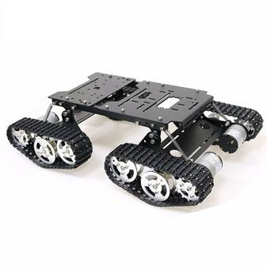

## 2. Materials List:

   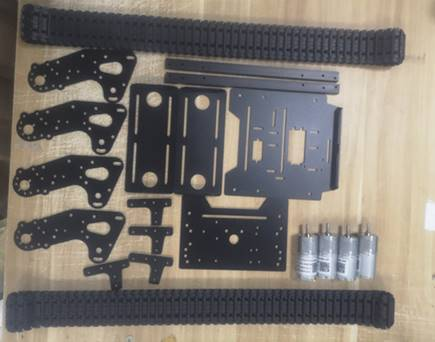

Screws:

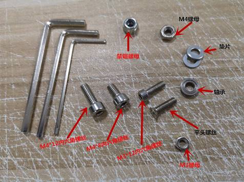

## 3. Installation Steps:

### 3.1 Install the wheels and motor

1. Use M3*8mm flat head screws to lock the motor and frame.

2.Install the wheel: install the driving wheel and bearing wheel firstly. Fix the Jackscrews into the flat end of the motor shaft.

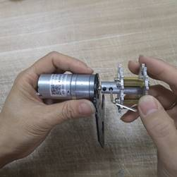

Note: The wheel coupling is stuck at the protruding position of the motor shaft during installation (if coupling are full inserted into the motor, it will be blocked and cannot be rotated)

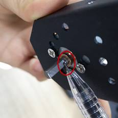

3. As the picture showed, install the middle bearing wheel, fix it with M4*12mm screws.

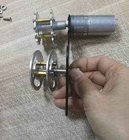

Install the next bearing wheel, put into 2pcs gasket on the inside and outside of the holes, and then install the wheel.

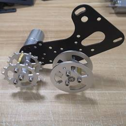

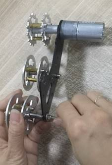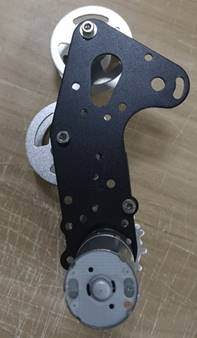

4. Install the spring, fix it with M4 screws and nuts.

5. Install the another 3 parts as the same way.

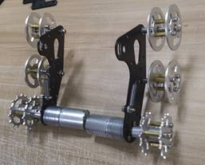

### 3.2 Install the Frame and wheels

1. Use the smallest frame, as the picture, fix it with M3*8mm hexagon screws.

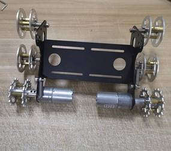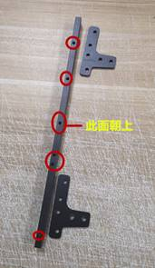

2. Install the frame, use the L and T frame as the picture showed, lock it with M3*8mm hexagon screws.

   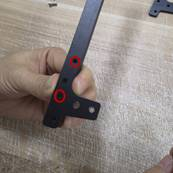

   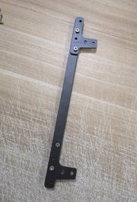

   

   3.Install the 3 frame, and fix it with M3*8mm hexagon screws.

   

   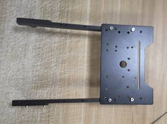

   

   

4. Install 4 frames with wheels. As the picture showed, install the 2 parts(Put into the gasket to avoid friction), use the M4*12 hexagon screws to pass trough the holes.

   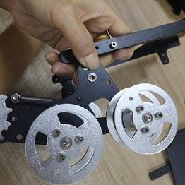

   

   

   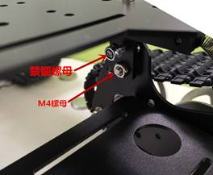

Use the M4 nut and fastening nut to lock it.

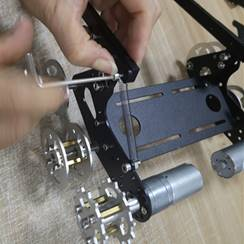

Note: be patient when install this parts.

5. Install the spring, fix it with M3*10mm hexagon screws.

Install the another 3 parts.

6. Install the big frame, as the picture showed, fix it with M3*10mm hexagon screws.

### 3.3 Install the track.

You can take apart the track, use Multimeter pen tip or other pointed tool to make the suitable length.

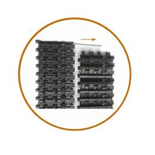

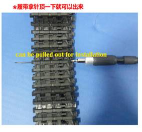

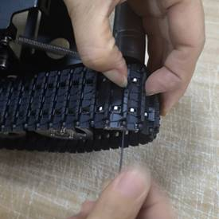

# Contact Us

- E-mails: [yichone@doit.am](mailto:yichone@doit.am), [yichoneyi@163.com](mailto:yichoneyi@163.com)
- Skype: yichone
- WhatsApp:+86-18676662425
- Wechat: 18676662425