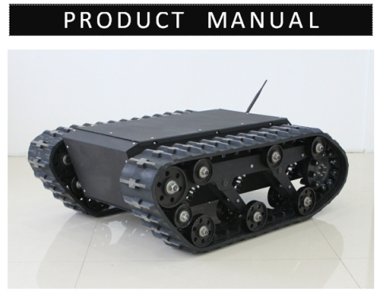
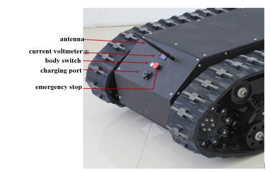
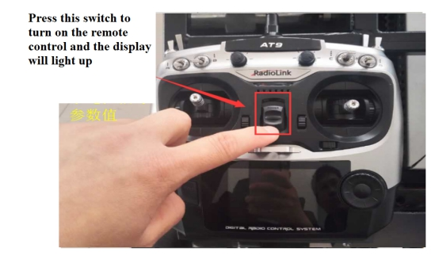
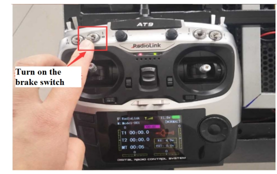
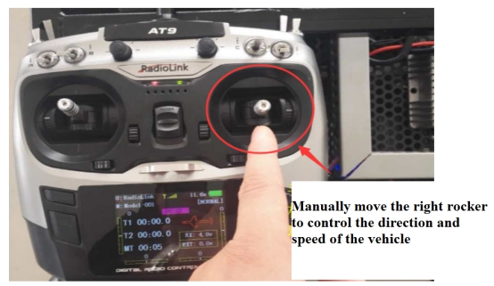
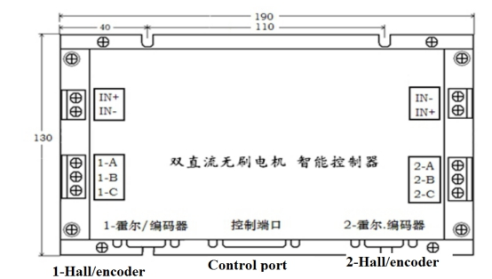
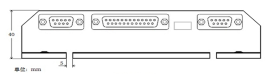
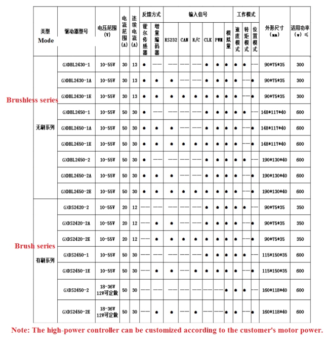

 600T Tank Car Description 

 From SZDOIT

## 1. Product overview

 Note: 

1. Please read the manual carefully before using the item

2. Please keep this manual

### 1.1 Product Name: 

**Tracked Chassis Safari-600T**

### 1.2 Product overview:

It is a universal crawler robot chassis vehicle with large development space and smoother driving. 

The whole car adopts Christie's independent suspension design to better achieve heavy-duty shock absorption.It’s high-torque DC brushless geared motor inside makes it strong enough to carry heavy bearing.The precise chassis height and reasonable power motor make this model have the advantages of low center of gravity, strong passability, and smooth running of heavy-duty shock absorbers. It is widely used in robot mobile solutions in complex environments.

### 1.3 Main functions:

Robot chassis mainly used for exploration, rescue, reconnaissance, shooting and other functions

## 1.4 Extended functions:

It can be used for the development of special robots such as inspection and exploration, rescue and EOD, special shooting, and special transportation. Solve functions such as robot movement.

### 1.5 Product features:

(1) Equipped with a 650W brushless DC motor and a reducer to provide strong power. The chassis height exceeds 90mm, which can load obstacles and climb stairs.

(2) The turning radius is extremely small, which can realize turning on the spot.

(3) The grousers on the track support surface are not easy to slip, the traction adhesion performance is good, and the independent suspension design makes the chassis travel more stable.

(4) The large inner warehouse space can carry more equipment.

(5) Strong versatility, supporting non-standard product development and customization.

## 2. Device startup steps

 

Note: This is only our control kit operation. If you use other control kits, please refer to its usage.

 

 

 

## 3. Matters needing attention

1. The protection level of this car is IP54, and it is forbidden to use it in harsh situations that exceed the protection level it can withstand. The working environment temperature should be in the range of -20℃～60℃.

2. The vehicle should avoid contact with flammable, explosive, corrosive liquid and gas.

3. It is necessary to understand the performance of the crawler vehicle such as load, climbing, obstacle and so on, and use it within the design parameters. Otherwise, the service life of the tracked vehicle will be reduced and the danger of overturning will occur.

4. Before starting the crawler vehicle, you should first try to run it to check whether

- the battery power, emergency stop switches, meters, etc. work normally

- the crawler vehicle steering is flexible

- the steering handle is normal, and whether the brake is normal.

5. Please start slowly. The starting speed should not be too fast. Please ensured that there are no people and obstacles in the range of the tracked vehicle, and the speed should be gradually adjusted from slow to fast to avoid sudden changes in speed causing injury or loss.

6. When the crawler is climbing and moving forward with a load, the speed should be reduced as much as possible to prevent the motor from overloading.

## 4. How to save and store tank chassis

- Tracked vehicles are strictly forbidden to park in damp, rainy, or exposed places.

-  Avoid stopping on slopes or obstacles when you park the tank chassis

- To ensure the storage capacity of the battery, the battery should be stored with electricity.

- The debris between the track and the gear train should be cleaned up in time,

- The tracked vehicle should be inspected and repaired every 100KM.

- Regularly check the tightness of the suspension track and whether the bolts and nuts are loose.

- Anti-corrosion of the whole vehicle steel structure

- When it is found that there is paint falling, bumps, etc., the paint should be repaired in time to prevent the rust from reaching a certain level, which will affect the performance of the steel structure, leading to accidents such as fracture.
- Timely lubrication and maintenance points for movable hinge points and bearings of the whole vehicle include: boom hinge pins, track shoe connecting pins, pulley block bearings, track driving wheel bearings, track carrier wheels, track rollers and other movable parts.

## 5. Design parameters

| Project	specification |                                                |                 |
| ------------------------ | ---------------------------------------------- | --------------- |
| power                    | 48V DC brushless motor                         |                 |
| Working temperature      | -20℃~60℃                                       |                 |
| Suspension system        | Christie suspension                            |                 |
| rated power              | 650W*2                                         |                 |
| Rated torque             | 60NM                                           |                 |
| Running speed            | 0~1.4m/s                                       |                 |
| Maximum obstacle         | 200mm                                          |                 |
| Maximum climbing         | 40 degrees (can climb stairs)                  |                 |
| damping                  | Left and right independent *6 shock absorbers  |                 |
| Remote control distance  | Open area 300M                                 |                 |
| Endurance                | 2h                                             |                 |
| Remote control function  | The right rocker controls the body movement    |                 |
| dimension                | Outlook size                                   | 1000*750*360mm  |
| Inner size               | 790*310*240mm                                  |                 |
| Chassis height           | 100mm                                          |                 |
| Track width              | 150mm                                          |                 |
| Ground length            | 540mm                                          |                 |
| Weight                   | Self-weight                                    | 96kg            |
| Load                     | 75kg                                           |                 |
| Material                 | Wheel                                          | aluminum        |
| Body                     | Stainless steel plate                          |                 |
| Track                    | High-quality rubber embedded with Kevlar fiber |                 |
| Surface treatment        | Plastic spray/partial spray paint              |                 |
| Battery                  | Type                                           | lithium battery |
| capacity                 | 30AH                                           |                 |
| Voltage                  | 48V                                            |                 |

## 6、Motor parameters

| Model             | 48V DC brushless motor |          |
| ----------------- | ---------------------- | -------- |
| Phase             |                        | 3        |
| Series            |                        | 4        |
| Rated voltage     | VDC                    | 48       |
| No-load speed     | RPM                    | 3000±10% |
| No-load current   | A                      | 1.7      |
| Rated speed       | RPM                    | 2500±10% |
| Rated torque      | N-m                    | 2.5      |
| Rated power       | W                      | 650      |
| Rated current     | A                      | 16       |
| Peak torque       | N-m                    | 7.5      |
| Peak current      | A                      | 48       |
| Back EMF Constant | V/KRPM                 | 16       |
| Torque constant   | N-m/Amps               | 0.15     |
| Insulation class  |                        | B        |

## 7. Instructions for Smart Controller

 Note: This is only our control kit operation. If you use other control kits, please refer to its usage.

 

 

PC series product selection table

 

Please read this instruction manual carefully before using this product.

And follow the precautions specified in the use and installation instructions

Safety Precautions

- Please install, connect and debug the equipment under the guide of  professional and technical person

- Do not install, remove or replace the equipment line when the power is on.

- Be sure to install necessary protection devices between the power input end of this product and the power supply (battery) to avoid dangerous accidents or fatal injuries; need to install: overcurrent protector, insurance, emergency switch.

- Please do a good job of isolation and insulation protection between this product and the earth and equipment.

- If you really need to debug this product with electricity, please use a non-metallic special screwdriver or special debugging tool with good insulation.

- This product needs to be installed in a well-ventilated environment.

## Contact Us

- E-mails: [yichone@doit.am](mailto:yichone@doit.am), [yichoneyi@163.com](mailto:yichoneyi@163.com)
- Skype: yichone
- WhatsApp:+86-18676662425
- Wechat: 18676662425