
 T100 Tank Car Installation Instructions 

 From SZDOIT

# 1. List of materials

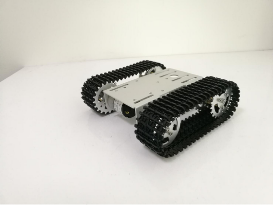 

| Name                           | Quantities | Name                   | Quantities |
| ------------------------------ | ---------- | ---------------------- | ---------- |
| Plate                          | 1          | 28mm copper pillar     | 6          |
| Big bearing wheel piece        | 4          | 5mm coupling           | 2          |
| 17mm copper pillar             | 6          | Black top silk         | 4          |
| M3*8 hexagon screws            | 24         | Long M4 hexagon screws | 2          |
| Bearing                        | 4          | 33 motor               | 2          |
| connector                      | 2          | M3*6 flat head screws  | 6          |
| M2 screws                      | 2          | Tracks                 | 2          |
| Short M4 hexagon srews         | 2          | M2 wrench              | 1          |
| Shim                           | 4          | M3 wrench              | 1          |
| Big hole driving wheel piece   | 2          | M4 wrench              | 1          |
| Small hole driving wheel piece | 2          |                        |            |

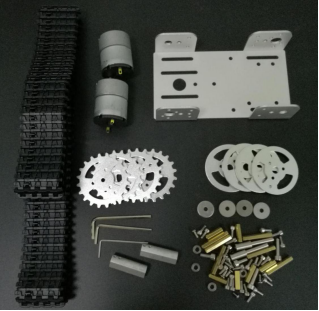 

# 2. Installation process

Assembly of load-bearing wheels and driving wheels

The car has 2 load-bearing wheels and 2 driving wheels. The assembly process of a single load bearing wheel and driving wheel is shown below.

## A. load-bearing wheel

List of materials:

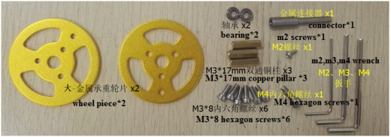 

Assembly process:

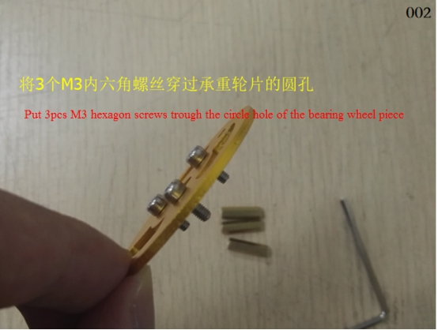 

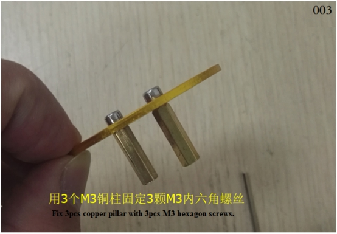 

 

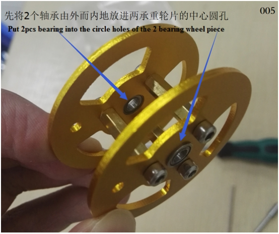 

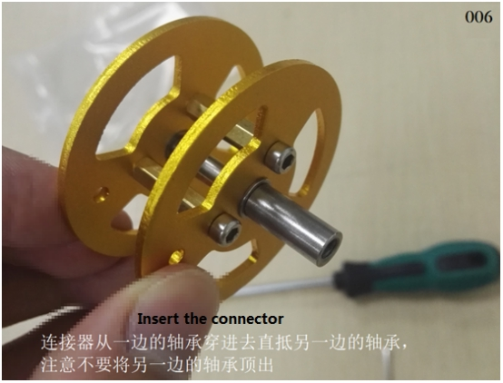 

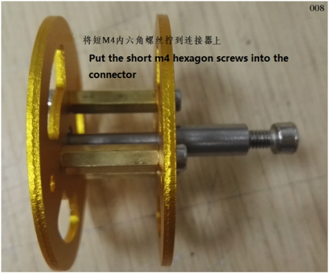 

## B. drive wheel

List of materials:

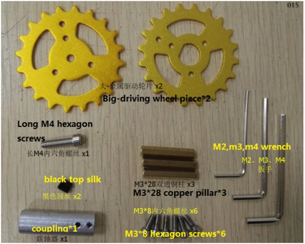 

Assembly process:

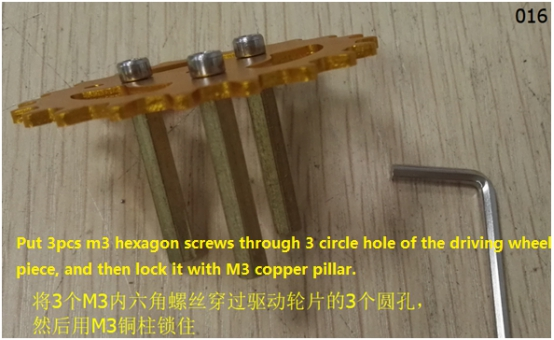 

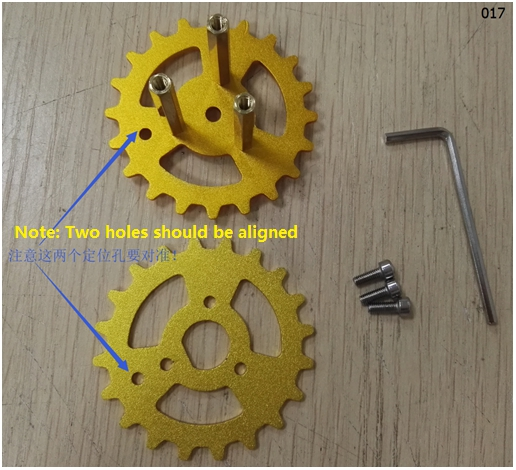 

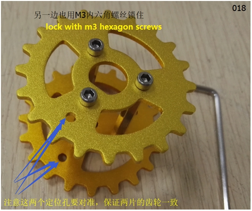 

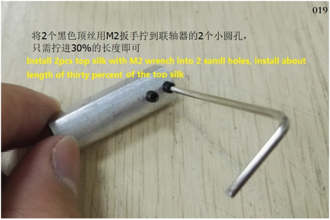 

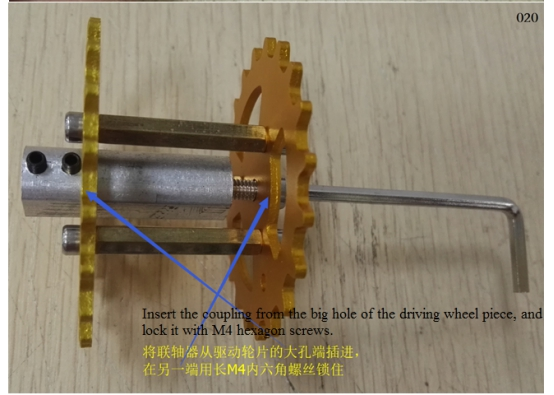 

 

2)Installation of load-bearing wheel

List:

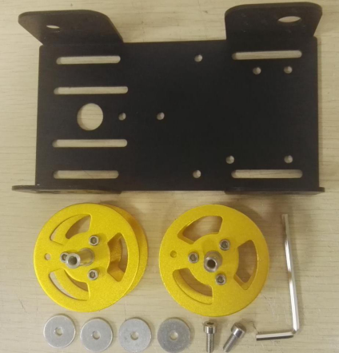 

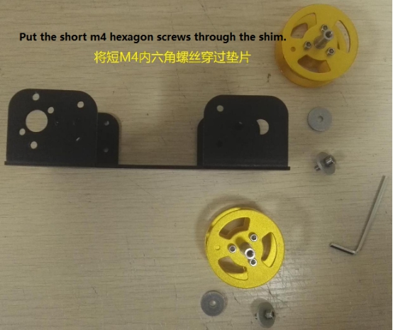 

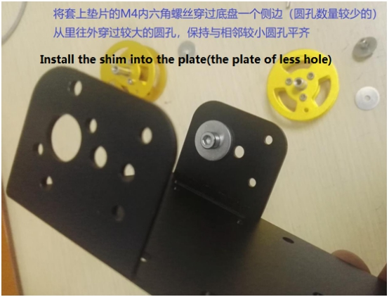 

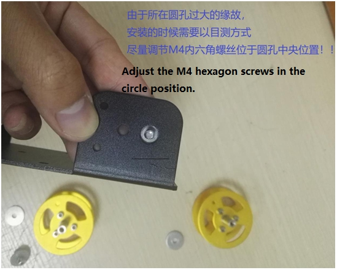 

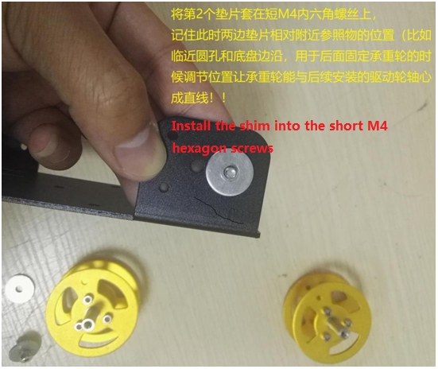 

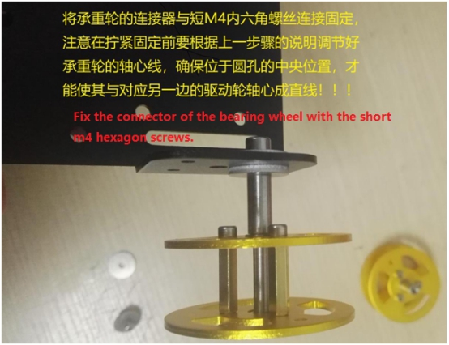 

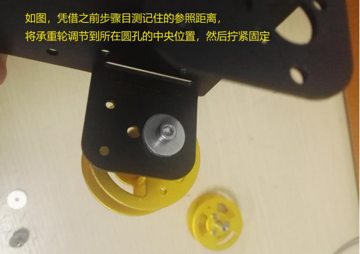 

 

 

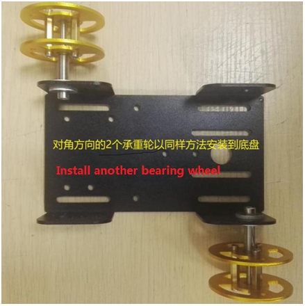 

## C. installation of motor and drive wheel

List:

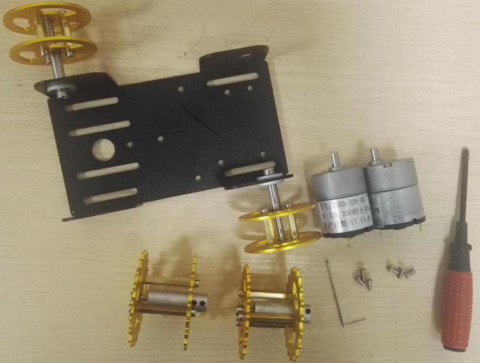 

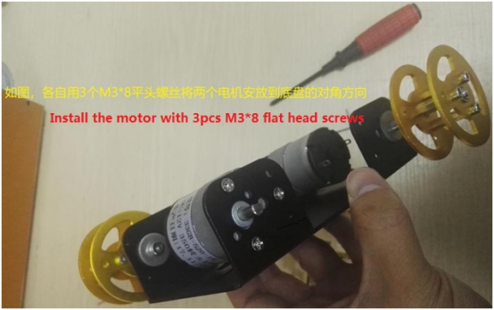 

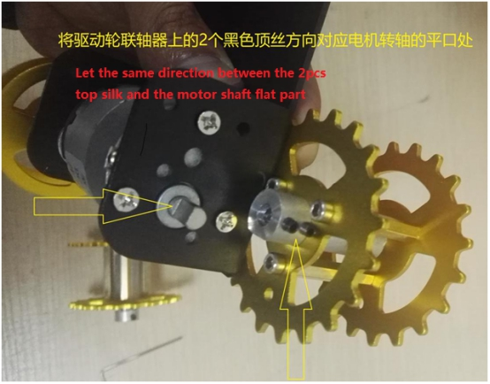 

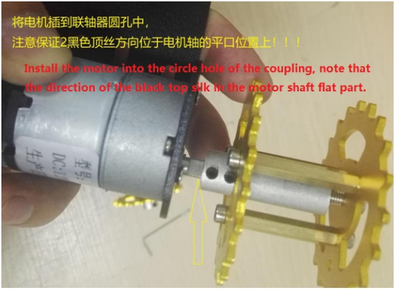 

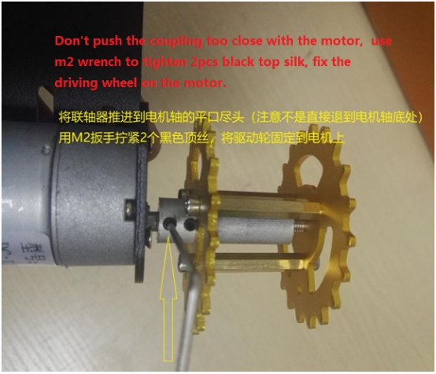 

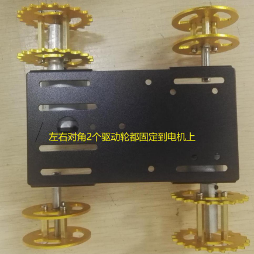 

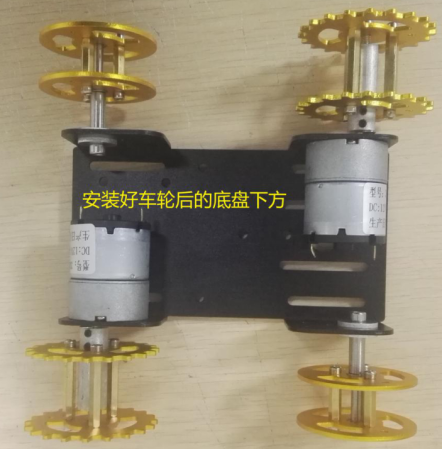 

## D: installation of track

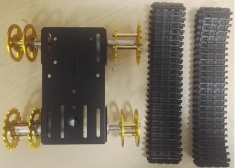 

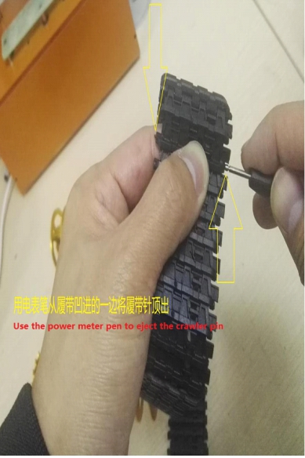 

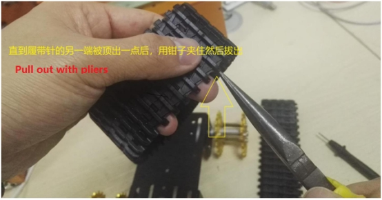 

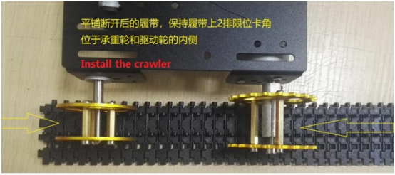 

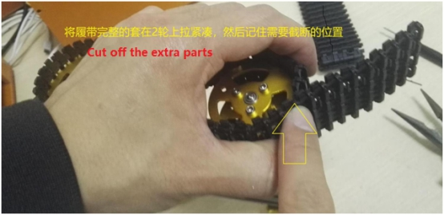 

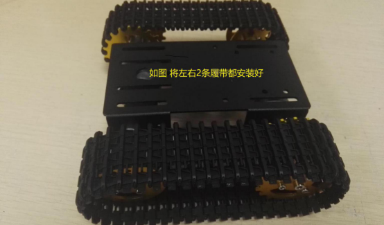 

# 3. Real Product

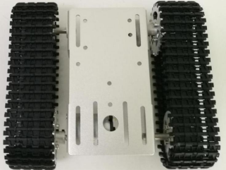 

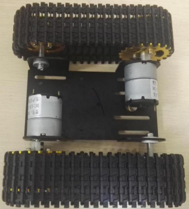 

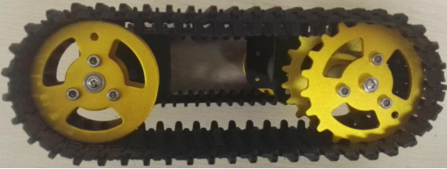 

# 4. Note

(1) Because of the narrow chassis, the two wheels at the same end need to be fixed in sequence first bearing wheel and then the motor.

# Contact Us

- E-mails: [yichone@doit.am](mailto:yichone@doit.am), [yichoneyi@163.com](mailto:yichoneyi@163.com)
- Skype: yichone
- WhatsApp:+86-18676662425
- Wechat: 18676662425