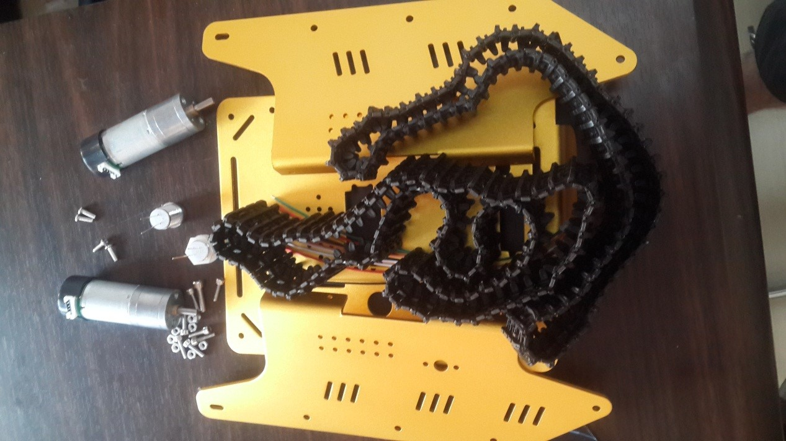
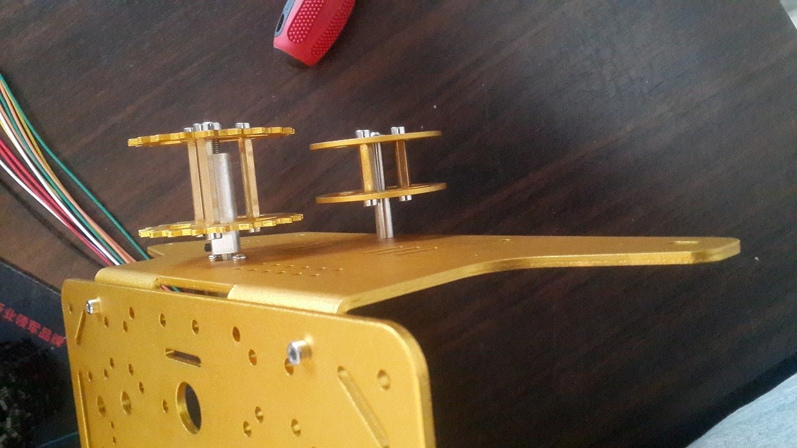
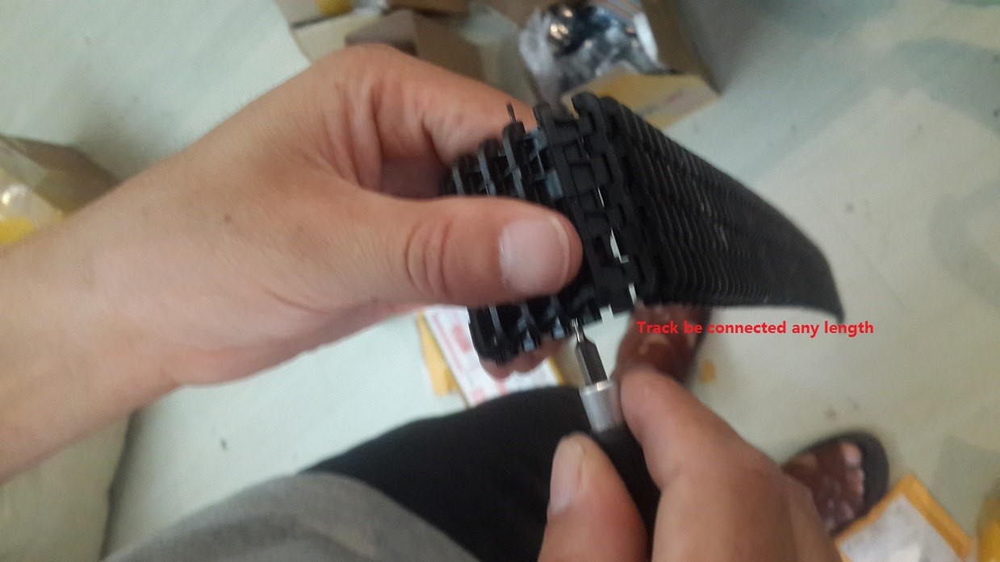

  User Manual for T Series Tank Chassis 

 from SZDOIT 

# 1. Introduction

In fact, the installation for T series tank chassis is similar. So, here, we just present the installation of **T300 tank chassis**.

Some useful installation links:

- metal bearing wheel: https://gitnova.com/metal-wheel-for-tank-chassis/
- track: https://gitnova.com/plastic-track/
- metal driving wheel: https://gitnova.com/metal-driving-wheel/
- DC motor: https://gitnova.com/9v-dc-motor/

All of the T series tank car chassis can be assembled by this manual, e.g., T800, T900, T200, T100, and so on.

# Material List for T300

- Motor: 2pcs
- LED light: 2pcs
- Track: 2pcs
- Panel: 3pcs
- Power cable: 2pcs
- M3*14 srew: 8pcs
- M3 nut: 8pcs
- M3*12 screw: 4pcs 

# 3. Install the chassis

# 4. Install the motor

# 5. Install the driving wheel

# 6. Install the bearing wheel

# 7. Install the plastic track

  Adjust the suitable length of track. Note that, the track is connected one by one, which can be any length. **Note that, the track can be connected with any length, which can be shown in the following picture. The track is out by a needle with easy.**

# 8. Connect the track on the wheel

# 9. Some Warm Tips

- When install the bearing wheel and the driving wheel, please note that the location holes must be aligned. 
- The track is connected one by one, so it can be connected to any length.
- Since there are many types of screws, so, please note the usage of screws. BUT since different batch production, the screw is different, e. g., M3* 6 is used to fix the motor. So, please choose the fitable screw to fix, but the screw on the pictures is just an example, similar but not same.
- When install the bearing, it may be tight, you can install it by some tools to let the bearing insert into the stainless steel connector.
- To let the driving wheels and bearing wheels move smoothly, together with the track, so please let the driving and bearing wheels are placed on **the horizontal level**. This is very important. By this way, the track can be move lastly.

#  Contact Us

- E-mails: [yichone@doit.am](mailto:yichone@doit.am), [yichoneyi@163.com](mailto:yichoneyi@163.com)
- Skype: yichone
- WhatsApp:+86-18676662425
- Wechat: 18676662425

