
 T900 Tank Chassis Installation Instruction 

 From SZDOIT

Part of the installation:

wheel：
metal bearing wheel:https://gitnova.com/#/Robot/FrameChassis/Wheel/MetalBearingWheel/MetalBearingWheel

track: https://gitnova.com/#/Robot/FrameChassis/track/track

metal driving wheel: https://gitnova.com/#/Robot/FrameChassis/Wheel/MetaDrivingWheel/metaldrivingwheel

DC motor: https://gitnova.com/#/Robot/Engine/9vMotor/9vmotor

Controller：
Arduino UNO:https://gitnova.com/#/Robot/Controller/ps2/4motor16servo

App：

https://gitnova.com/#/Robot/Controller/app/AppforSmartCar

## 1. Materials List

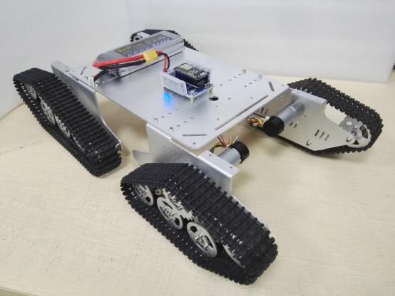 

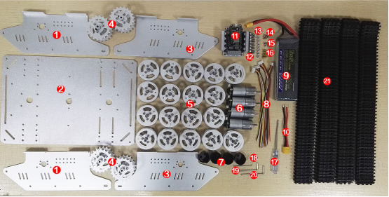 

| No.  | Name                                      | Quantities | No.  | Name                  | Quantities |
| ---- | ----------------------------------------- | ---------- | ---- | --------------------- | ---------- |
| 1    | Side Plate(right)                         | 2          | 12   | M3 hexagon screws     | 8          |
| 2    | Chassis                                   | 1          | 13   | M3 nut                | 8          |
| 3    | Side Plate(left)                          | 2          | 14   | M3*8 flat head screws | 9          |
| 4    | Metal Driving Wheel(big)                  | 4          | 15   | M3nut                 | 4          |
| 5    | Metal Bearing Wheel(big)                  | 18         | 16   | 7mm support coupling  | 4          |
| 6    | 9V motor with encoder                     | 4          | 17   | screwdriver           | 1          |
| 7    | Motor cover                               | 4          | 18   | M2 wrench             | 1          |
| 8    | Motor wires                               | 4          | 19   | M3 wrench             | 1          |
| 9    | 11.1V Battery(Not Included)               | 1          | 20   | M4 wrench             | 1          |
| 10   | Battery adapter wires                     | 1          | 21   | Plastic tracks(big)   | 4          |
| 11   | 4 road motor big power driver control kit | 1          |      |                       |            |

## 2. Main Control Board Introduction

Full set：

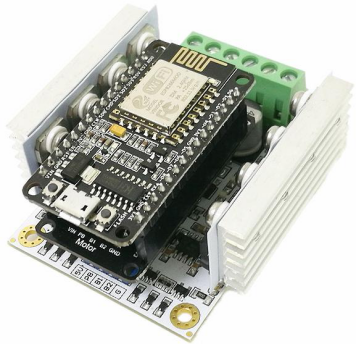 

Control board：

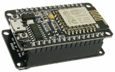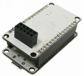 

Front                Back

Driver board：

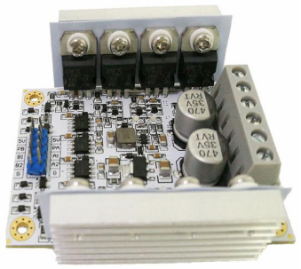 

 

## 3. Installation

### 1)Install the tank car

#### Step 1：Install the wheel to the side plate

① Install the bearing wheel

List：

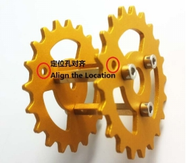 

Installation：

 

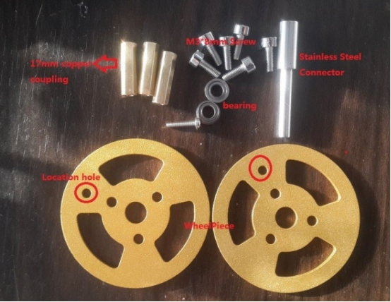 

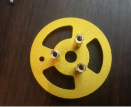 

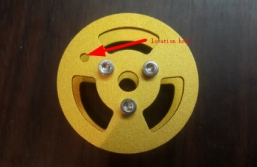 

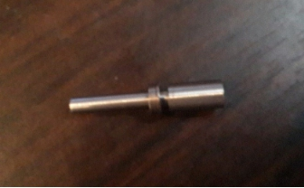 

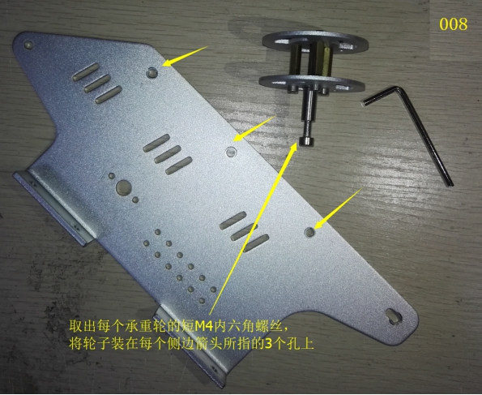 

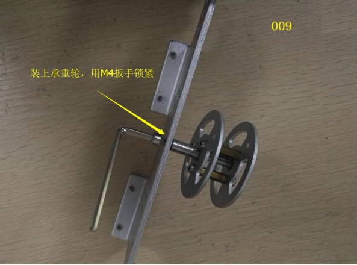 

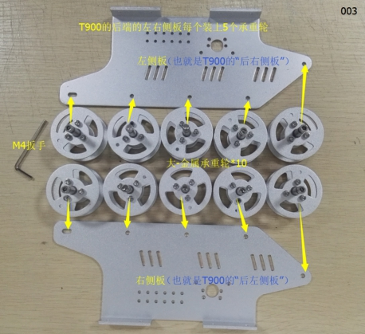 

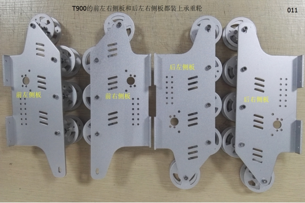 

② Install the driving wheel

a． Install the motor wires

List：

 

Installation：

 

b. Install the motor to the side plate

List：

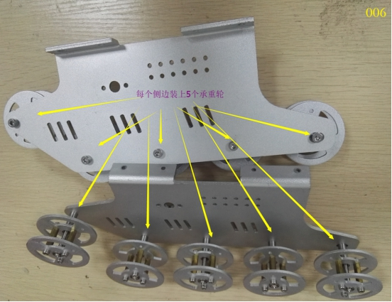 

Installation：

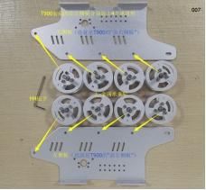 

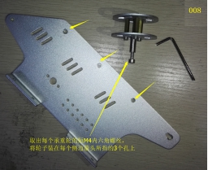 

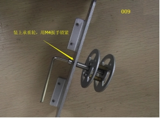 

b. Install the driving wheel

List：

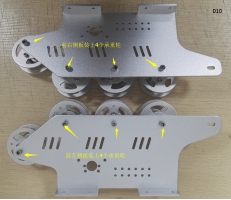 

组装：

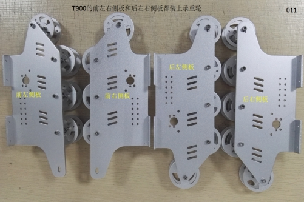 

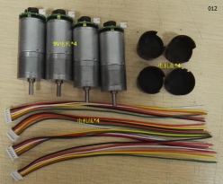 

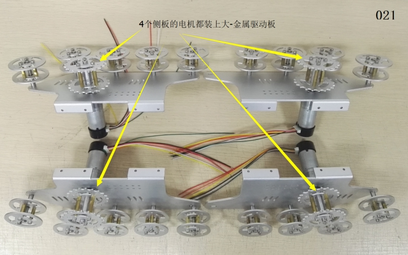 

#### Step2：Install the side plate to the chassis

a． List

 

b． Installation

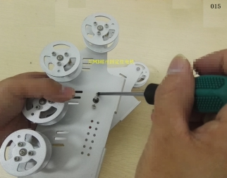 

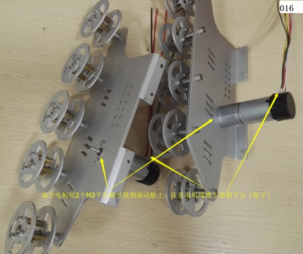 

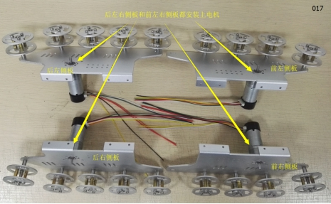 

#### Step3：Install the tracks

① Install the plastic tracks

List：

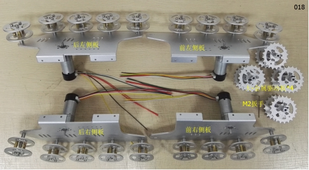 

Installation：

 

 

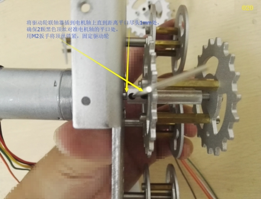 

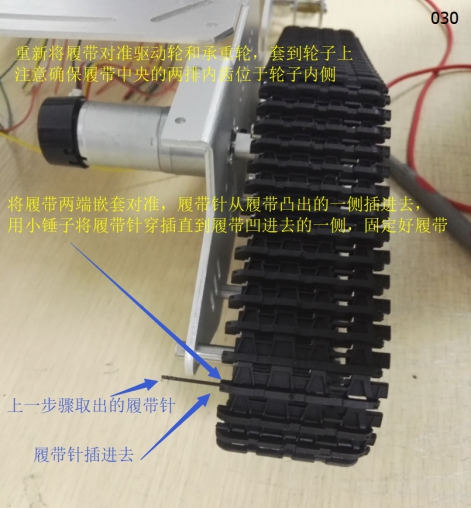 

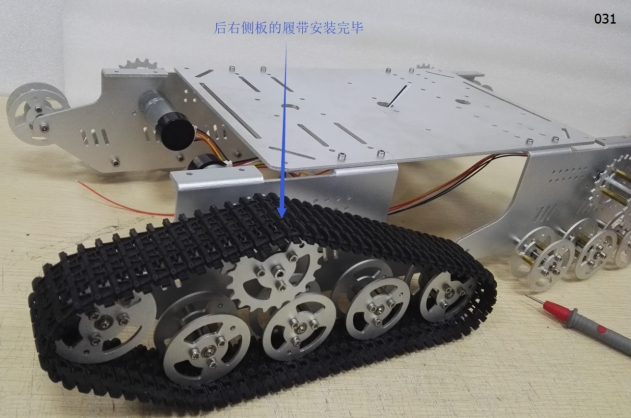 

 

### 2)Install the control board and motor wires

① Install the control board

List：

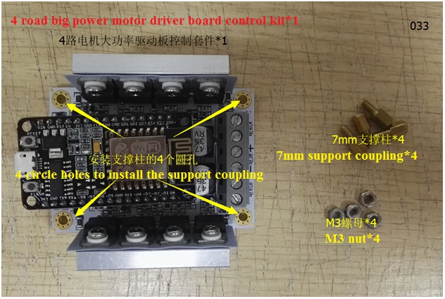 

Installation：

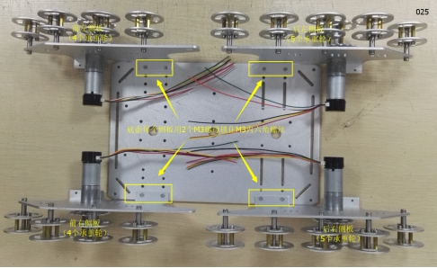 

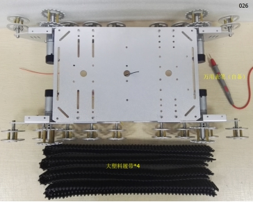 

② Install the main control board and battery box. 

List：

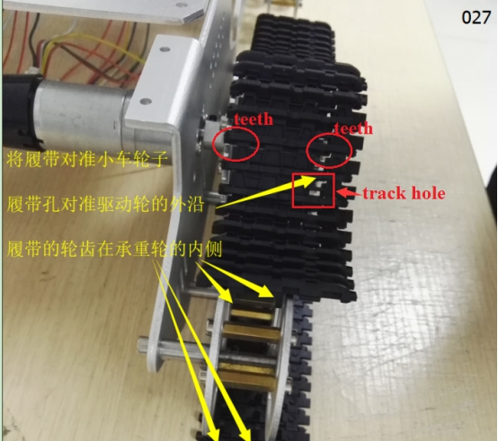 

Installation：

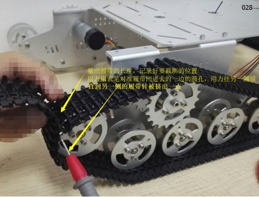 

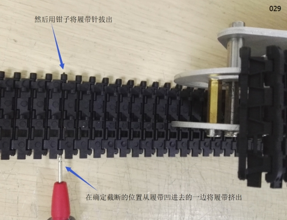 

③ Circuit wiring

a. Connect the motor wires

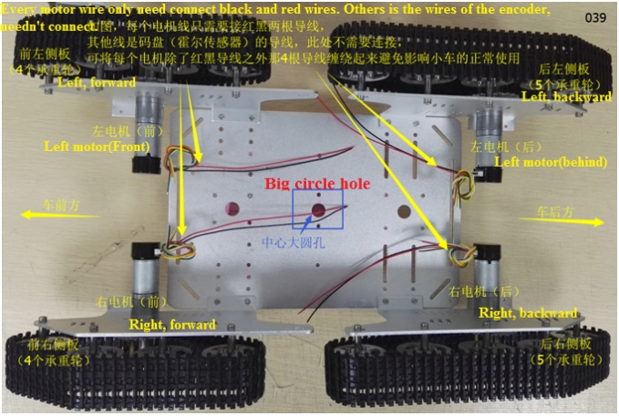 

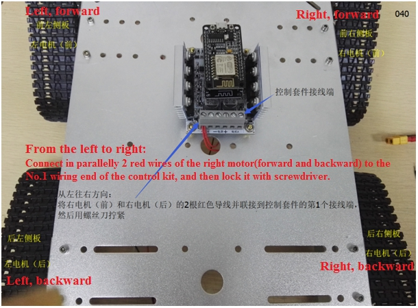 

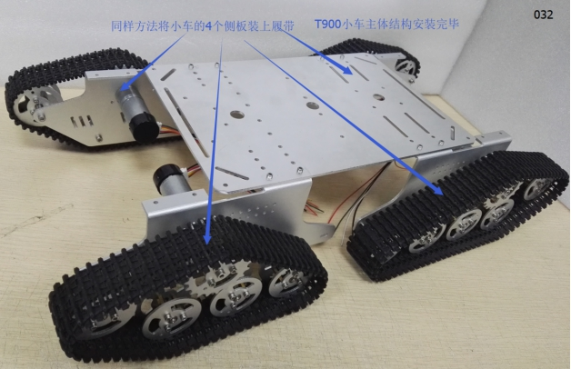 

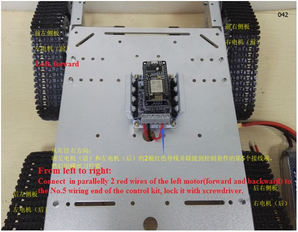 

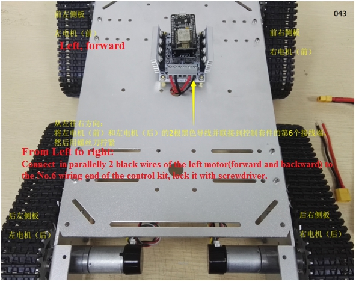 

b. Connect the power supply wires

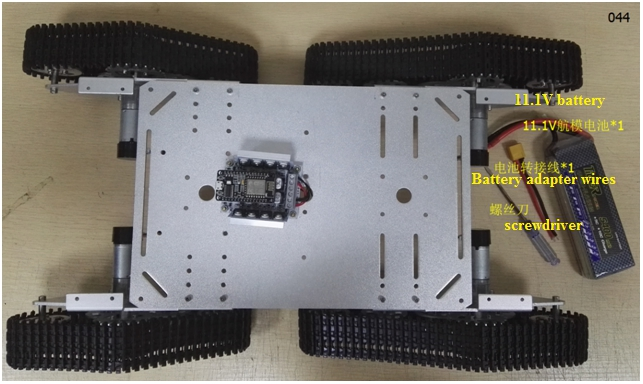 

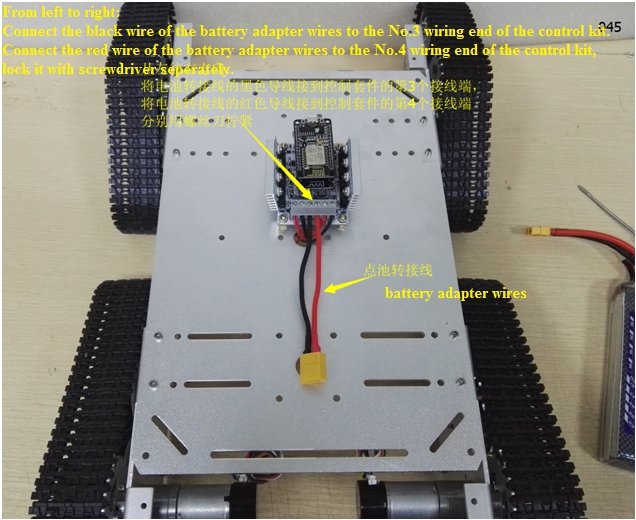 

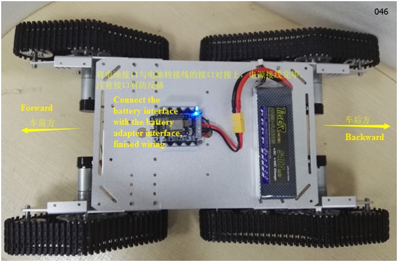 

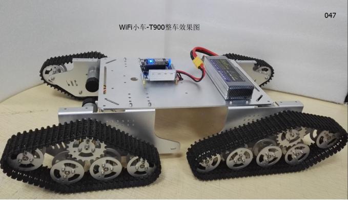 

 

## Contact Us

- E-mails: [yichone@doit.am](mailto:yichone@doit.am), [yichoneyi@163.com](mailto:yichoneyi@163.com)
- Skype: yichone
- WhatsApp:+86-18676662425
- Wechat: 18676662425