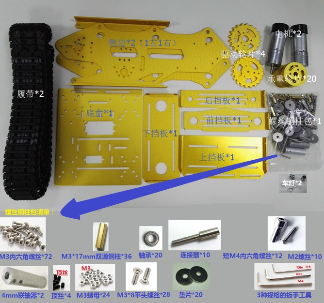
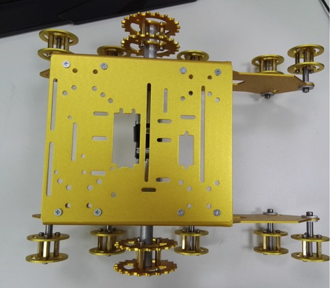
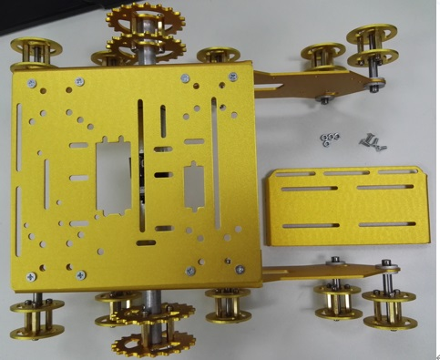
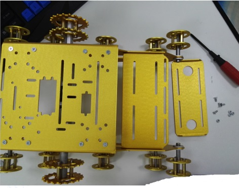
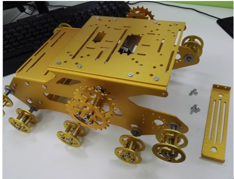
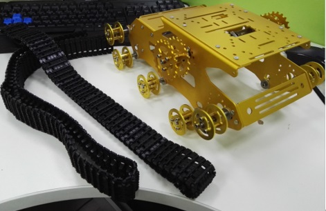
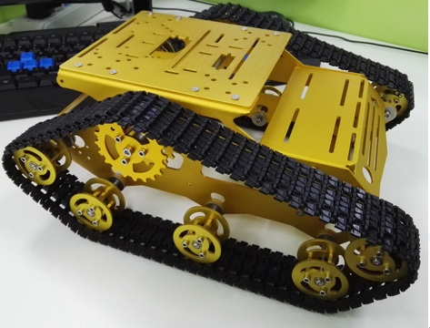
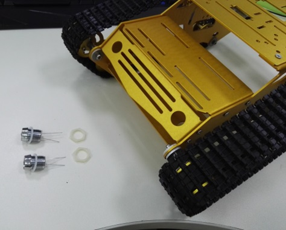

  User Manual for Y100  

 from SZDOIT 

# 1. Introduction

This manual is for Y100 installation. Note that, wheel and motor can be read to the following links:

**metal bearing wheel**: https://gitnova.com/metal-wheel-for-tank-chassis/
**track**: https://gitnova.com/plastic-track/
**metal driving wheel**: https://gitnova.com/metal-driving-wheel/
**DC motor**: https://gitnova.com/9v-dc-motor/

# 2. Materials

# 3. Install the Car Chassis

# Contact Us

- E-mails: [yichone@doit.am](mailto:yichone@doit.am), [yichoneyi@163.com](mailto:yichoneyi@163.com)
- Skype: yichone
- WhatsApp:+86-18676662425
- Wechat: 18676662425

