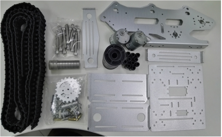
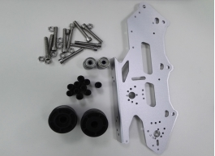
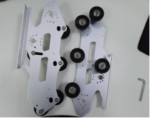
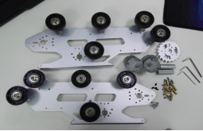
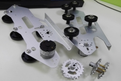
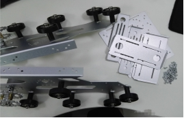
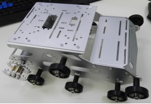
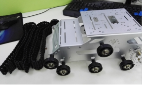
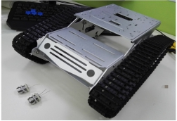
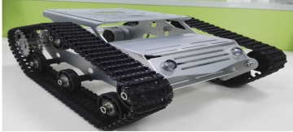

 User Manual for YP100 

 From SZDOIT

Part of the installation:

track: https://gitnova.com/#/Robot/FrameChassis/track/track

DC motor: https://gitnova.com/#/Robot/Engine/9vMotor/9vmotor

Controller：
Arduino UNO:https://gitnova.com/#/Robot/Controller/ps2/4motor16servo

ESPDuino:https://gitnova.com/#/Robot/Controller/controller/espduinoController

App：

https://gitnova.com/#/Robot/Controller/app/AppforSmartCar

# 1. Package Include:

 

# 2. Installation Steps

## 2.1 Install load bearing wheel

 

## 2.2 Install drive wheel

 

## 2.3 Install the chassis

 

## 2.4 Install the crawler

 

## 2.5 Install LED

 

# Contact Us

- E-mails: [yichone@doit.am](mailto:yichone@doit.am), [yichoneyi@163.com](mailto:yichoneyi@163.com)
- Skype: yichone
- WhatsApp:+86-18676662425
- Wechat: 18676662425