
 Homekit Temperature And Humidity Sensor

 From SZDOIT

# 1.Appearance and Parameters

 

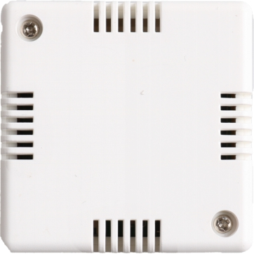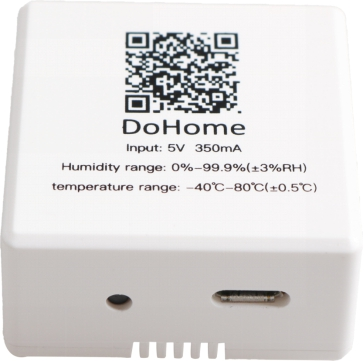 

Parameter description:

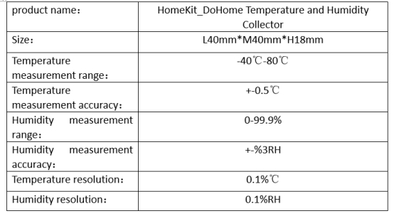 

# 2. How to use

## Step 1: Configure device networking

Step 1: Please open the WLAN setting page of your iPhone (as Fig. 1), find and connect the WiFi hotspot named as Homekit-sensor_xxxx. After about 3s, WiFi configuration interface will pop up automatically.

Note: If the interface doesn’t pop up automatically, please open your phone browser and input http://192.168.4.1. And then, please wait for entering the interface of configuration.

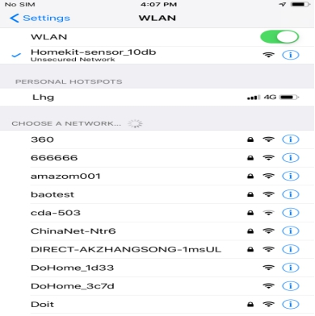 

Fig.1 Connect your iPhone or iPad to the new wifi network Homekit_sensor_xxxx hotspot

Step 2: Wait for the Captive Portal and select your WiFi network in the pop-up window, and insert your password and click “join” (as Fig. 2). Please make sure that the indicator always lights (the WiFi account information in the pictures is only for reference).

Note: If you don't find your router or smart plug at other states. Please look over the Frequent Problems and reconfigure the smart socket.

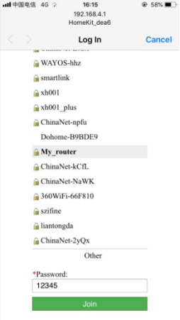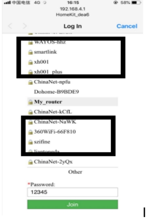 

## Fig. 2 Wait for the Captive Portal and select your WiFi network

 

## Step 3: Please check if you have installed Home APP.

If not, please download it in the App Store. (as Fig. 3). If it is already installed, go to step 4.

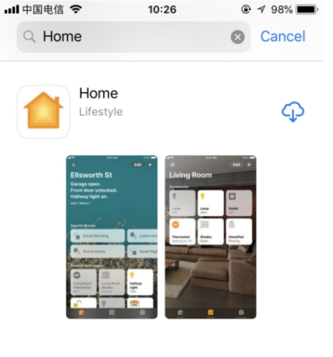 

Fig. 3 Download the Home App

## Step 4: Please connect your phone with your home WiFi network (as Fig. 4)

Note: If you can’t find your device name in the app, please make sure that the mobile phone and smart socket are in the same LAN. Please make sure that the light is always on. If the addition fails, please check the FAQ.

 

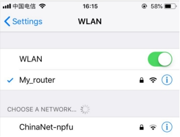 

Fig. 4 Connect your phone with your home WiFi network

## Step 5: 

1)Open the Home app

 2)Click the + symbol

 3)Click I don't have the code..

 4) Select the Homekit_sensor_xxxx. When the Homekit_sensor_xxxx does not appear on top of the page, if you have a dual-band router, please turn off the 5GHZ Wi-Fi network and ensure that you are using 2.4GHz Wi-Fi network.

 5)Confirm that you want to add the device

6)Insert the Password that is 12345678

 7) After waiting for the encryption check (about 30s-50s), you have added the switch successfully. Please rename the smart device for convenient operation in the later, and enjoy it.

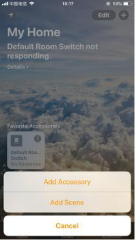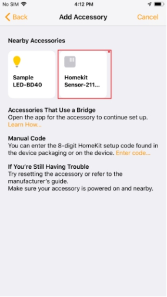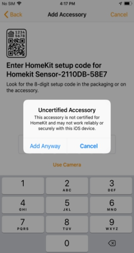 

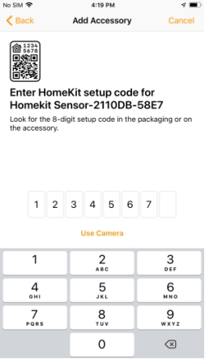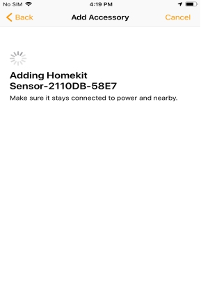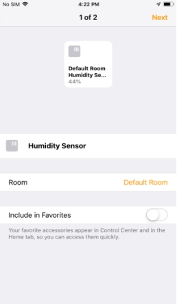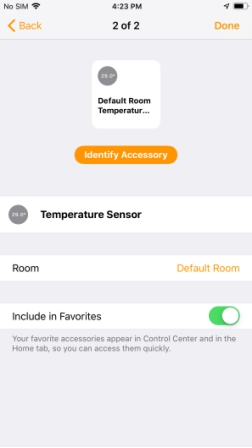 

Fig. 4 How to Pair HomeKit

# 3. Frequent Problems:

Q1: How to reset the socket to the factory mode?

A1: If you want to reconfigure the new router, switch on and off more than five times continuously, each time the power-on time is more than 2S, less than 10s, and then repeat the first step of distribution network.

Q2: How to develop your own firmware and upgrade to a device?

A2: https://github.com/SmartArduino/DoHome/

 

Q3: What should we pay attention to in the process of distribution network

1. Make sure that equipment, mobile phone and router are close to each other in the process of distribution network.

2. Make sure the password of the router is correct in the process of distribution network.

3. Make sure that the router works in 2.4 G band and enables broadcasting, and works in non-11 n only mode.

4. In the process of network distribution, please ensure that the router wireless encryption mode is wpa2-psk type, the authentication type is AES, or both are set to automatic.

5. If the router opens wireless MAC address filtering in the process of distribution network, please remove the device from the router's MAC filter list; make sure that the router has firewall function. If yes, please turn off the firewall function and then try to connect the device to the router.

6. If it is a dual-band router, please set different passwords for 2.4G signal and 5G signal, or turn off 5G signal. Do not turn on the dual-band function.

# Contact Us

- E-mails: [yichone@doit.am](mailto:yichone@doit.am), [yichoneyi@163.com](mailto:yichoneyi@163.com)
- Skype: yichone
- WhatsApp:+86-18676662425
- Wechat: 18676662425