
 Homekit Smart Swithc

 From SZDOIT

# 1. Introduction

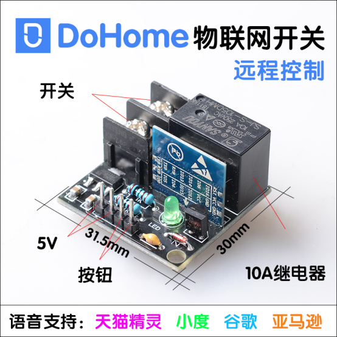 

 

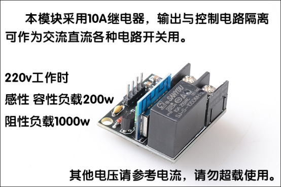 

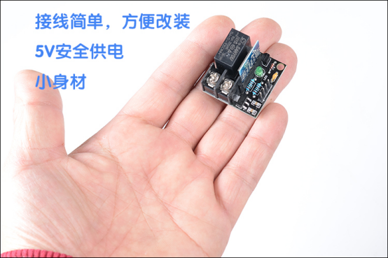 

**Warm tips:**

Please check if the smart socket has any abnormal noise, damage, fracture or other problems because of the transportation process. If there is any damage, please contact the manufacturer in time. Please power on the plug to the 85V-255V (50-60hz) home circuit and check that the indicator light is blinking slowly. (the light blinks about one time each second)

Note: If the smart plug doesn’t blink slowly, please long press the button for 3s to set it to this mode.

# 2. How to Use

## For iphone:

Step 1: Please open the WLAN setting page of your IPhone (as picture one) and find the hotspot of Homekit_xxxx, and then connect with it. After about 3s, the interface of WiFi configuration will pop up automatically.

Note: If the interface doesn’t pop up automatically, please open your phone browser and input htt://192.168.4.1. And then, please wait for entering the interface of configuration.

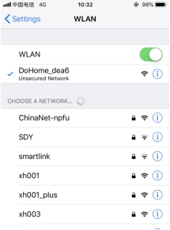（图需要更换为Homekit_XXXX）

Step 2: Please choose your home Wifi name in the pop-up window, input your password and click “join” (as picture two). After the WiFi configuration interface has skipped to the WiFi list page (as picture three), please make sure that the indicator light is shining on continuously. (the WiFi account number in the picture is only for reference)

Note: If the smart plug is in other modes, it means that the network configuration had failed. Please look over the normal problems and reconfigure the smart socket.

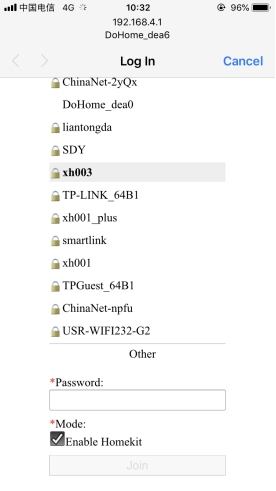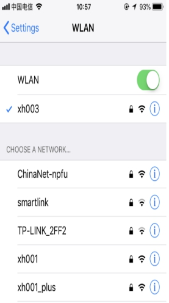

 

 

Step 3: Please check if you have installed Home APP.

If you don’t have Home APP, please download it in the APP store. (as picture four)

 

 

 

Step 4: Please connect your phone with your home WiFi network (as picture five)

Note: Please ensure that the IPhone and the smart plug are in the same network.

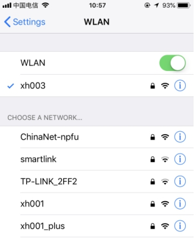 

 

Step 5: Please open Home APP, click “Add accessory”. And then, please click “Don’t have a code or cannot scan”, “Add anyway”, and wait for the encryption check (about 30s). After that, you have added the switch successfully.

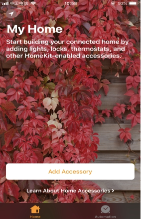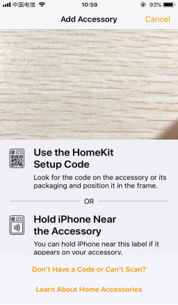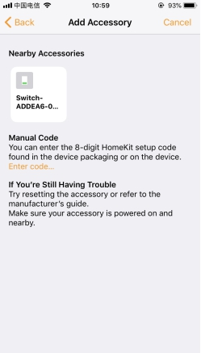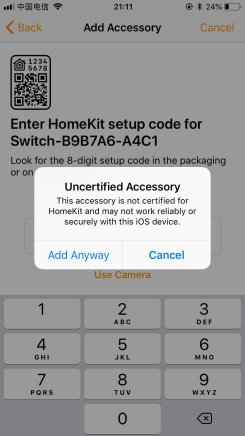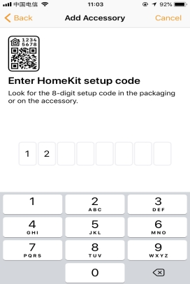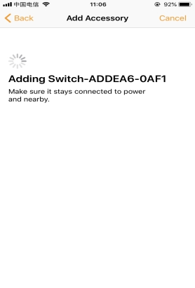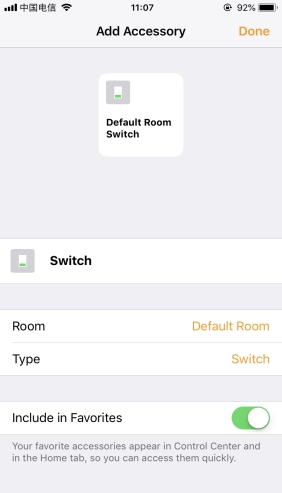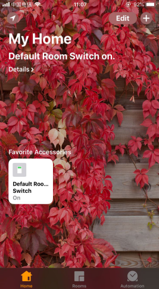

 

Note: If it doesn’t refresh the device, please make sure that the phone and the smart plug are in the same local network. Please ensure that the indicator light is shining on continuously. If you still cannot add your device, please look over the normal problems.

 

Step 6: If you want to use the intelligent audio device, like alexa, google assistant, Tianmao spirit or Xiaoai schoolmate. Please connect your phone to the WiFi which the smart plug has connected in the step 4. Scan the QR code in the following and download DoHome  APP.

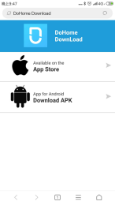

 

Step 7: Login the account number and password of DoHome. Pull down and refresh the list to look for your smart device.

Note: The phone and the smart plug must be connected in the same WiFi network.

 

 

 

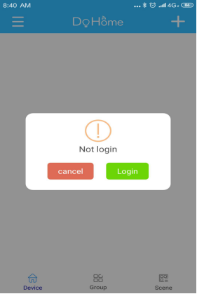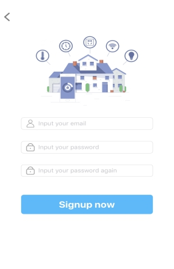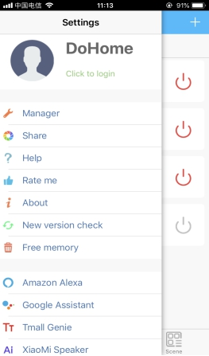

Step 8: Please open the menu in the upper left corner, click “Manager” and find your device. And then, choose it and click “Bind device”.

Note: If you want to use the smart audio, please click the corresponding icon to check the user manual. If you need help, please click the option of help.

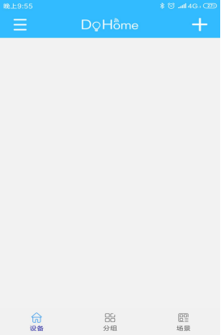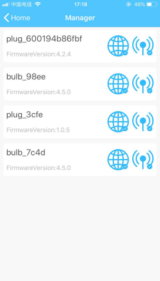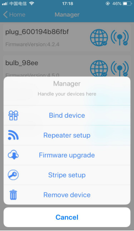

## For android:

Step 1: Please power on the plug to the 85V-255V (50-60hz) home circuit and check that the indicator light is blinking slowly. (the light blinks about one time every second) Long press the button of smart plug for 3s and observe that the indicator light blinks quickly. (the light blinks about one time every second)

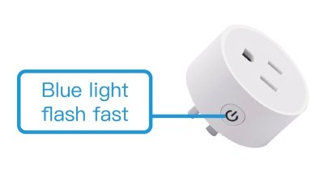 

Step 2: Open the Android phone, scan the QR code in the following and download DoHome  APP.

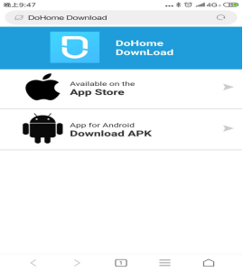

Step 3: Open DoHome APP and login your account number and password. And then log in to DoHome.

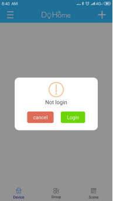

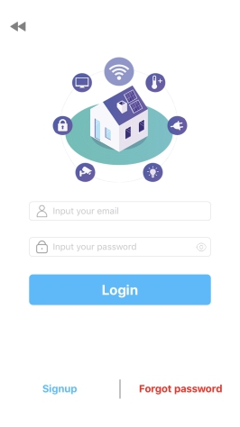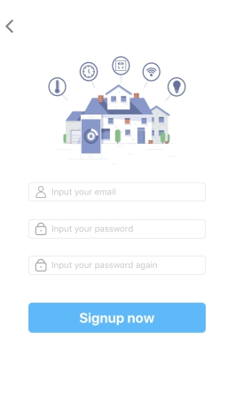

 

 

Step 4: Click the“+”in the upper right corner to add the device according to the hint.

Note: If you still have a doubt, please click the menu in the upper right corner to look for help and click the instruction.

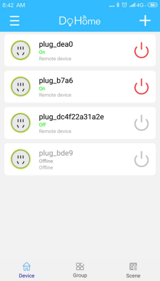

 

 

 

 

 

 

Step 5: If you want to use the smart audio device, like alexa, google assistant, Tianmao spirit or Xiaoai schoolmate. Please click the menu in the upper right corner to find the corresponding audio and check the corresponding manual.

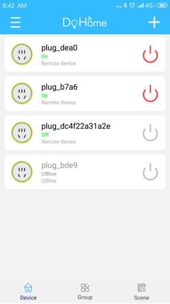

 

 

# Technology support:

https://support.doiting.com

# Normal problems:

Remains to be established: this device only supports more than IOS 10 version/ more than android 8.0 version.

A: When adding the device, if the pop-up window prompts “whether accept the app to get the location”, how to handle it?

B: This question is very important, please must click “accept or yes”.

A: Why the device name should be short?

B: Because it is convenient for voice controlling function, for example, DoHome.

A: How to reset the socket to the factory mode?

B: Long press the button of the smart plug (3s) and the indicator light will blink slowly.

A: During the network configuration, if there is something you should take attention of?

1. Please make sure that the device, your phone and the router are close to each other during the network configuration.

2. Please ensure that you input the password of the router correctly.

3. During the configuration of network, please keep that the router works in the 2.4G frequency domain, enables the broadcasting function and works in the non-11n only mode.

4. During the configuration of network, please ensure that wireless encryption mode of the router is wpa2-psk and the type of authorization is AES. Or both are set to the automatic mode.

5. During the network configuration, if the router opens the wireless MAC address filter, please move the device away from the MAC filter list of the router.

6. If it is a dual-frequency router, please set different passwords for 2.4G signal and 5G signal or turn off 5G signal. Please remember not opening the function of dual-frequency combination.

7. If it is a customized router provided by the operator, please confirm whether the router has the firewall function. If this function exists, please turn off the firewall function and then try to connect the device to the router.

 

Clip art:

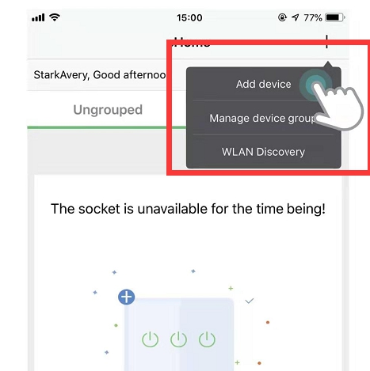 

# Contact Us

- E-mails: [yichone@doit.am](mailto:yichone@doit.am), [yichoneyi@163.com](mailto:yichoneyi@163.com)
- Skype: yichone
- WhatsApp:+86-18676662425
- Wechat: 18676662425