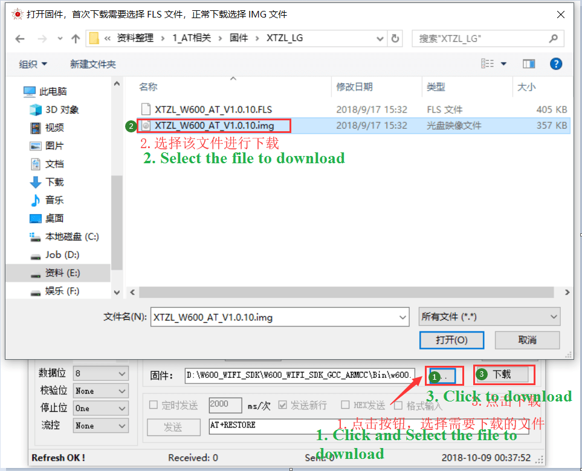
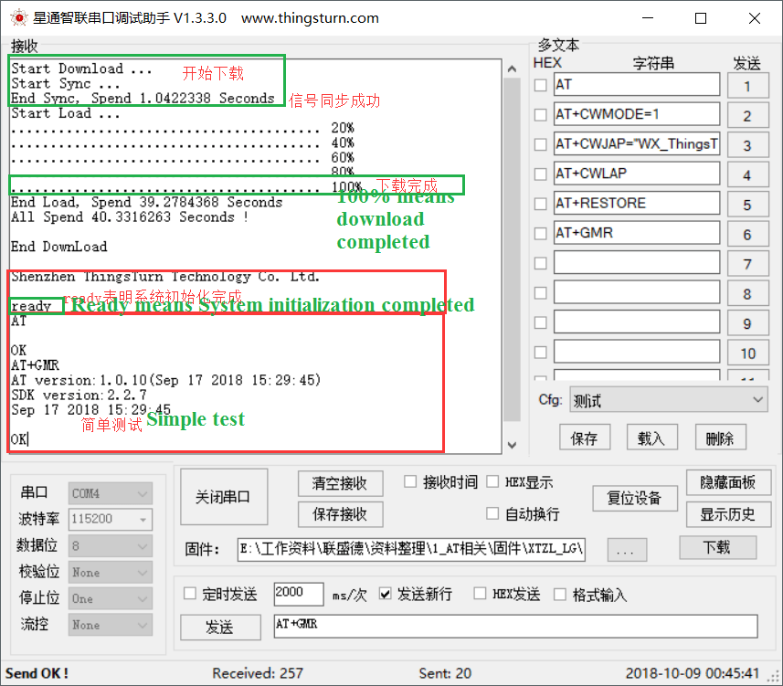

 Compatible Version AT Command User Guide 

 From SZDOIT

Note: This article aims to guide customers to download and debug AT firmware using W600 series products, including hardware environment, software environment, download firmware, modulation and other steps.

## 1 Preparation

## Computer: firmware download currently only supports Windows operating system

-   Software: [Serial debugging assistant](https://download.w600.fun/tool/%E6%98%9F%E9%80%9A%E6%99%BA%E8%81%94%E4%B8%B2 %E5%8F%A3%E8%B0%83%E8%AF%95%E4%B8%8B%E8%BD%BD%E5%8A%A9%E6%89%8B.7z)
-   Firmware: [AT compatible firmware](https://download.w600.fun/firmware/thingsturn_w600_at_v1.1.6_20190304.7z)
-   Hardware: TB-01 development board or W600 series module, development board（[购买链接](http://shop.thingsturn.com/)）
-   Micro USB cable
-   [Compatible Version AT Command Set Manual](https://download.w600.fun/document/W600_%E5%85%BC%E5%AE%B9%E7%89%88AT%E6%8C%87%E4%BB %A4%E9%9B%86.pdf)

## 2 Development board introduction

TB-01 is an ultra-small core development board based on Lianshengde W600. The development board leads out all the IO of the chip, and has built-in LDO and UART transmission chips. Only a Micro USB data cable is required to connect to the computer. 
It supports one-key download, and the peripheral has 5 ring LEDs and 2 buttons, which makes debugging and operation extremely convenient.

## 3.Firmware burning and testing

-   -Operate according to the following figure, use the Xingtong Zhilian serial port tool to burn and test;
    -Click "Download" to download the firmware, `The baud rate is 115200 bps by default and supports 2Mbps! `;
    -`Users who encounter problems with burning, please refer to:` [W600 firmware burning guide](../app/download.md)

**At this point, the download and debugging of the AT firmware of W600 series products has been completed.**

## 4. Reference example

### 4.1Create STA and server for TCP communication

**Device**：

**1.Set working mode**

AT+CWMODE=1

response：

OK

**2.Scan surrounding routing information**

AT+CWLAP

response：

+CWLAP:(4,“ChinaNet-pYvA”,-70,“54:e0:61:15:96:89”,3)

+CWLAP:(4,“ChinaNet-UMSH”,-66,“f0:92:b4:28:c0:31”,3)

+CWLAP:(4,“WX\_ThingsTurn”,-7,“2e:b2:1a:df:98:5b”,7)

OK

**3.Set the parameters of the AP to join**

AT+CWJAP=“WX\_ThingsTurn”,“thingsturn2018”

response：

WIFI CONNECTED

WIFI GOT IP

OK

**4.Create TCP connection**

AT+CIPSTART=“TCP”,“192.168.2.198”,10001
//IP and port are filled in according to the actual parameters, this parameter is for reference

response：

CONNECT

OK

**5.Send command to send data**

AT+CIPSEND=5

response：

\> //A sending identifier appears, waiting to send data

**6send data**

12345 //This is the actual parameter sent which is not displayed

response：

SEND OK

**7.Check network connection status**

AT+CIPSTATUS

response：

STATUS:3

+CIPSTATUS:0,“TCP”,“192.168.2.198”,10001,50831,0

### 4.2 Create STA and server for transparent transmission TCP communication

**Create STA and server for TCP communication**

**Device Terminal**

**1.****Set to enter transparent transmission mode**

AT+CIPMODE=1

response：

SEND OK

**2.Trigger transparent transmission mode**

AT+CIPSEND

response：

\> //After the transparent transmission mode is triggered, subsequent data can be sent directly without responding to instructions

**Service-Terminal：**

**3.Server side sends data**

12345

****Device Terminal**：**

**4.Device receives data:**

Server test

Server test

Server test

**5.Exit transparent transmission mode**

+++ //Don't add Enter button 

response：

\> //After the transparent transmission mode is triggered, subsequent data can be sent directly without responding to instructions

### 4.3 Create STA enter transparent transmission mode

**Device-Terminal：**

**1.Set working mode**

AT+CWMODE=1

response：

OK

**2.Scan surrounding routing information**

AT+CWLAP

response：

+CWLAP:(4,“ChinaNet-pYvA”,-70,“54:e0:61:15:96:89”,3)

+CWLAP:(4,“ChinaNet-UMSH”,-66,“f0:92:b4:28:c0:31”,3)

+CWLAP:(4,“WX\_ThingsTurn”,-7,“2e:b2:1a:df:98:5b”,7)

OK

**3.Set the parameters of the AP to join**

AT+CWJAP=“WX\_ThingsTurn”,“thingsturn2018”

response：

WIFI CONNECTED

WIFI GOT IP

OK

**4.Save transparent transmission parameters to flash

AT+SAVETRANSLINK=1,“192.168.2.198”,10001,“TCP”

response：

OK

**5.Reset**

AT+RST

response：

OK

**6.Exit transparent transmission mode****

+++ //Don't add Enter button 
Note that the module will be in transparent transmission mode regardless of whether the power is connected or not, and any commands sent at this time will be sent in the form of data and will not be responded

response：

### 4.4 Create AP as a server to open multi-link communication

**Device-Terminal**

**1.Set working mode**

AT+CWMODE=2

响应：

OK

**2.Set the parameters of the AP to be created**

AT+CWSAP=“ThingsTurn”,“123456789”,5,3

response：

OK

**3.Query the parameters of the created AP**

AT+CWSAP?

response：

+CWSAP:“ThingsTurn”,“123456789”,5,3,4,0

OK

**4.Enable Multiple links**

AT+CIPMUX=1

response：

OK

**5.Create server**

AT+CIPSERVER=1,10000

response：

OK

**  client ：**

**Note: The client can be simulated by PC software or other software. All clients must be in the same local area network as the device, otherwise they cannot connect and communicate**

**6.Use PC software or other w600 series modules as the client to connect to the device**

**7.The client sends data to the server**

**Device Terminal**

**8.The server device sends data to all clients**

### 4.5. smartconfig

**Using the smart network configuration method, connect the device to the router through the mobile phone (support WeChat, app)**

### 4.6 Modify the baud rate

**Note that V1.0.10 does not support flow control settings**

### 4.7   Reset to defaults 

**Note: During the debugging  some command parameters will be saved, and the power-on is automatically set, which will affect the debugging. It is recommended to use AT+RESTORE to clear these configurations instead of using AT+RST to reset。**

## 5  Resource download

[Compatible version AT firmware](https://download.w600.fun/firmware/thingsturn_w600_at_v1.1.6_20190304.7z)
[Serial download tool](https://download.w600.fun/tool/%E6%98%9F%E9%80%9A%E6%99%BA%E8%81%94%E4%B8%B2%E5 %8F%A3%E8%B0%83%E8%AF%95%E4%B8%8B%E8%BD%BD%E5%8A%A9%E6%89%8B.7z)
[Network Debug Assistant](https://download.w600.fun/tool/NetAssist.exe)
[Compatible Version AT Command Set Manual](https://download.w600.fun/document/W600_%E5%85%BC%E5%AE%B9%E7%89%88AT%E6%8C%87%E4%BB %A4%E9%9B%86.pdf)
[Reference example for using compatible version AT command set](https://download.w600.fun/document/W600_%E5%85%BC%E5%AE%B9%E7%89%88AT%E6%8C%87%E4 %BB%A4%E5%8F%82%E8%80%83%E7%A4%BA%E4%BE%8B.pdf)

