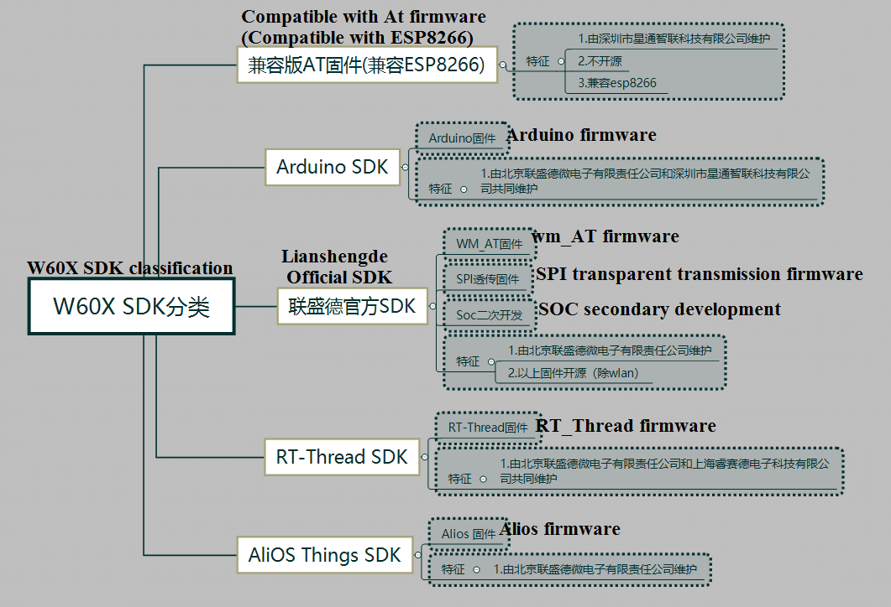

 AT firmware version description 

 From SZDOIT

W600 series wifi products currently have two versions of AT firmware；

**Compatible version  AT firmware** 和 **WM_AT firmware** are developed based on two different versions of SDK. The compatible version  AT firmware refers to the firmware compatible with ESP series AT commands. The WM_AT firmware is compiled from the official SDK of Lianshengde.

If the user is not sure which version of the AT firmware the product is , he can judge by one command。

|        Firmware version         | PC send |    W600 Reply    |
| :-----------------------------: | :-----: | :--------------: |
| Compatible version  AT firmware |   AT    |        OK        |
| Compatible version  AT firmware |   AT+   |      ERROR       |
|              WM_AT              |   AT    | -（no response） |
|              WM_AT              |   AT+   |        OK        |

**Compatible version  AT firmware**

Compatible AT firmware compatible with Espressif's ESP8266 AT command set；

The firmware is not open source, please refer to [Introduction Guide for Compatible AT Command Development](https://docs.w600.fun/?p=at/esp-start.md) ；

**WM_AT firmware**

This firmware can be obtained after compiling by modifying the macro definition of the official SDK of Lianshengde (Macro definition is opened by default)；

First, refer to [W600 development environment setup](https://docs.w600.fun/?p=app/ide.md) to prepare the development environment, the default is AT firmware, send `AT+` reply `OK`
